# 矩阵及其线性运算 #

这里面包含两部分内容：

- 矩阵的概念
- 矩阵的线性运算

矩阵的概念的内容有如下：

- 矩阵的定义
- 矩阵的元素
- 矩阵的行列大小：n阶矩阵（n阶方阵）、行矩阵、列矩阵
- 线性变换：系数矩阵
- 两个矩阵：同型矩阵、相等矩阵
- 特殊矩阵：零矩阵、单位矩阵、对角矩阵、数量矩阵

矩阵的线性运算：

- 矩阵的加法
- 矩阵加法的运算律
- 负矩阵：为矩阵的减法做准备
- 矩阵的减法
- 移项
- 数与矩阵相乘
- 数乘矩阵的运算律
- 数量矩阵

## 1、矩阵的概念 ##

	矩阵的概念

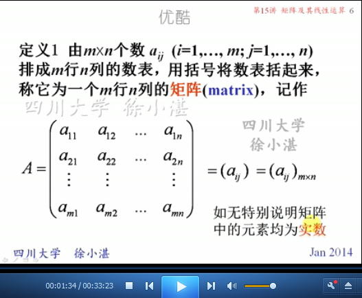

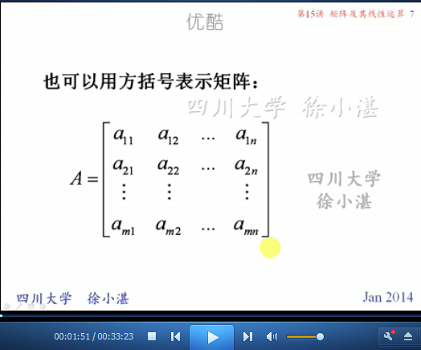

	矩阵的元素

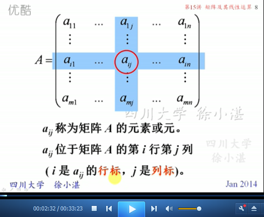

	从矩形大小角度区分的矩阵：n阶矩阵（n阶方阵）、行矩阵、列矩阵

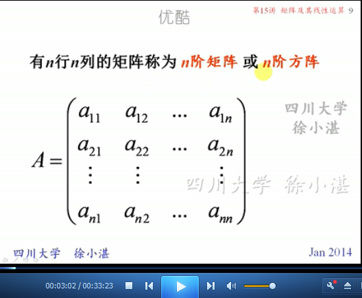

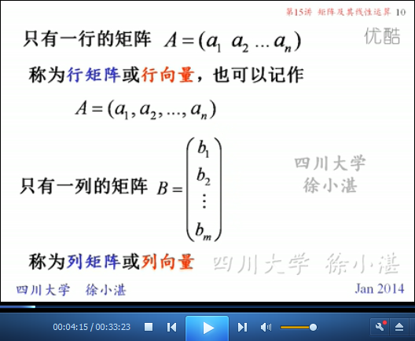

	线性变换

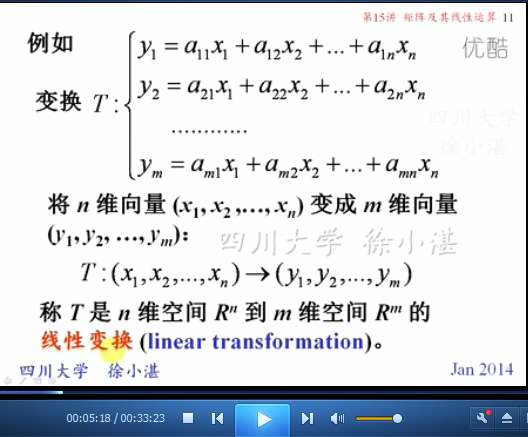

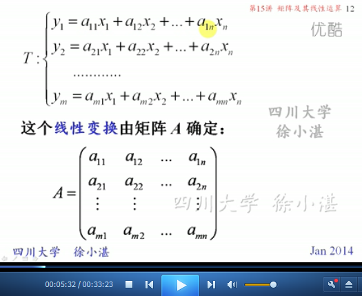

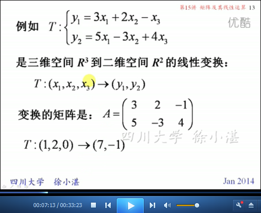

	线性变换中的“系数矩阵”

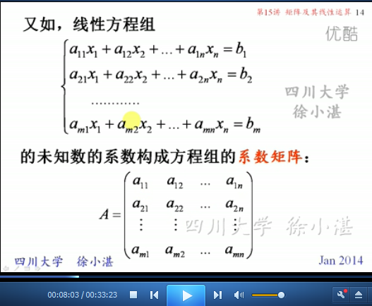

	两个矩阵相比较：同型矩阵、相等矩阵

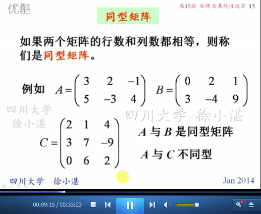

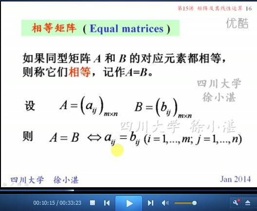

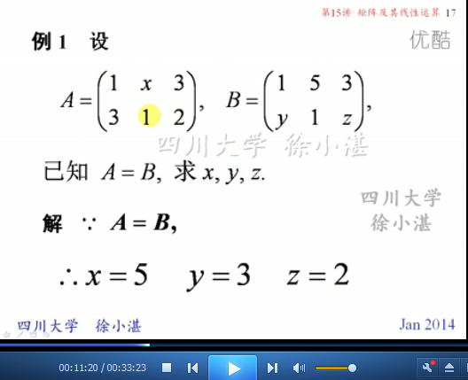

	特殊矩阵：零矩阵、单位矩阵、对角矩阵

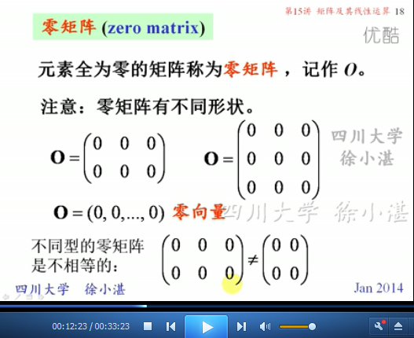

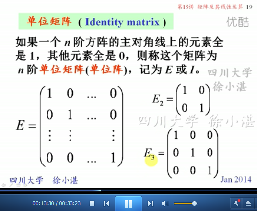

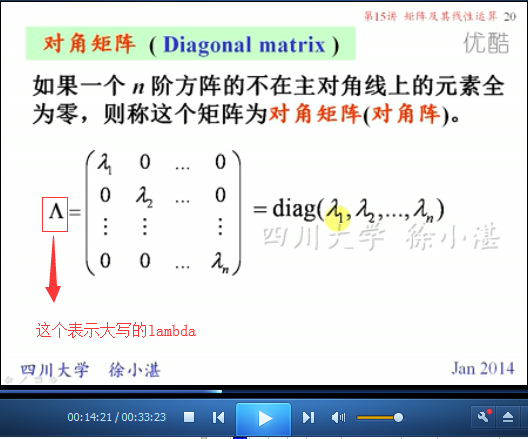

## 2、矩阵的线性运算 ##

	矩阵的加法

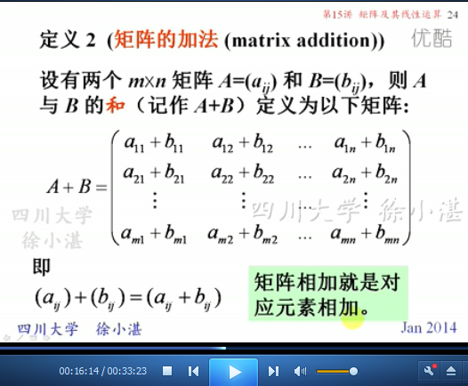

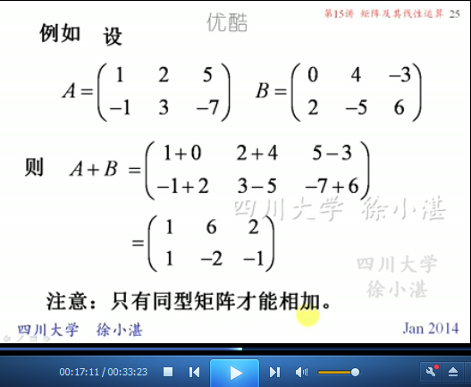

	矩阵加法的运算律

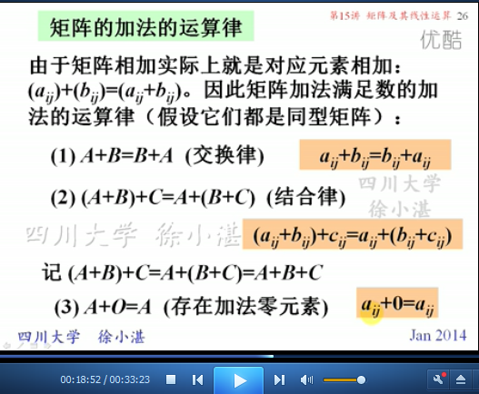

	负矩阵:为矩阵减法做准备

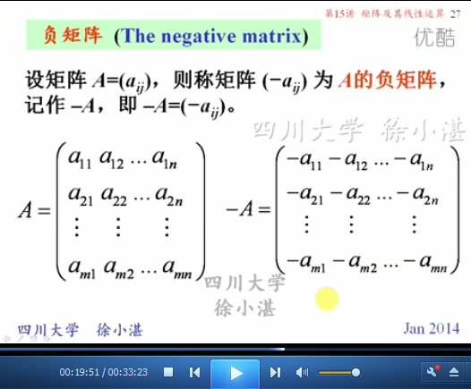

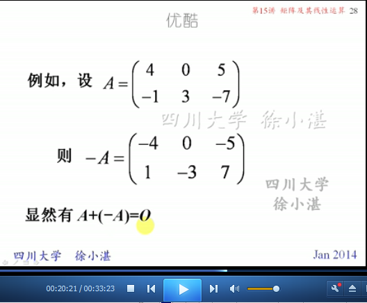

	矩阵的减法

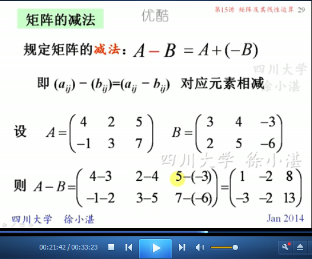

	移项

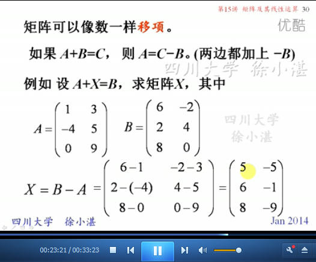

	数乘矩阵

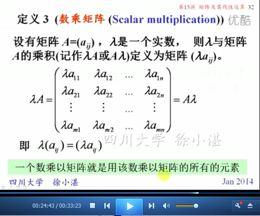

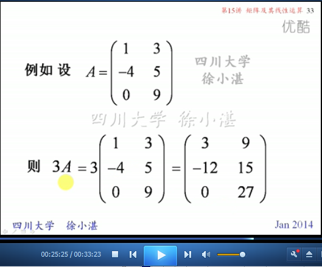

	数乘矩阵的运算律

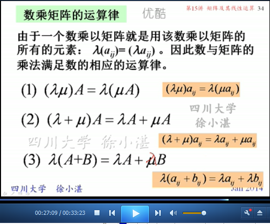

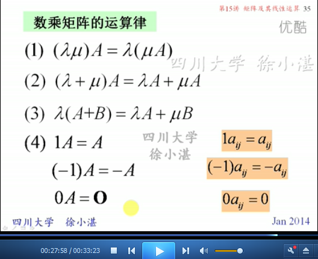

	矩阵的线性运算

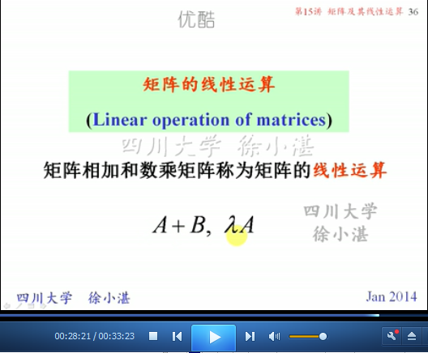

	举例

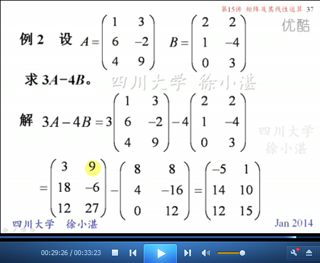

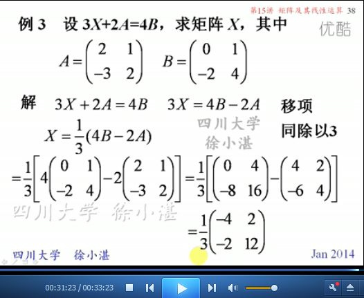

	数量矩阵

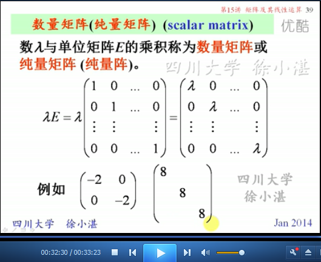

> 至此结束。 水库理论，那种办法我也不知道，但我们必须要有不建水库就誓不罢休的决心。
