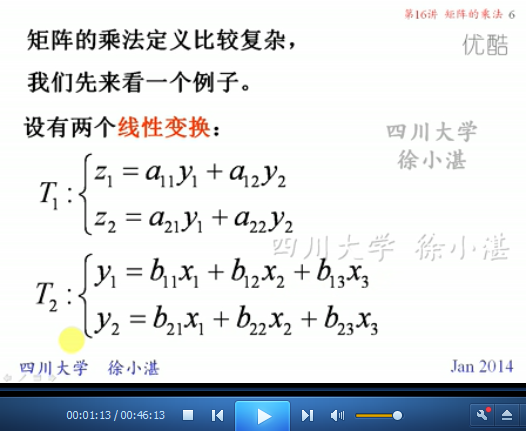
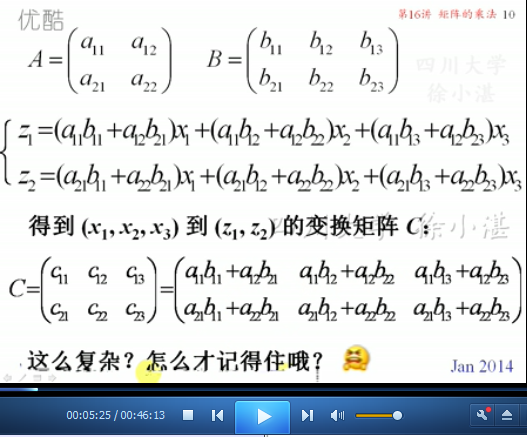
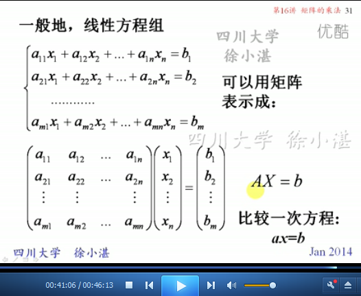

# 矩阵的乘法 #

矩阵的运算中包括：

- 矩阵的线性运算：矩阵加减、数乘矩阵（上一次讲的）
- 矩阵的乘法（这一次讲的）

矩阵的乘法要包括以下几个部分：

- 为矩阵乘法做准备
- 矩阵的乘积：数量积（点积）
- 矩阵可乘的条件
- 矩阵乘积 与 零矩阵的关系 
- 可交换矩阵
- 线性方程组的矩阵表示
- 线性变换的矩阵表示

## 1、为矩阵乘法做铺垫 ##

## 2、矩阵乘法的定义 ##

	矩阵乘法-->数量积（点积）

## 3、矩阵可乘的条件 ##

	矩阵乘积不具有交换性

## 4、矩阵乘积 与 零矩阵 的关系 ##

	例2

	矩阵乘积为零矩阵，未必有零因子。

	例3：

## 5、可交换矩阵 ##

	单位矩阵或纯量矩阵 与 方阵 可交换

	例4：

	作业：

	例5：

## 6、线性方程组的矩阵表示 ##

## 7、线性变换的矩阵表示 ##

	例6：

> 至此结束。 在紧要关头不敢赌上性命的人，把希望寄托于还有明年那种不确定未来的人，以及放弃机会的人，我认为像这样意志不坚定的废物根本就没资格成为中忍！
