# 矩阵乘法的性质及矩阵的幂 #

这里只要讲3部分内容：

- 矩阵乘法的运算率：结合率、数乘率（自己起的，哈哈）、分配律、单位阵律（又是自己起的，哈哈）
- 矩阵乘法不满足的运算率：不满足交换率、消去率
- 矩阵的幂：矩阵的幂，本质依然是“矩阵乘法”，只不过是针对同一个矩阵

矩阵乘法的运算率：

- （1）(AB)C=A(BC)=ABC   结合律
- （2）lambda(AB)=(lambdaA)B=A(lambdaB)
- （3）C(A+B)=CA+CB   (A+B)C=AC+BC 分配律
- （4）EA=A   AE=A 单位矩阵左乘（右乘）矩阵，不改变矩阵

矩阵乘法不满足的运算率：

- （1）交换率不成立：AB=BA 一般不成立
- （2）AB=0 得不出 A=0 或 B=0
- （3）消去律不成立 AB=AC且A不等于零矩阵，得不出B=C

矩阵的幂：

- 矩阵幂的定义
- 矩阵幂的一些注意项
- 单位矩阵的幂

## 1、矩阵乘法的运算率 ##

	矩阵乘法的运算率：结合率

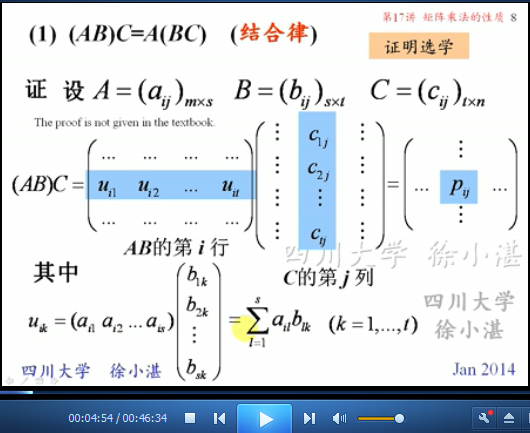

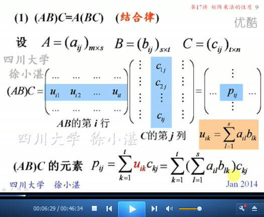

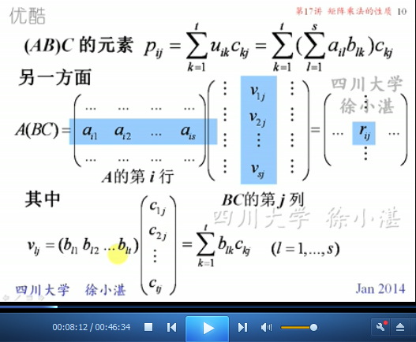

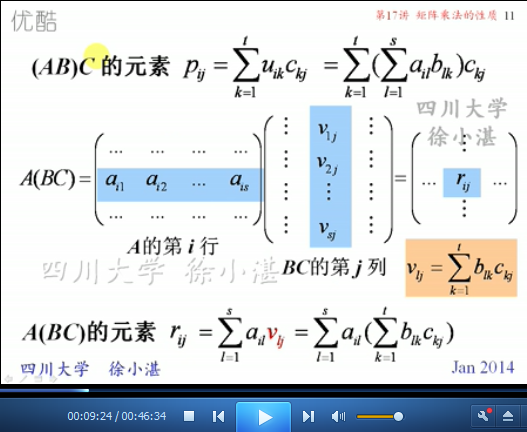

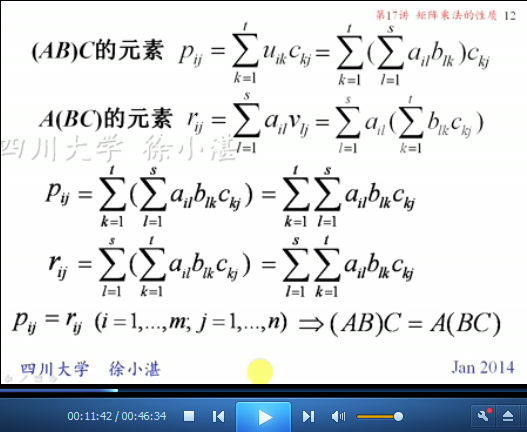

	矩阵乘法的运算率：结合律、数乘律、分配律

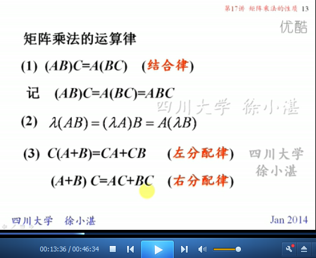

	左分配律的证明过程

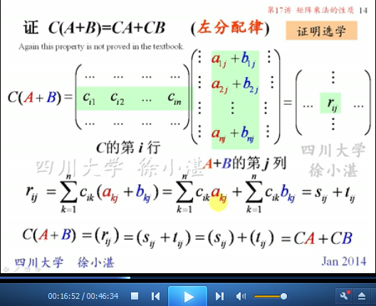

	矩阵乘法的运算率：单位阵左乘（右乘）矩阵，不改变该矩阵

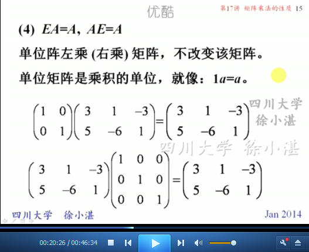

## 2、矩阵乘法不满足的运算律 ##

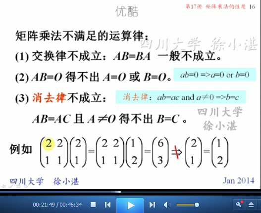

	例1：验证矩阵乘法的结合律

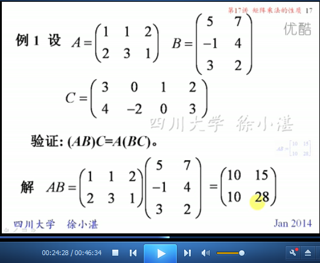

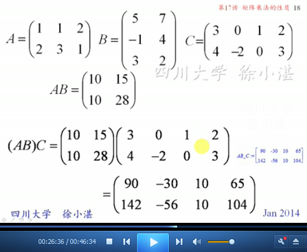

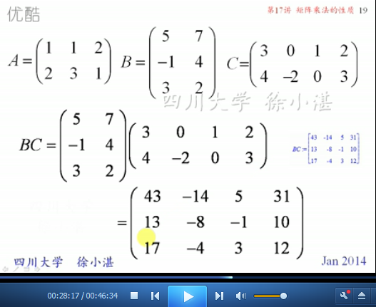

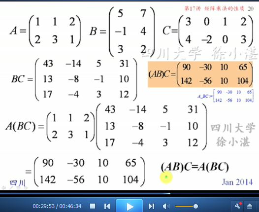

## 3、矩阵的幂 ##

	矩阵幂的定义

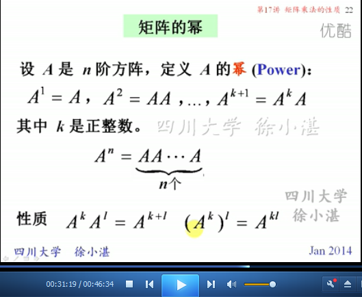

	矩阵幂需要注意的事情：

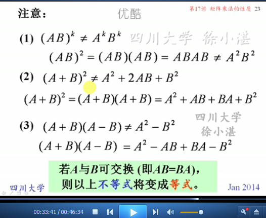

	例2：求对角矩阵的n次幂

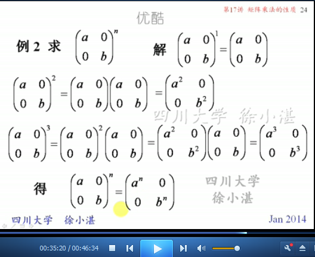

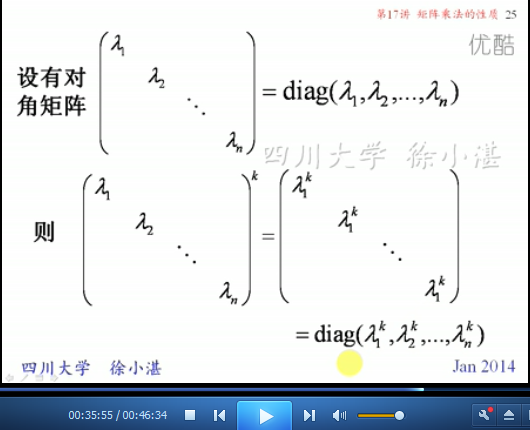

	例3：数学归纳法

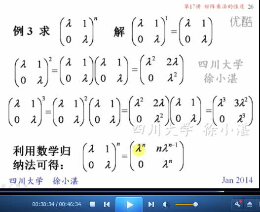

	作业：

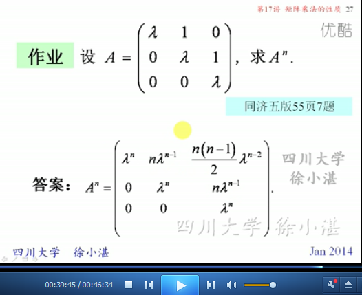

	例4：用平方法求n次幂

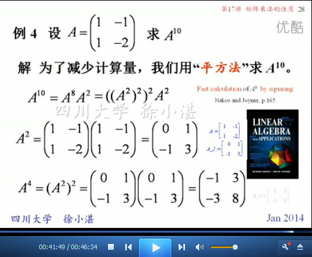

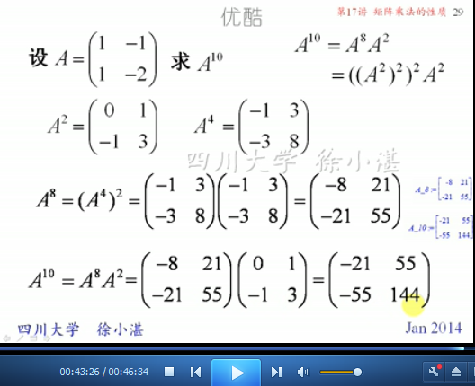

	例5：使用结合律

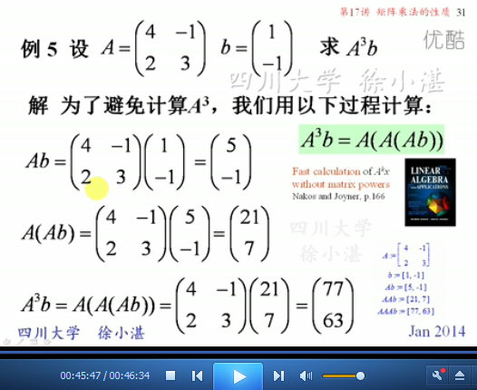

> 至此结束。 不积跬步，无以至千里；不积小流，无以成江海。——荀子
