# 旋转变换 #

矩阵的运算包括：

- 矩阵的线性运算
- 矩阵的乘法

矩阵的乘法，目前包括：**矩阵的幂**、**旋转变换**。**矩阵的幂**，是由同一个矩阵，进行矩阵乘法运算多次而得到的；**旋转变换**，是用**矩阵**乘以**向量**，来实现空间坐标点的位置变换。

旋转变换包括3部分内容：

- （1）旋转变换定义，注意是逆时针旋转
- （2）旋转变换在平面解析几何中的应用
- （3）旋转变换在空间解析几何中的应用

## 1、旋转变换的定义 ##

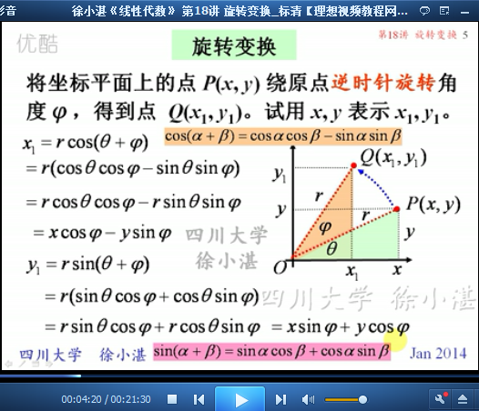

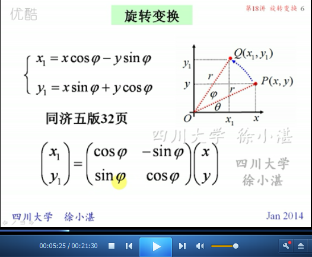

	例1：逆时针旋转n个角度

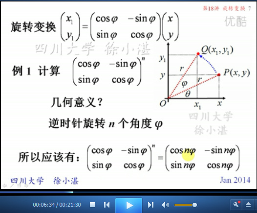

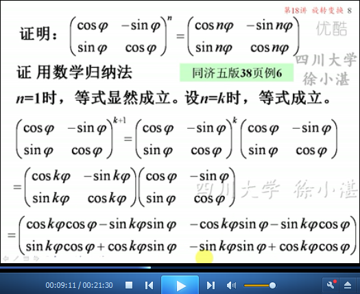

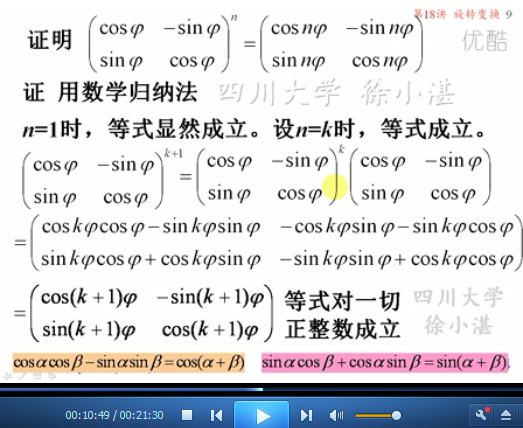

## 2、旋转变换在平面解析几何中的应用 ##

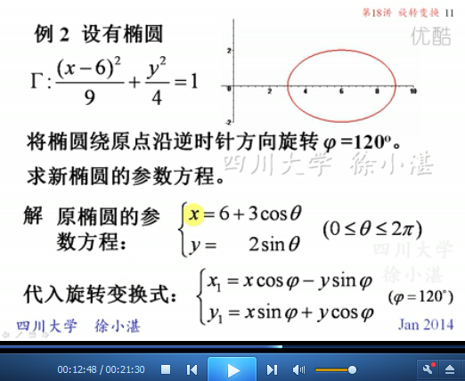

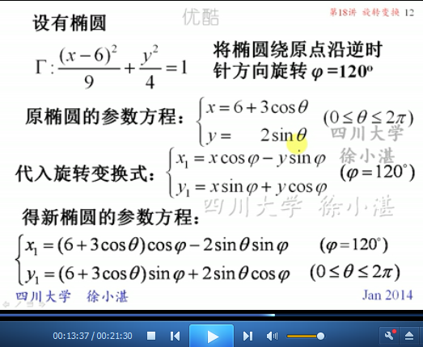

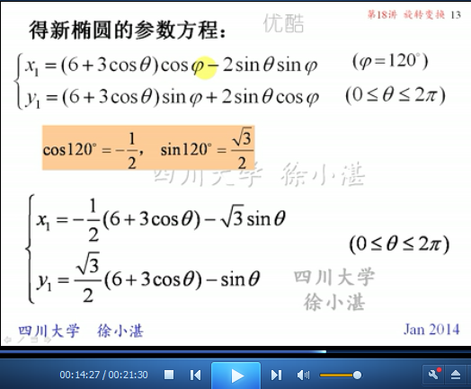

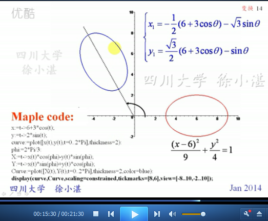

## 3、旋转变换在空间解析几何中的应用 ##

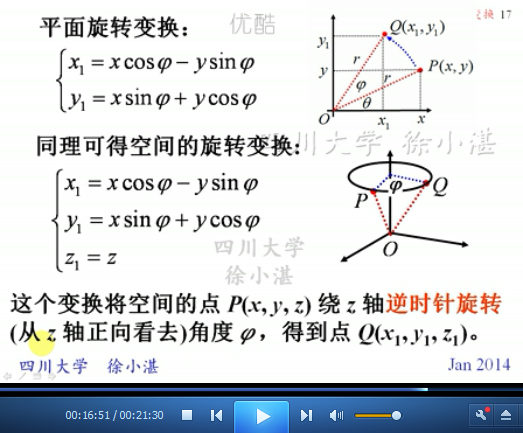

	例3：

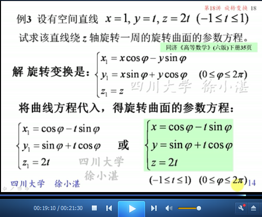

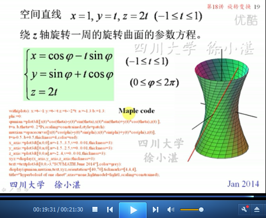

> 至此结束。 成大事不在于力量的大小，而在于能坚持多久。——约翰逊
