# 转置矩阵与对称矩阵 #

矩阵的运算包括：

- 矩阵的线性运算
- 矩阵的乘法
- 矩阵的转置

矩阵的乘法，目前包括：**矩阵的幂**、**旋转变换**。

这一节包括3个部分：

- 转置矩阵：转置矩阵的定义、矩阵转置的运算性质
- 对称矩阵：对称矩阵是矩阵转置的一种特殊形式，而且该矩阵必须是n阶方阵
- 反对称阵：反对称矩阵是对称矩阵的一种变形

## 1、转置矩阵 ##

	转置矩阵的定义

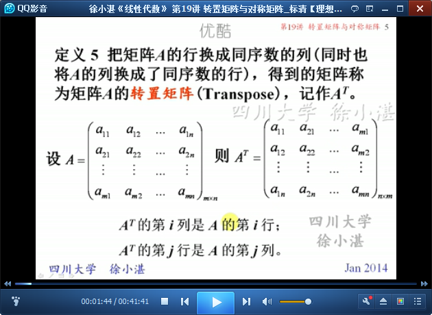

	A与At以及At与A总是可乘的。

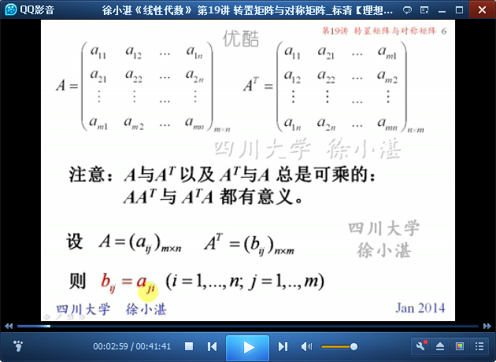

	举个例子演示“矩阵转置”

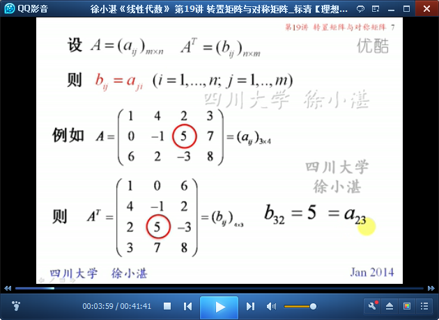

	矩阵转置的运算性质：两次转置还原、转置的线性性质、转置的反交换律

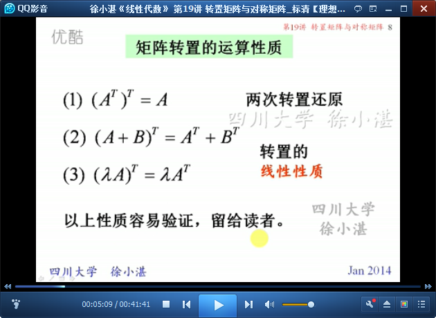

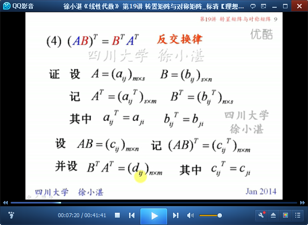

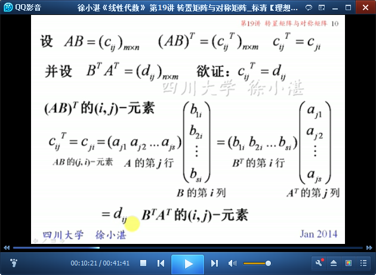

	矩阵转置的反交换律的推论

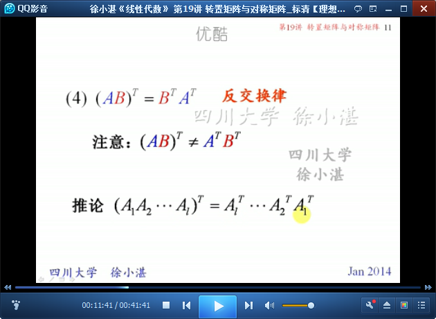

	例1：验证性质（4）反交换律

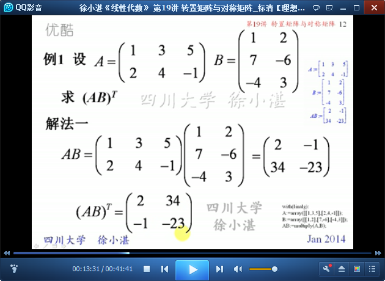

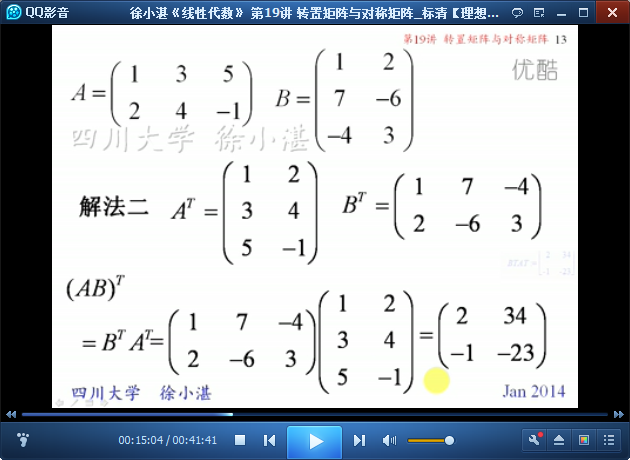

	例2：矩阵转置后，再进行矩阵相乘，得到不同的结果

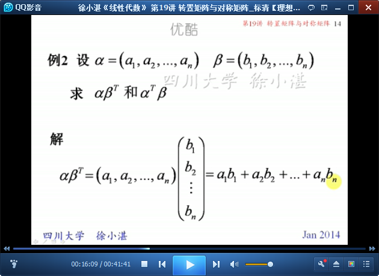

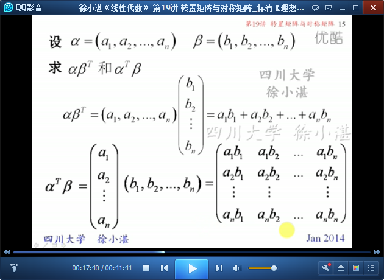

	例3：基于例2，求矩阵的幂，先进行拆分，再用结合律，求结果

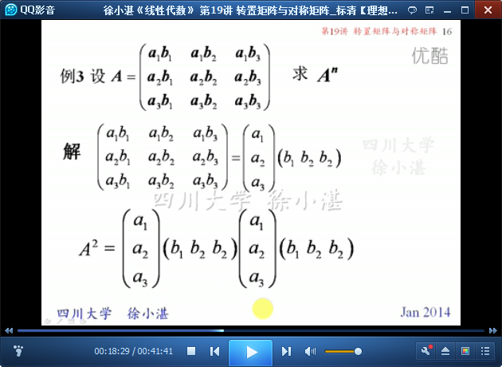

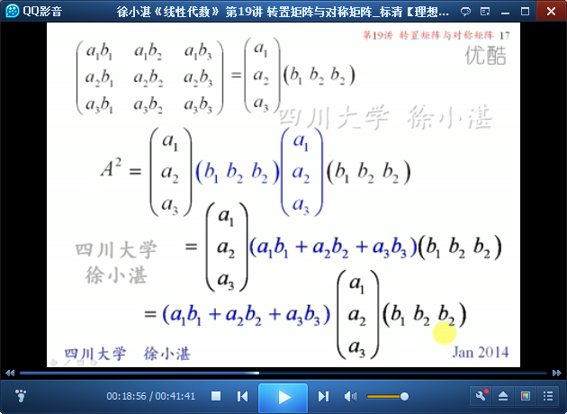

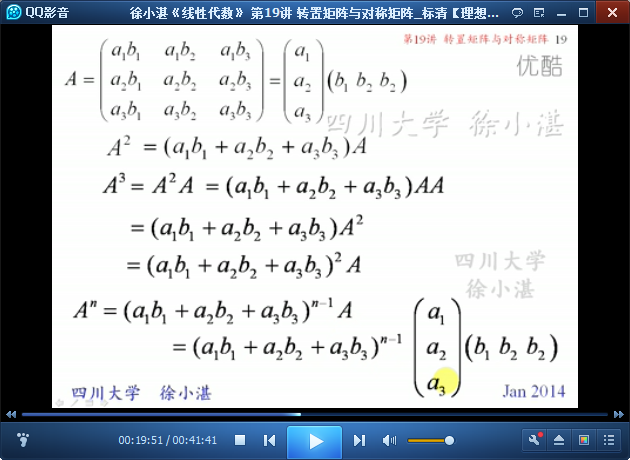

## 2、对称矩阵 ##

	对称矩阵，是在转置基础上的一种特殊形式，还必须是n阶方阵。
	首先，来观察一下什么是对称矩阵，什么不是对称矩阵

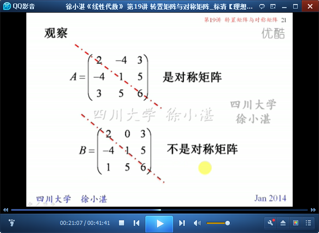

	对称矩阵（symmetric matrix）的定义

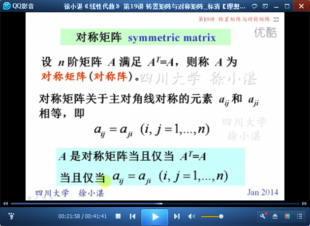

	例4：对任何矩阵A，AAt和AtT总是对称阵

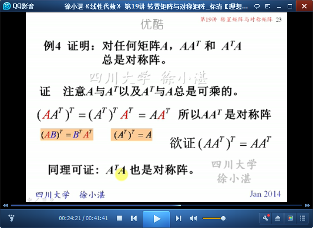

	对称矩阵的乘积不一定是对称矩阵。
	两个矩阵的乘积AB是对称矩阵的充分必要条件是A与B可交换，即AB=BA。

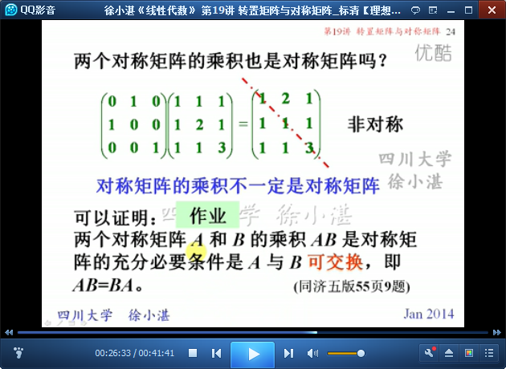

	例5：不知道说点什么好

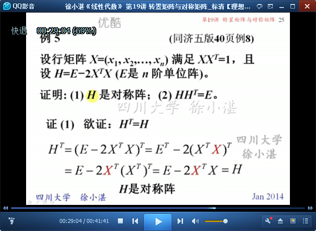

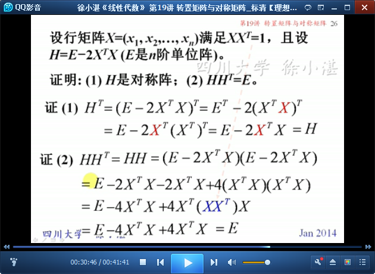

	作业

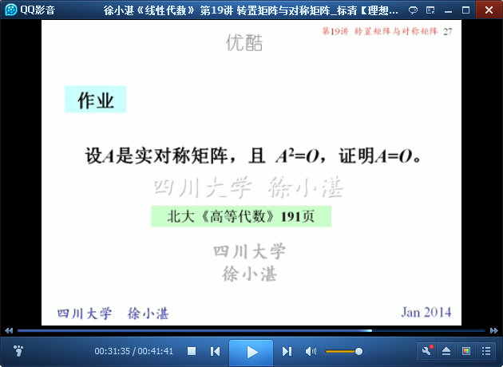

## 3、反对称矩阵 ##

	反对称矩阵 skew symmetric matrix

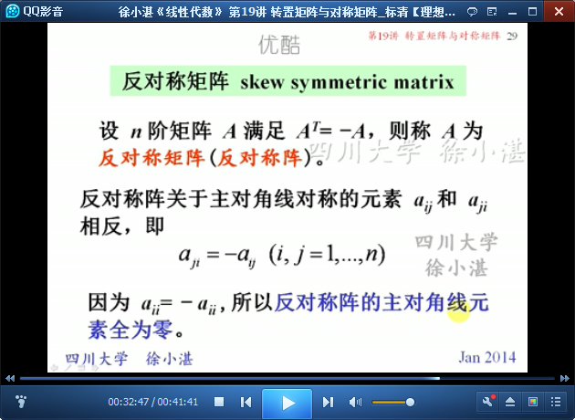

	举个例子：反对称矩阵

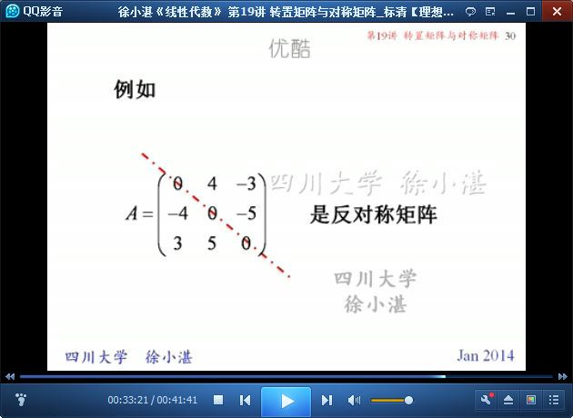

	例6：AB是对称阵的充分必要条件是AB=BA。

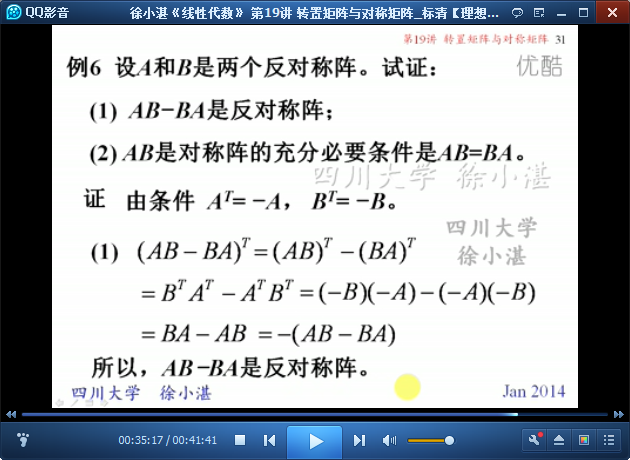

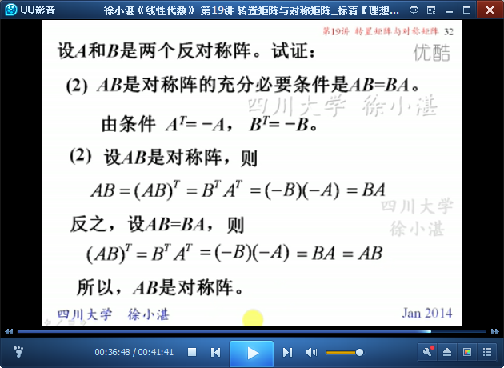

	例7：任何方阵都可以表示成一个对称阵与一个反对称阵的和

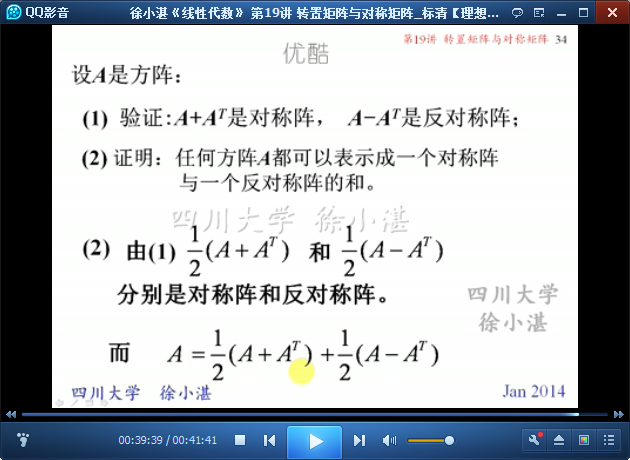

	方阵和函数的对比

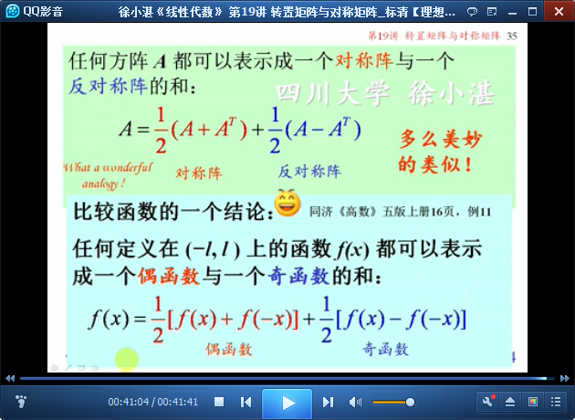

> 至此结束。 既然我已经踏上这条道路，那么，任何东西都不应妨碍我沿着这条路走下去。——康德