# 方阵的行列式 #

方阵的行列式由2部分组成：

- （1）方阵行列式的定义
- （2）方阵行列式的性质

## 1、方阵行列式的定义 ##

	方阵行列式的定义

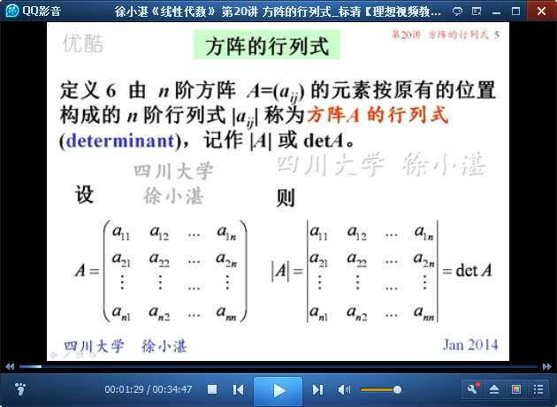

	注意：区分方阵和行列式两个概念

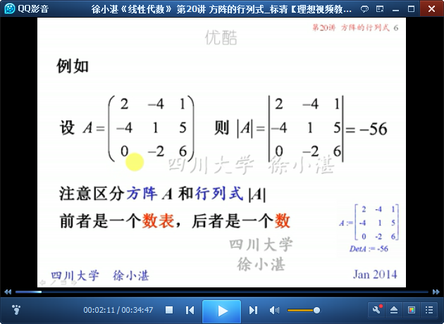

	例1：单位阵和数量阵的行列式

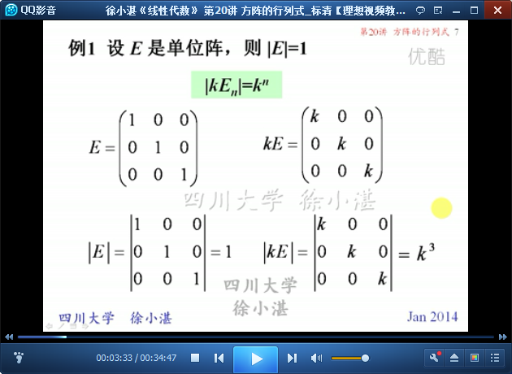

## 2、方阵行列式的运算性质 ##

	方阵行列式的运算性质：（1）矩阵自身的转置；（2）矩阵数乘；（3）矩阵相乘

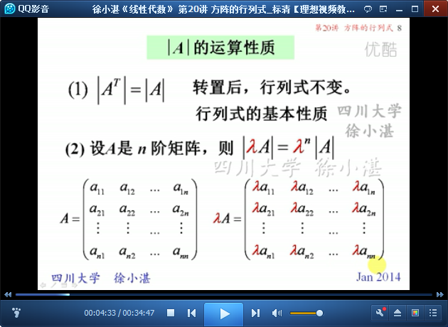

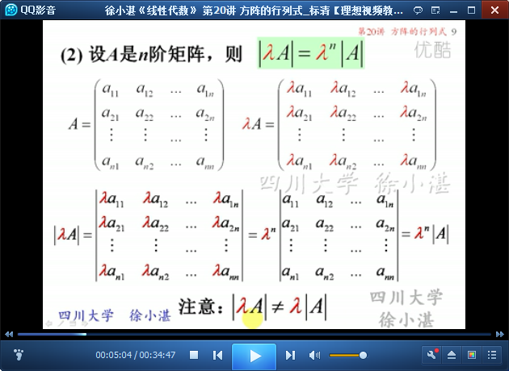

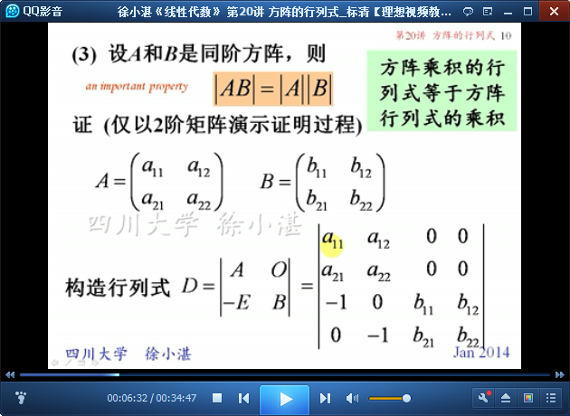

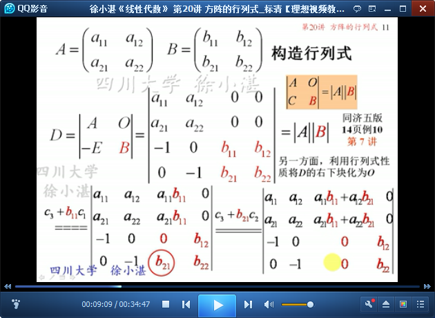

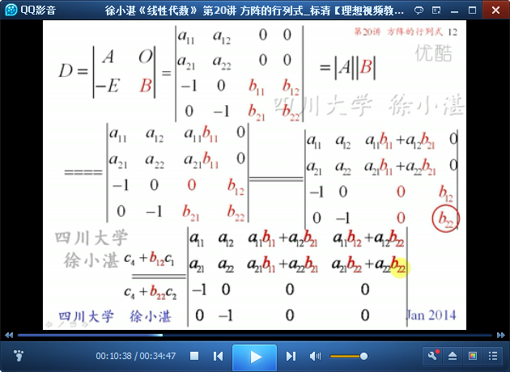

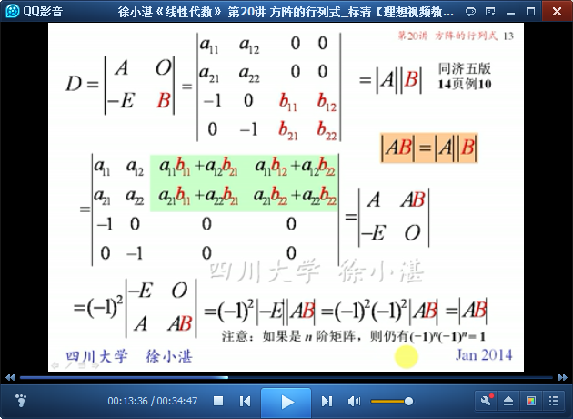

	由性质（3）得到的推论

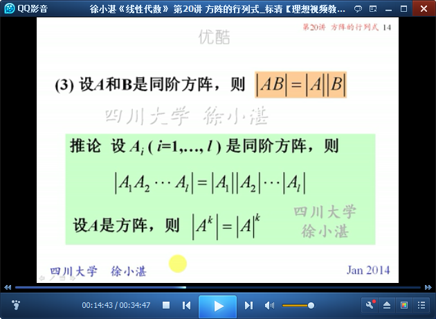

	例2和例3：

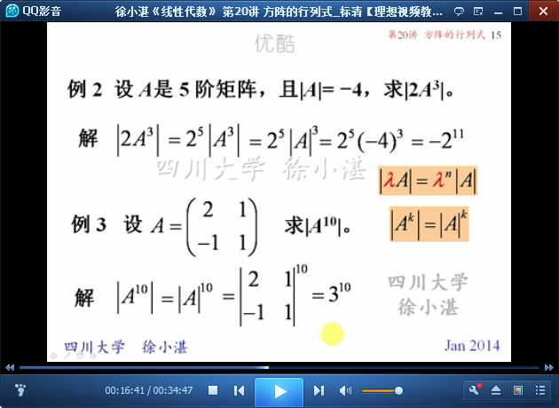

	例4：

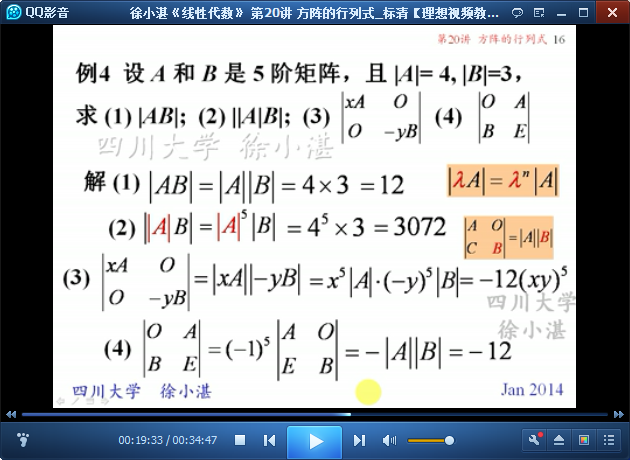

	例5：

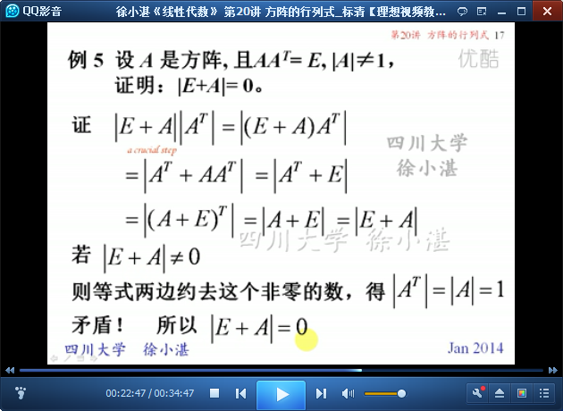

	例6：

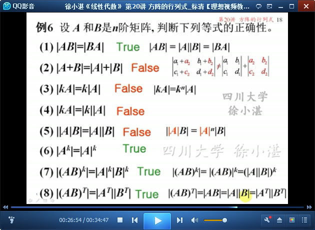

	例7：

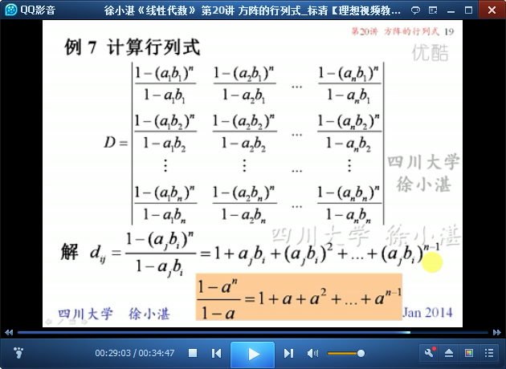

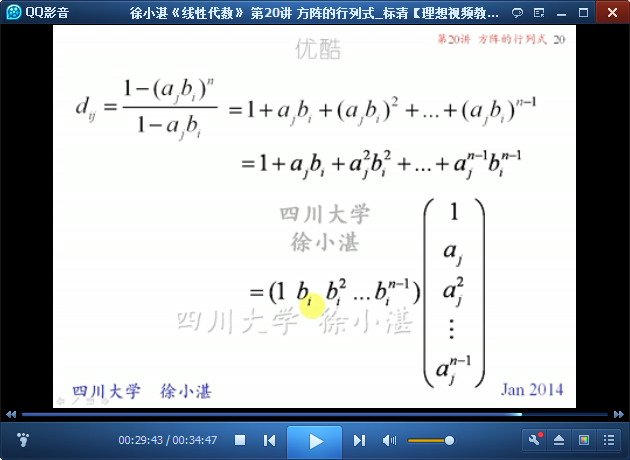

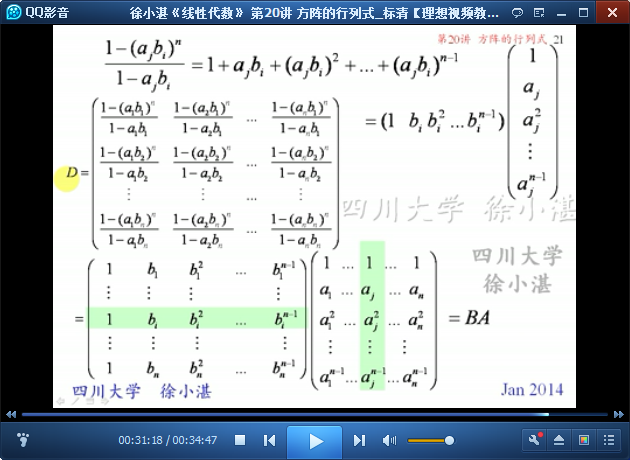

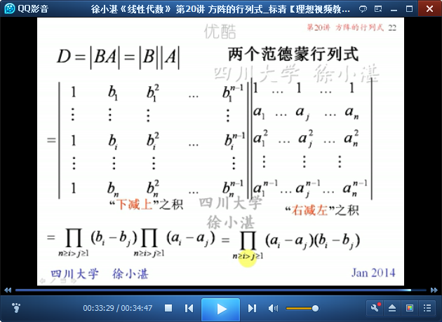

> 至此结束。 立志不坚，终不济事。——朱熹