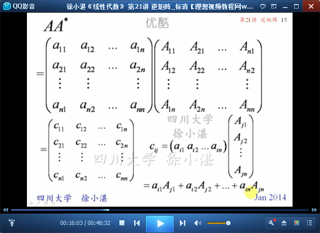
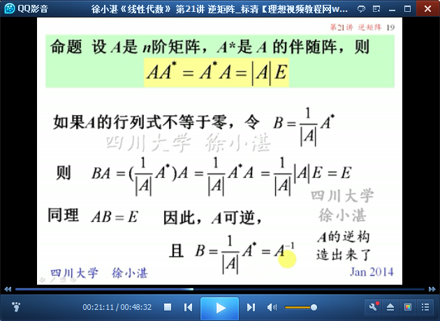

# 逆矩阵 #

矩阵的运算包括：

- 矩阵的线性运算
- 矩阵的乘法
- 矩阵的转置
- 逆矩阵

矩阵的乘法，目前包括：**矩阵的幂**、**旋转变换**。

逆矩阵，从本质上来说，是矩阵乘法的一种特殊形式。

在逆矩阵的内容中包含两部分内容：

- 逆矩阵的概念
- 求逆矩阵的例子

逆矩阵的部分包含了4小部分：

- （1）可逆矩阵的定义
- （2）逆矩阵的唯一性
- （3）矩阵可逆的条件
- （4）伴随矩阵：余子式、代数余子式；伴随矩阵是求解逆矩阵的一种方式。

# 1、逆矩阵的概念 #

	举例：通过回忆一次线性方程，来引出矩阵的逆

	可逆矩阵的定义

	逆矩阵的唯一性

	定理1：矩阵可逆的必要条件
	行列式不等于零是方阵可逆的必要条件。
	推论：行列式等于零的方阵不可逆。

	由矩阵可逆的充分条件，来引出伴随矩阵

	伴随矩阵 与 余子式、代数余子式

	伴随矩阵

	方阵 和 方阵的伴随矩阵 的乘积

	由伴随矩阵构造出逆矩阵

	定理2和定理3：方阵可逆的充分必要条件是行列式不为零

	如果两个矩阵相乘等于E，它们就是对方的逆矩阵。

## 2、求逆矩阵的例子 ##

	例1：二阶矩阵的逆矩阵计算公式

	二阶矩阵的逆矩阵的公式

	利用二阶矩阵的逆矩阵公式来计算

	例2：

	一般地，对角矩阵取逆就是对角元素取倒数

	一般地，次对角阵取逆就是次对角线元素取倒数后，再反向排列。

	例3：

	这种求逆矩阵很麻烦，以后会找到简便的方法

> 至此结束。 为学须刚与恒，不刚则隋隳，不恒则退。——冯子咸