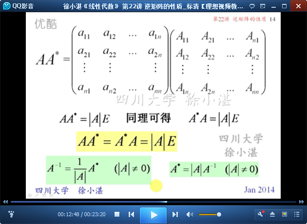
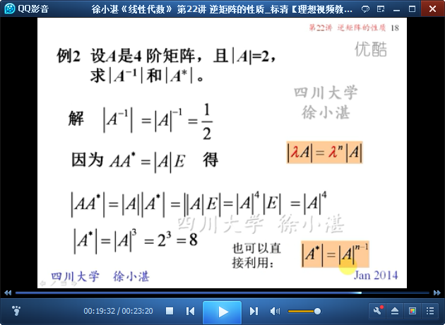

# 矩阵的性质 #

主要有两部分：

- 逆矩阵的运算律
- 伴随矩阵的性质

逆矩阵的运算律有以下内容：

- （1）矩阵自身求逆
- （2）数乘-->求逆
- （3）矩阵相乘-->求逆
- （4）转置-->求逆
- （5）求逆-->行列式

伴随矩阵有以下内容：

- （1）伴随矩阵的行列式
- （2）伴随矩阵 用 原矩阵 和 行列式表示

## 1、逆矩阵的性质 ##

	复习上一讲的互逆定理

	逆矩阵的运算律：（1）对于自身的求逆，再求逆

	逆矩阵的运算律：（2）对数乘的求逆

	逆矩阵的运算律：（3）对矩阵相乘的求逆

	逆矩阵的运算律：（4）对矩阵转置的求逆

	逆矩阵的运算律：（5）对矩阵求逆后，再求行列式

## 2、伴随矩阵 ##

	对伴随矩阵的回顾

	性质：伴随矩阵的行列式

	例1：

	总结

	例2：

	例3：

> 至此结束。 我有两个忠实的助手，一个是我的耐心，另一个就是我的双手。——[法]蒙田
