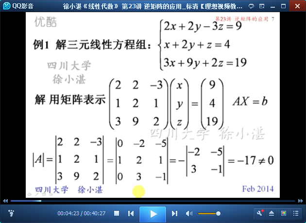

# 逆矩阵的应用 #

这里包括两部分：

- 矩阵方程
- 矩阵多项式

## 1、矩阵方程 ##

	打个基础

	例1：行列式-->伴随矩阵-->逆矩阵-->方程组的解

	例2：利用二阶矩阵的逆矩阵计算公式

	例3：重要的是求(A-E)的逆矩阵

	例4：逆矩阵+矩阵的幂

## 2、矩阵多项式 ##

	方阵A的n次多项式的定义

	例5：HelloWorld，直接带入多项式即可

	矩阵多项式，可以相乘展开，也可以因式分解

	例6：对角阵和n次多项式

	对角矩阵，作为多项式输入参数的一般结论

	例7：巧妙使用矩阵多项式

	例8：关键的一步是完成因式分解

> 至此结束。 要让事情改变，先改变我自己；要让事情变得更好，先让自己变得更好。