# 分块矩阵Block Matrices #

这里包括两部分：

- 分块矩阵的概念
- 分块矩阵的运算

分块矩阵的运算包括：

- 分块矩阵的线性运算
- 分块矩阵的乘积
- 分块矩阵的转置：大转置+小转置
- 分块对角矩阵：行列式、逆矩阵
- 分块三角矩阵：行列式

## 1、分块矩阵的概念 ##

	分块矩阵、子矩阵
	大矩阵分块后往往可以简化矩阵的运算

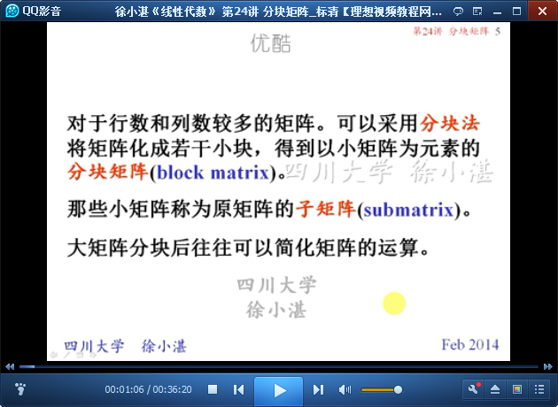

	例如：

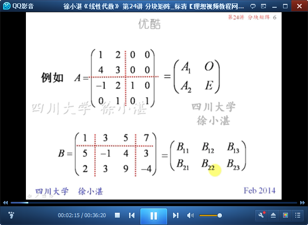

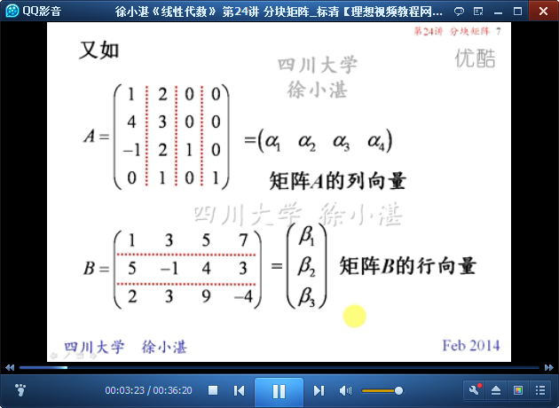

## 2、分块矩阵的运算 ##

	分块矩阵的线性运算

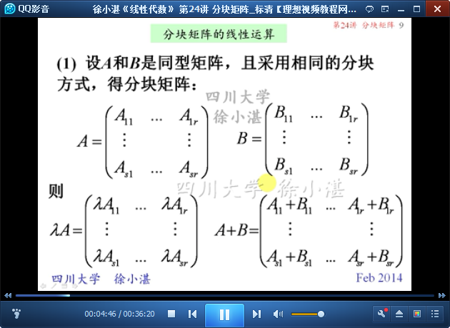

	分块矩阵的乘积

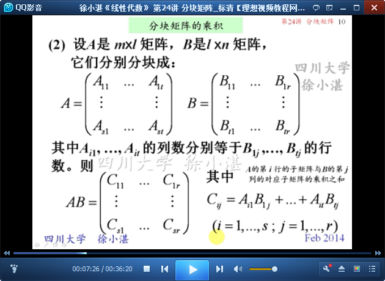

	例1：利用分块矩阵的乘积和线性性质

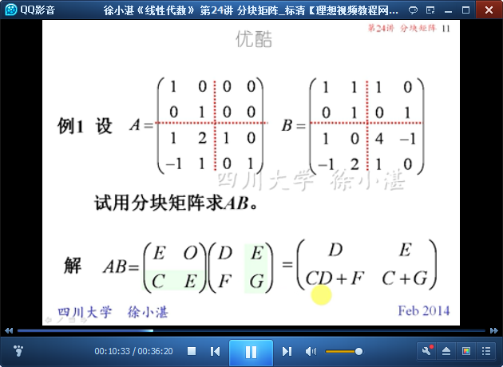

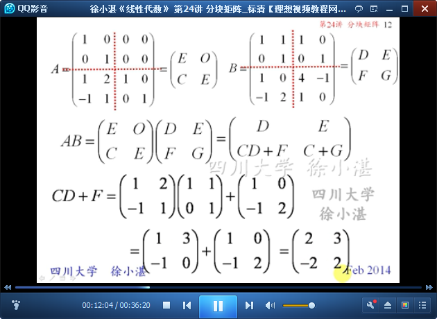

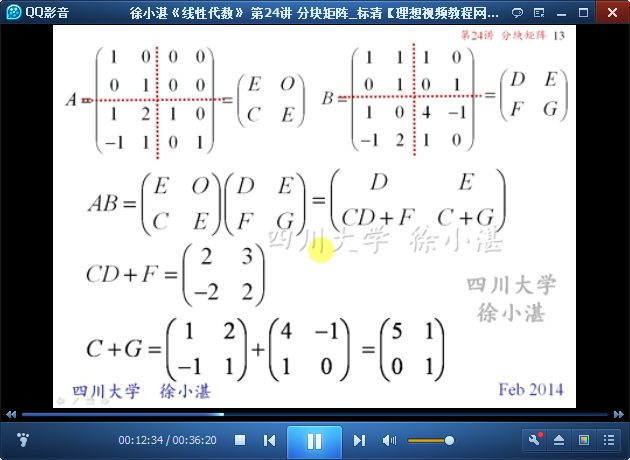

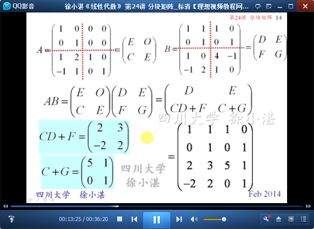

	分块矩阵的转置

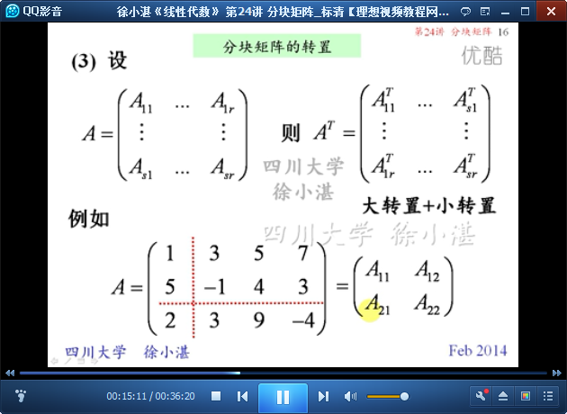

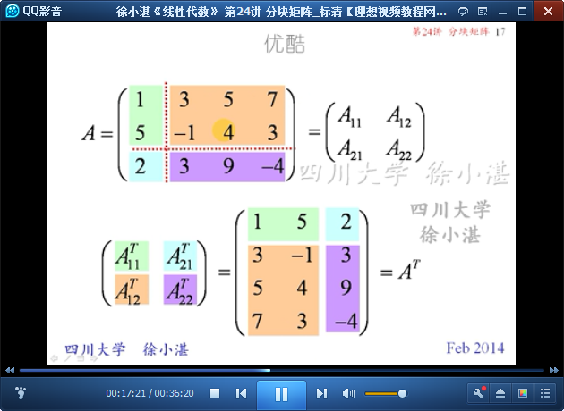

	分块对角矩阵：行列式、逆矩阵

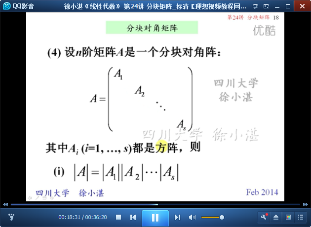

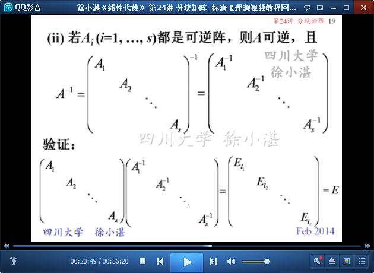

	例2：求逆矩阵

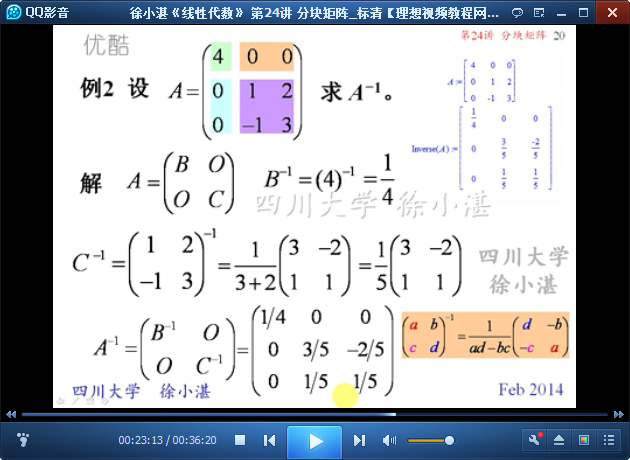

	例3：行向量、列向量

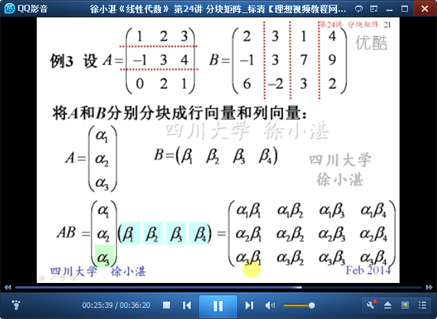

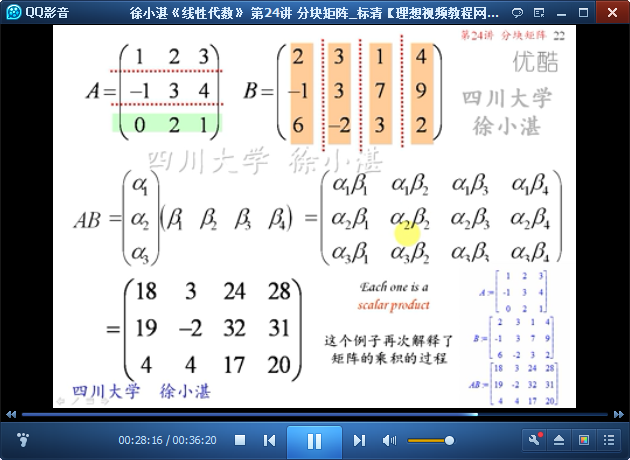

	分块三角矩阵：行列式

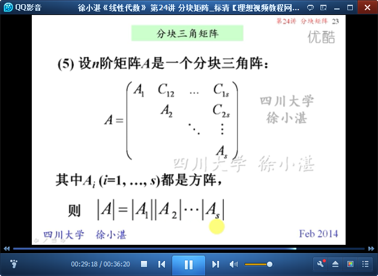

	例4：证明

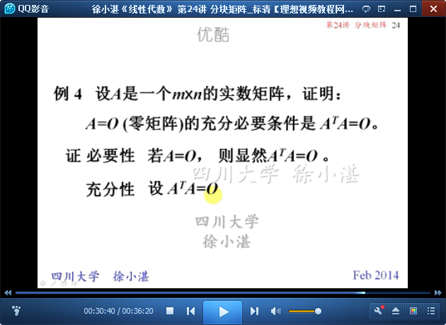

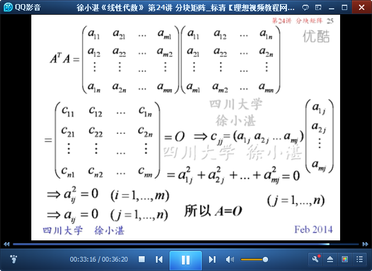

	习题1：

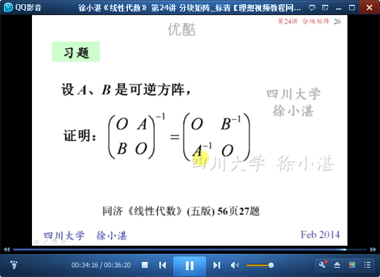

	习题2：

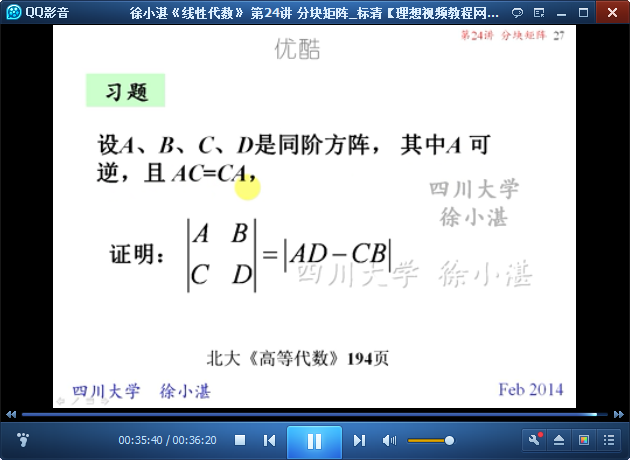

> 至此结束。 黑发不知勤学早，白首方悔读书迟。——颜真卿