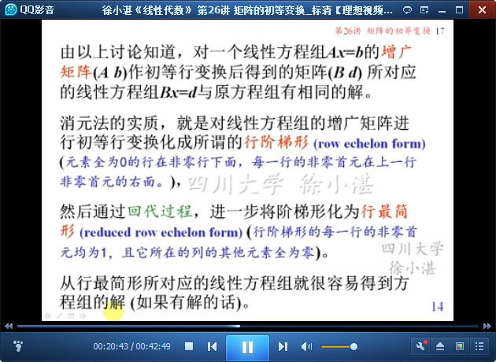

# 矩阵的初等变换 #

矩阵的初等变换 Elementary operations for matrices

这一部分主要包括以下（不严格划分的）5个部分：

- （1）消元法的矩阵表示：线性方程组的同解变换（等价变换）；线性方程组-->增广矩阵
- （2）矩阵的初等变换：初等行变换、初等列变换。增广矩阵-->初等行变换-->行阶梯形-->行最简形-->初等列变换-->标准形
- （3）初等变换的逆变换

## 1、消元法的矩阵表示 ##

	线性方程组的三种同解变换（等价变换）

	方程组的三种同解变换的记号

	线性方程组-->增广矩阵

	矩阵的初等行变换

## 2、矩阵的初等变换 ##

	矩阵的初等变换：初等行变换、初等列变换

	增广矩阵-->行阶梯形（row echelon form）-->行最简形（reduced row echelon form）

	任何矩阵都可以经过有限次初等行变换将其化成行阶梯形，进而化成行最简形。

	行最简形-->初等列变换-->标准形

	结论：任何矩阵A总可以经过有限次初等变换化成标准形。

	例1：求矩阵的标准形

## 3、初等变换的逆变换 ##

	三种初等变换都是可逆的。
	下一节，将讨论用矩阵乘积来表示初等变换。

> 至此结束。 鸟欲高飞先振翅，人求上进先读书。——李苦禅