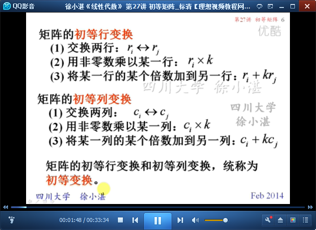
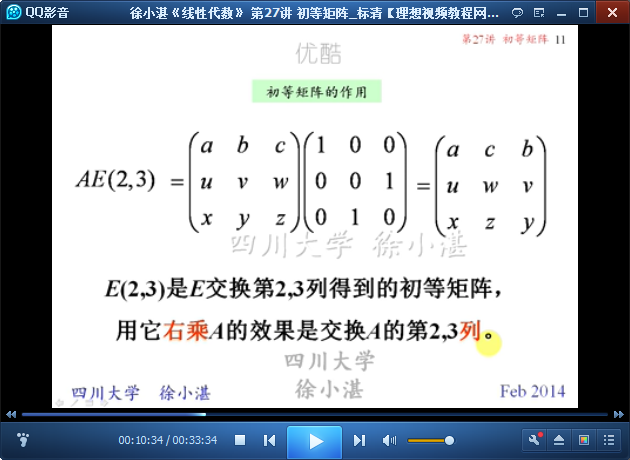

# 初等矩阵Elementary matrices #

在26节讲了矩阵的**初等变换**，这一节来讲如何用**初等矩阵**实现**初等变换**。

这里包含三部分内容：

- （1）初等矩阵的定义
- （2）初等矩阵的作用
- （3）初等矩阵的逆矩阵

## 1、初等矩阵的定义 ##

	先复习矩阵的初等变换

	初等矩阵的定义
	初等矩阵有三种，分别对应三种初等变换

## 2、初等矩阵的作用 ##

	交换行-左乘

	交换行-右乘

	乘以k-左乘

	乘以k-右乘

	乘以k再相加-左乘

	乘以k再相加-右乘

	性质1：左乘（右乘）对应初等行变换（初等列变换）

	举例：

## 3、初等矩阵的逆矩阵 ##

	回忆：初等变换的逆变换

	初等矩阵的逆矩阵

	性质2：矩阵的可逆的充分必要条件是 A是一些初等矩阵的乘积。

> 至此结束。 一个真正见过大世面的人，会讲究，能将就，能享受最好的，也能承受最坏的，见过世面的他们自然会在人群中散发不一样的气质，温和却有力量，谦卑却有内涵。