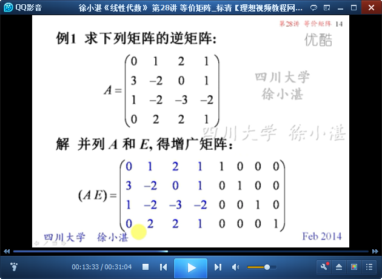
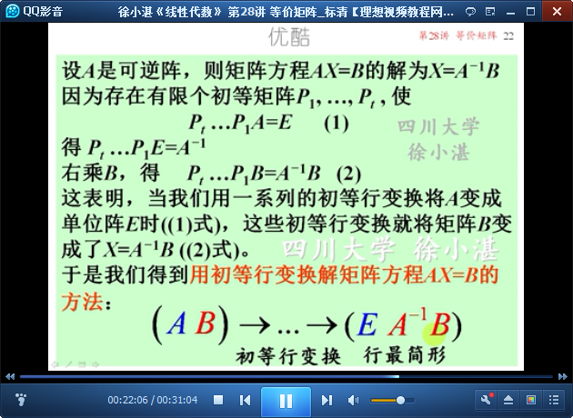
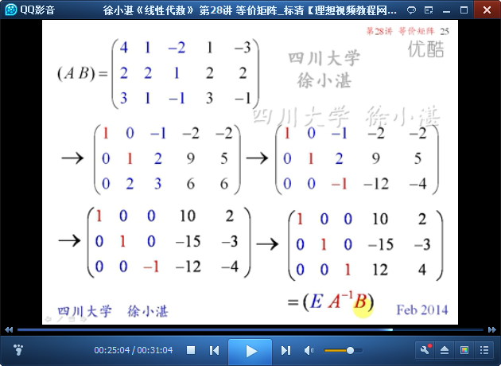

# 等价矩阵Equivalent matrices #

这里主要包含三个部分：

- 矩阵等价的定义
- 逆矩阵的简便求法：增广矩阵法（用初等行变换求逆矩阵）
- 求解矩阵方程
	- 用初等行变换求矩阵方程
	- 用初等列变换求矩阵方程

## 1、矩阵等价的定义 ##

	等价矩阵的定义

	对矩阵A进行一次初等行（列）变换相当于用一个初等矩阵左乘（右乘）A
	由此得出的结论：

	性质2-->定理1

	定理1的推论：矩阵A可逆的充分必要条件是A与单位阵行等价

	矩阵之间的等价关系具有以下性质：自反性、对称性、传递性

## 2、逆矩阵的简便求法 ##

	用初等行变换求逆矩阵的方法

	增广矩阵法: This is the quickest way to find the inverse of a matrix.

	例1：求矩阵的逆矩阵

## 3、求解矩阵方程 ##

	用初等行变换解矩阵方程AX=B

	例2：解矩阵方程AX=B

	用初等列变换解矩阵方程XA=B

	例3：解矩阵方程XA=B

> 至此结束。 不随便评价他人，是一种修养，而不活在别人的评价里，是一种修行。