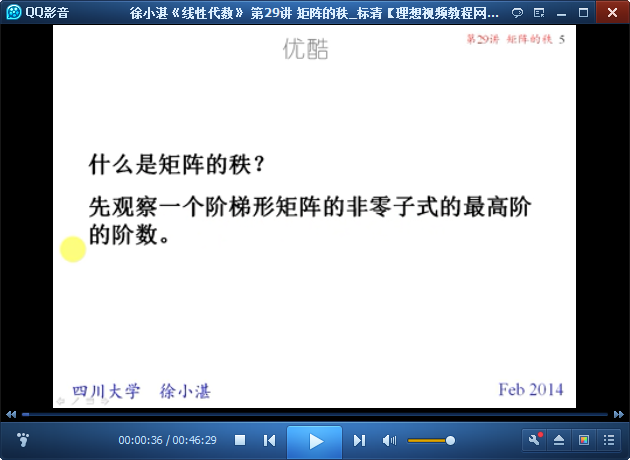
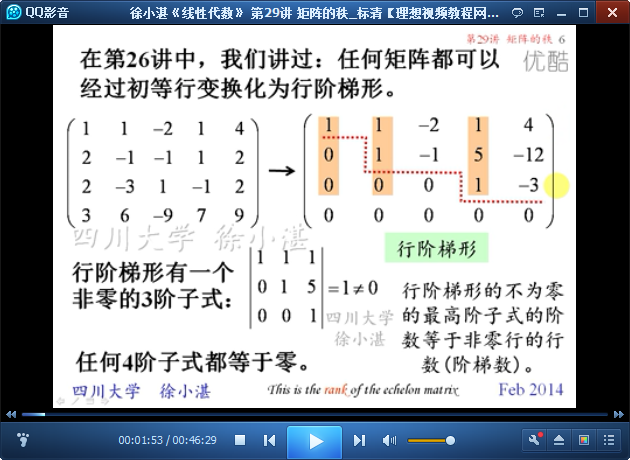
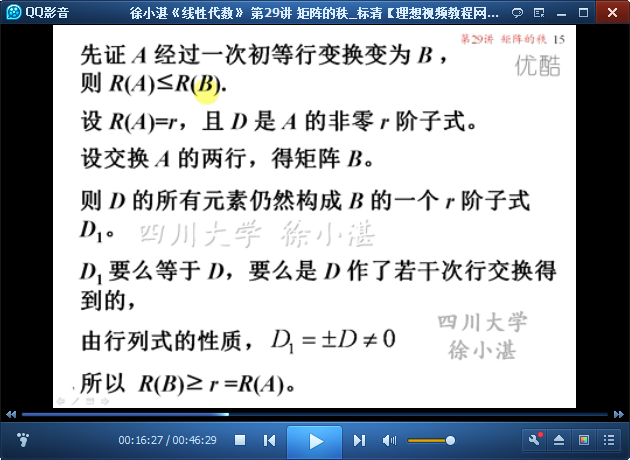
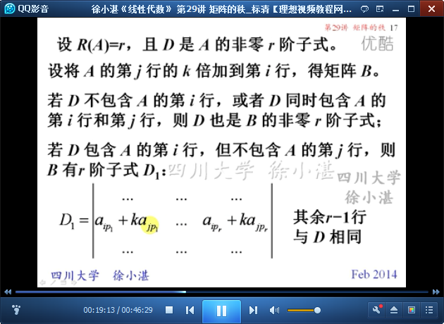

# 矩阵的秩The Rank of a Matrix #

这里主要讲了三部分内容：

- 矩阵的秩的概念
- 求矩阵秩的方法
- 秩的性质

## 1、矩阵的秩的概念 ##

	什么是矩阵的秩？  阶梯形矩阵-->非零子式-->最高阶的阶数



	任何矩阵都可以经过初等行变换化为行阶梯形



	矩阵子式的定义


	例如


	概念：矩阵的秩


	矩阵转置，其秩不变
	概念：行满秩、列满秩、满秩矩阵、降秩矩阵


	例1：求矩阵的秩


	矩阵的秩 等于 其行阶梯形矩阵的秩


	等价 必 等秩


	下面是证明过程（我看不懂了）







	经过初等变换后，矩阵的秩不变


	矩阵乘可逆矩阵，其秩不变


	思考：等秩的矩阵一定等价吗？


	两个同型矩阵等价的充分必要条件是它们的秩相同


## 2、求矩阵秩的方法 ##

	求矩阵秩的方法：A-->初等行变换-->行阶梯形B-->非零行的行数


	例2：求矩阵的秩


## 3、秩的性质 ##

秩的性质：

- 矩阵的秩，不超过矩阵的行列数
- 矩阵转置，其秩不变
- 等价，必等秩
- 乘满秩矩阵，秩不变


	和（差）的秩，小于等于　秩的和


	乘积的秩，不超过因子的秩。矩阵乘积不会增加秩。


	例3：


	例4：


	推论


用numpy求解矩阵的行列式：

```python
import numpy as np

matrix_A = np.array([[2,3,0],
                     [3,2,-1],
                     [0,1,1]])
matrix_B = np.array([[2,3,0],
                     [3,3,0],
                     [0,1,1]])
matrix_C = np.array([[2,3,0,-1],
                     [3,2,-1,3],
                     [0,1,1,-1],
                     [5,4,-2,3]])

detA = np.linalg.det(a=matrix_A)
detB = np.linalg.det(a=matrix_B)
detC = np.linalg.det(a=matrix_C)
print('detA = ', detA)
print('detB = ', detB)
print('detC = ', detC)
```

输出：

	detA =  -3.000000000000001
	detB =  -3.0000000000000004
	detC =  -5.9952043329758185e-15


> 至此结束。 所谓成熟就是，你要习惯任何人的忽冷忽热，也要看淡任何人的渐行渐远。