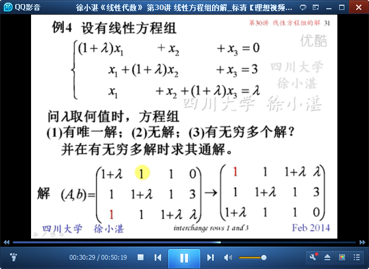
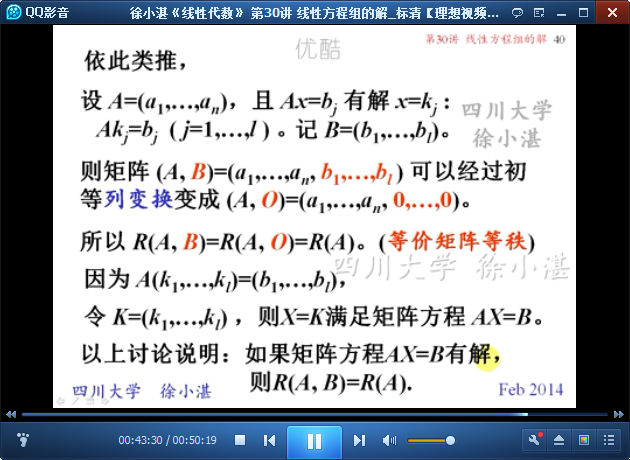

# 线性方程组的解 #

主要是从“**秩**”的角度，来看待**线性方程组**的**有解和无解**。

这里要区分两个概念：线性方程组 和 矩阵方程，因此内容分成两部分：

- 从秩的角度，查看线性方程组的解
- 从秩的角度，查看矩阵方程的解

## 1、线性方程组的解 ##

	系数矩阵和增广矩阵；相容的、不相容

	n元线性方程组Ax=b的无解、有唯一解、有无穷解的充分必要条件

	解齐次线性方程组Ax=0的步骤

	例1：解齐次线性方程组

	解非齐次线性方程组Ax=b的步骤

	例2：解非齐次线性方程组（无解）

	例3：解非齐次线性方程组（有无穷个解）

	例4：解非齐次线性方程组（无解、有唯一解、有无穷个解）

	线性方程组的两个基本定理

## 2、矩阵方程的解 ##

	定理6：矩阵方程AX=B有解的充分必要条件

	定理7：矩阵乘积的秩

> 至此结束。 不要把自己活得像落难者一样，急着告诉所有人你的不幸。总有一天你会发现，酸甜苦辣要自己尝，漫漫人生要自己过，你所经历的在别人眼里都是故事，也别把所有的事都掏心掏肺的告诉别人，成长本来就是一个孤立无援的过程，你要努力强大起来，然后独当一面。