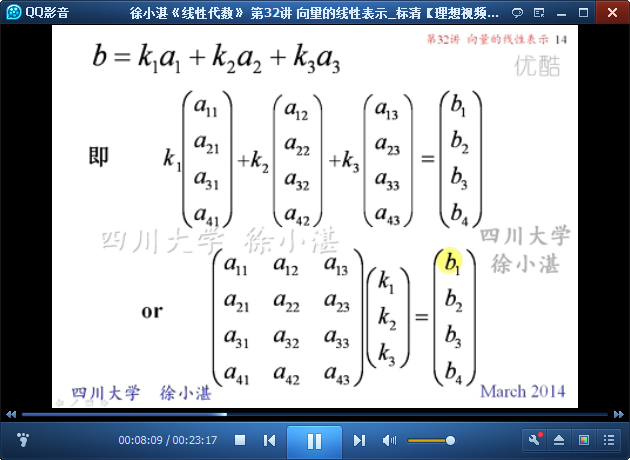

# 向量的线性表示Linear Combination of Vectors #

这里主要有两部分组成：

- 向量的概念：n维向量、向量组
- 向量的线性组合与线性表示：线性组合、线性表示

## 1、向量的概念 ##

	向量、线性组合、坐标或分量 

	定义：n维向量

	向量组

	举例

## 2、向量的线性组合与线性表示 ##

	定义：向量的线性组合

	向量的线性表示

	命题1

	定理1：线性表示 与 矩阵的秩 的关系

	例1：判断是否能够线性表示

> 至此结束。 你以为是炫耀，只不过是因为你没有，才看别人拥有的都晃眼，而他不过在分享自己的普通日常。