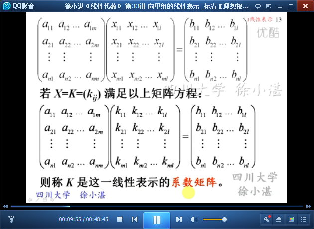
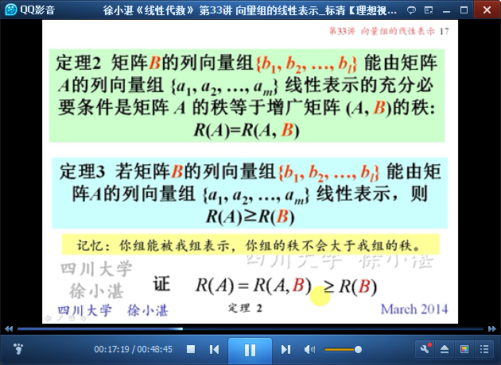
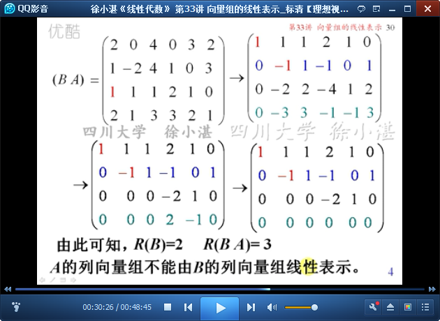

# 向量组的线性表示 #

思路：

- 上一讲，**一个向量**由**一个向量组**线性表示的条件
- 这一讲，**一个向量组**由**另一个向量组**线性表示的条件

## 1、向量组的线性表示和等价性 ##

	向量组的线性表示 和 等价向量组

	从向量组的线性表示-->矩阵方程AX=B的解

	命题2：列向量组线性表示-->矩阵方程有解-->矩阵的秩

	定理2的推论：矩阵等价的充分必要条件

	几个等价命题

	列向量组-->行向量组

	例1：证明向量组等价

	例2：

## 2、矩阵行（列）向量组的等价性 ##

	命题3

	例3：

>至此结束。 既然选择了远方，便注定风雨兼程