# 向量组的线性相关性 #

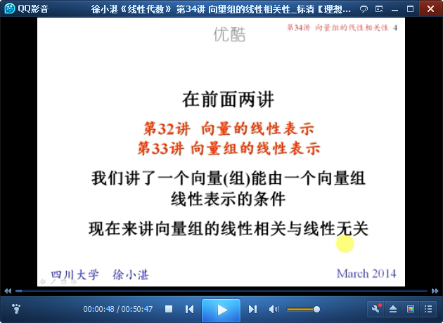

## 1、向量组的线性相关与线性无关的概念 ##

	线性相关 与 线性无关

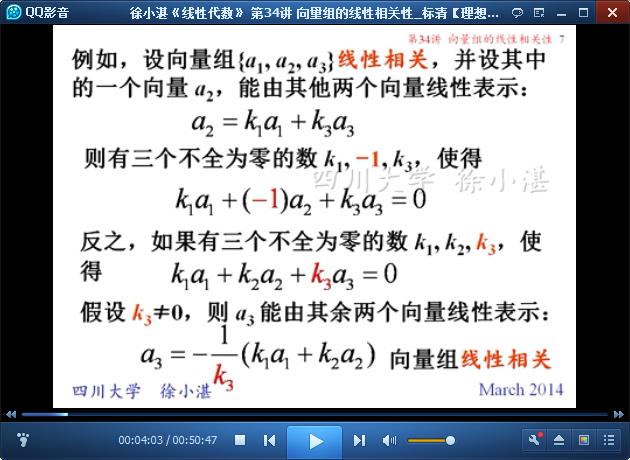

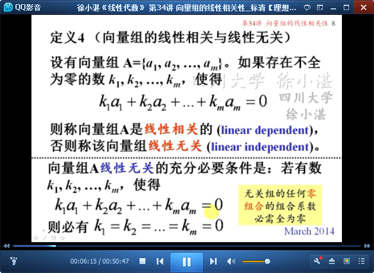

	线性无关 的充分必要条件

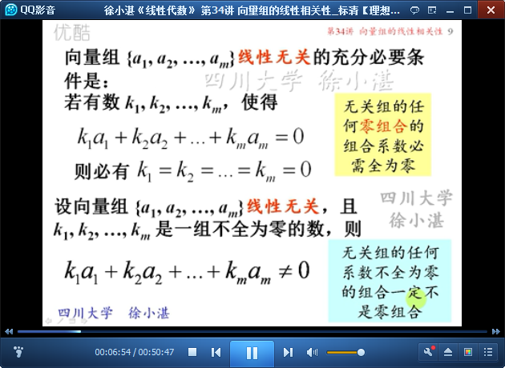

	只有一个向量的向量组

	至少有两个向量的向量组

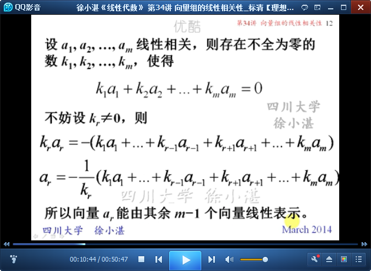

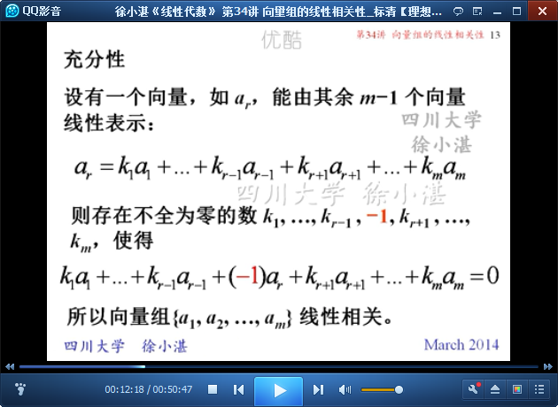

	定理和推论：线性相关的充分必要条件、线性无关的充分必要条件

	两个向量线性相关的充分必要条件

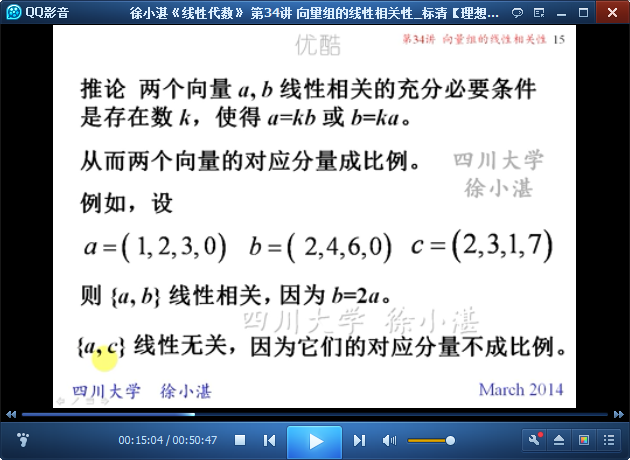

	线性无关组不能含有零向量

	向量组线性相关的充分必要条件

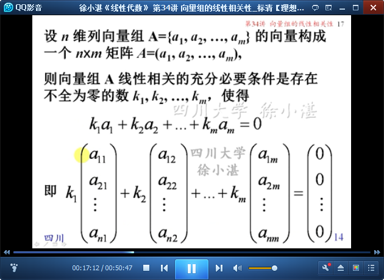

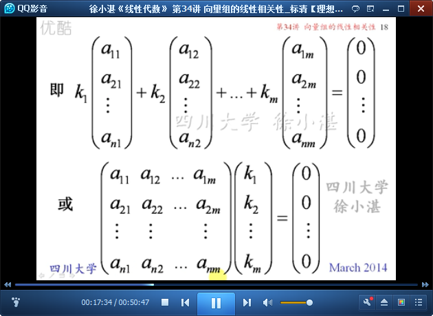

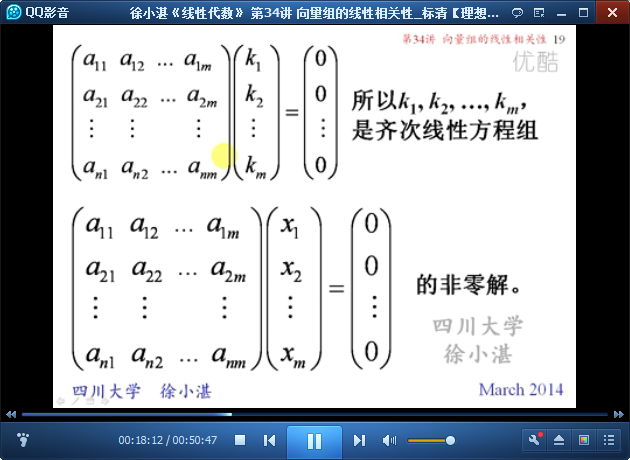

	定理4：

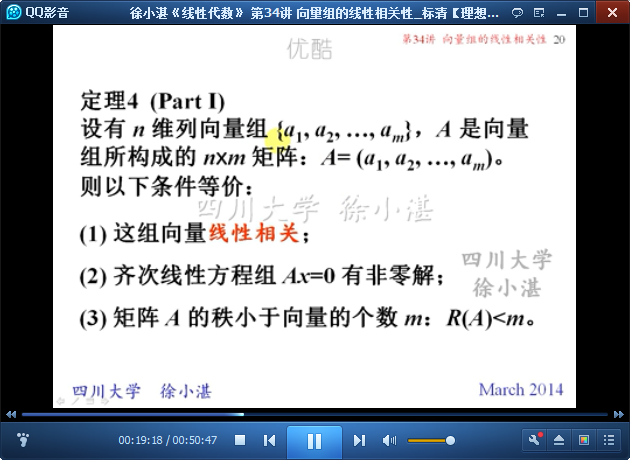

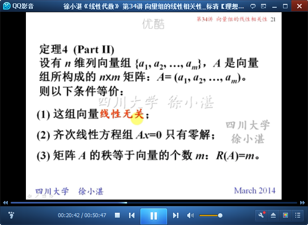

	如何证明向量组线性无关？

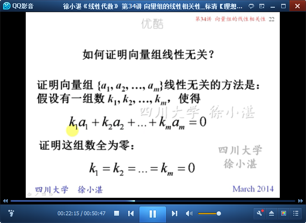

	例1：证明线性无关

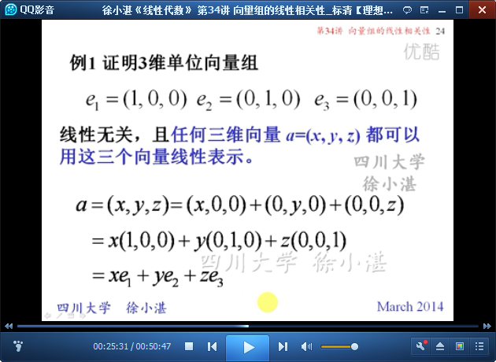

	一般结论

	例2：证明线性无关

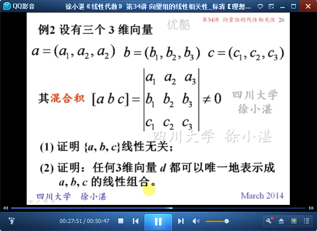

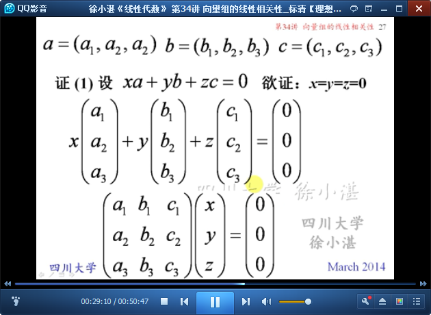

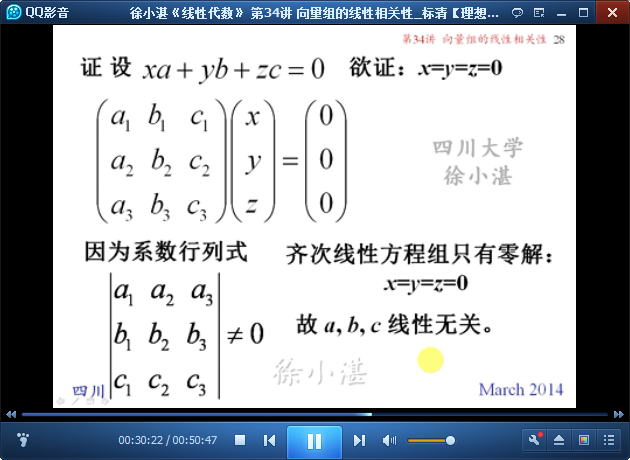

	n个n维向量线性相关的充分必要条件

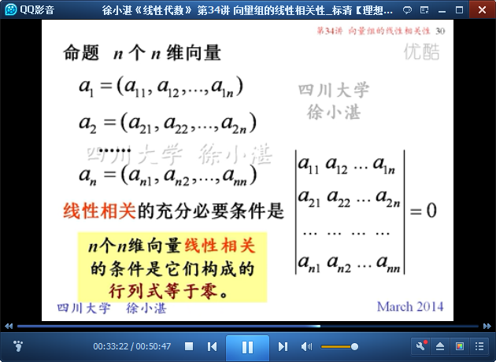

	n个n维向量线性无关的充分必要条件

	例3：判断线性相关性

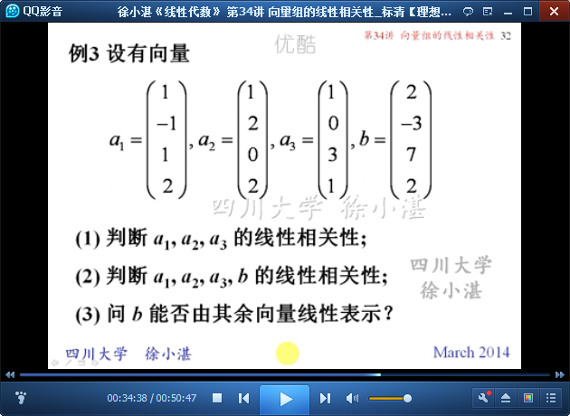

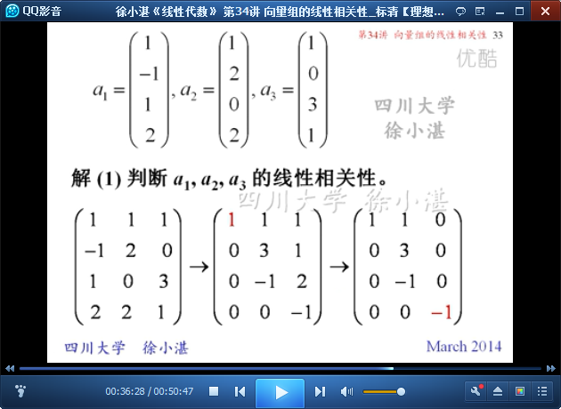

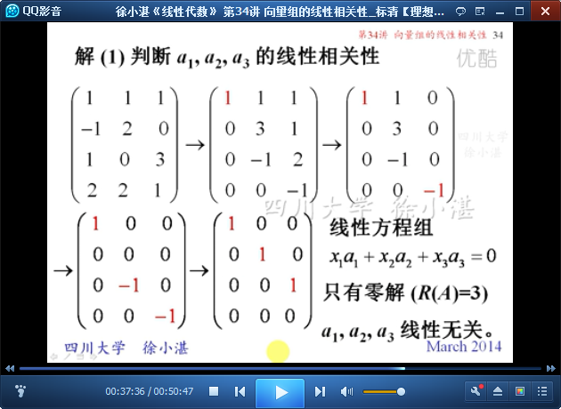

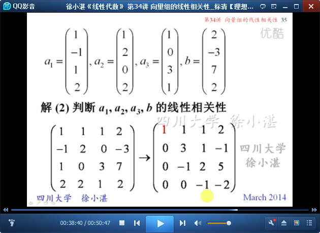

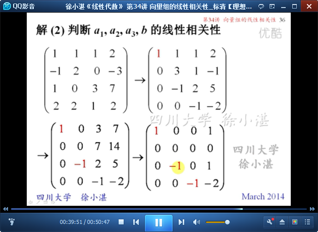

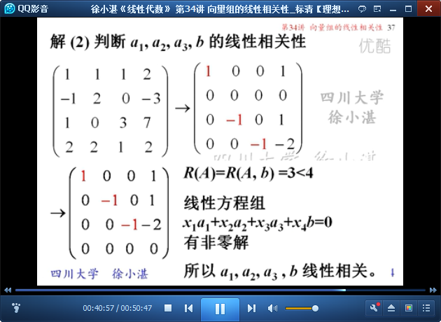

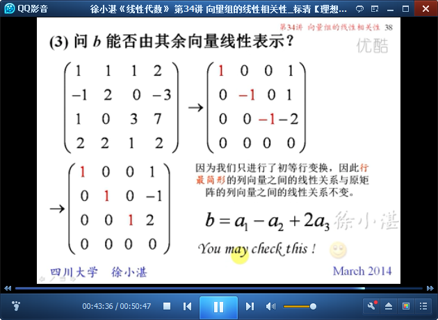

	例4：证明 线性无关

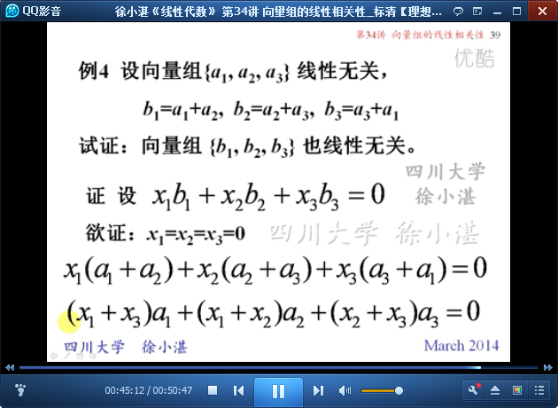

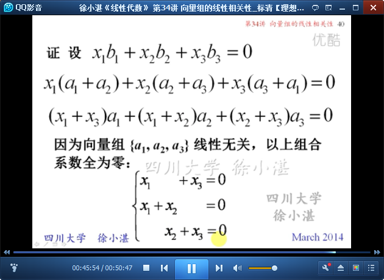

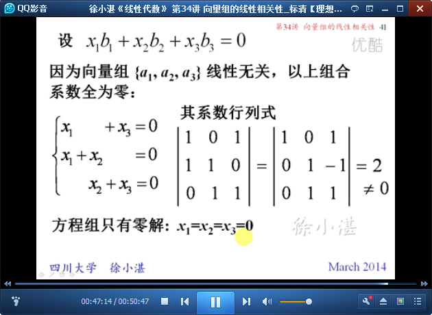

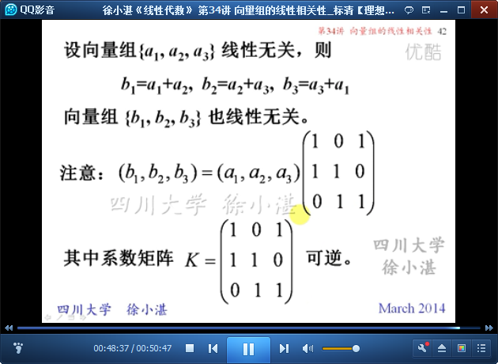

	一般结论：

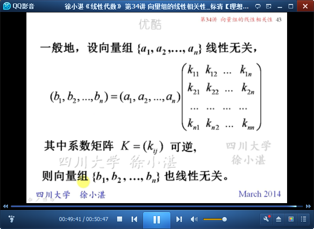

至此结束。 所谓的生活就是问题叠着问题的