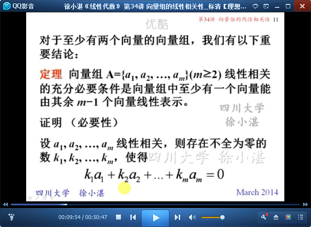
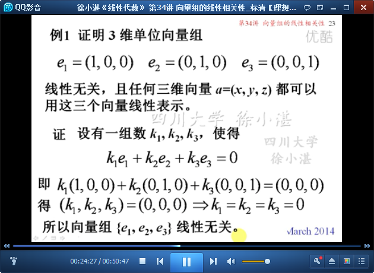
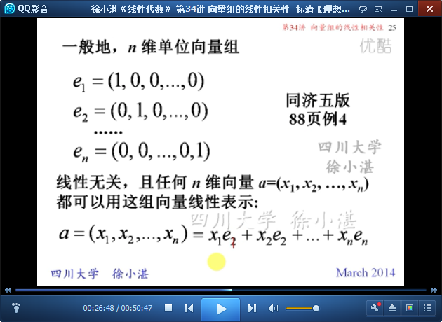
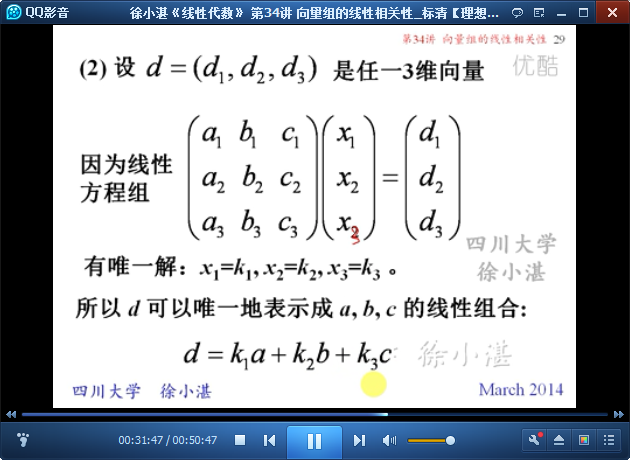
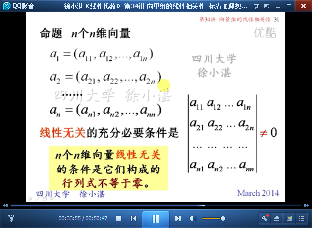

# 向量组的线性相关性 #

## 1、向量组的线性相关与线性无关的概念 ##

	线性相关 与 线性无关

	线性无关 的充分必要条件

	只有一个向量的向量组

	至少有两个向量的向量组

	定理和推论：线性相关的充分必要条件、线性无关的充分必要条件

	两个向量线性相关的充分必要条件

	线性无关组不能含有零向量

	向量组线性相关的充分必要条件

	定理4：

	如何证明向量组线性无关？

	例1：证明线性无关

	一般结论

	例2：证明线性无关

	n个n维向量线性相关的充分必要条件

	n个n维向量线性无关的充分必要条件

	例3：判断线性相关性

	例4：证明 线性无关

	一般结论：

至此结束。 所谓的生活就是问题叠着问题的