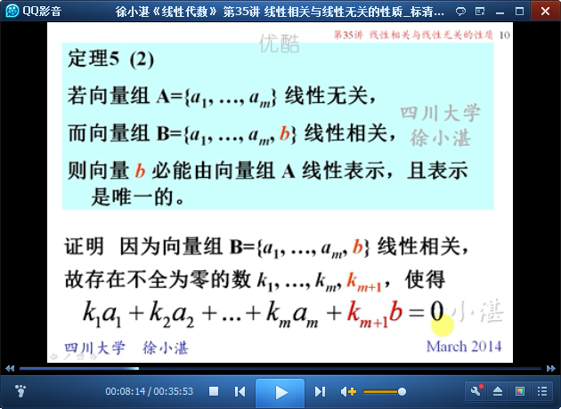

# 线性相关与线性无关的性质 #

思路：

- 在上一讲，给出了一个向量组线性相关与线性无关的概念；
- 在这一讲，来讲线性相关与线性无关的一些性质

## 1、线性相关与线性无关的性质 ##

	回忆：线性相关 和 线性无关 的条件

	定理5（1）：相关组扩大后，仍相关；无关组缩小后，仍无关。

	定理5（2）：无关组增加一个向量变成相关组，则新加入的向量可以被无关组唯一线性表示。

	定理5（2）的推论

	练习：无关组表示向量的形式必唯一；相关组表示向量的形式不唯一。

	定理5（3）：向量个数大于向量维数，则向量组一定线性相关。

	记忆和推论

	定理5（4）：无关组加长后仍无关

	例1：

	例2：

	例3：

> 至此结束。 聪明的人懂得把时间用在自己身上，蠢的则只会为他人透支自己。