# 向量组的秩与极大无关组 #

**向量组的秩**是在**极大无关组**的基础上得出的。

## 1、极大无关组 ##

	回忆：无关组增加一个向量变成相关组，则加入的向量可以被无关组唯一地线性表示。

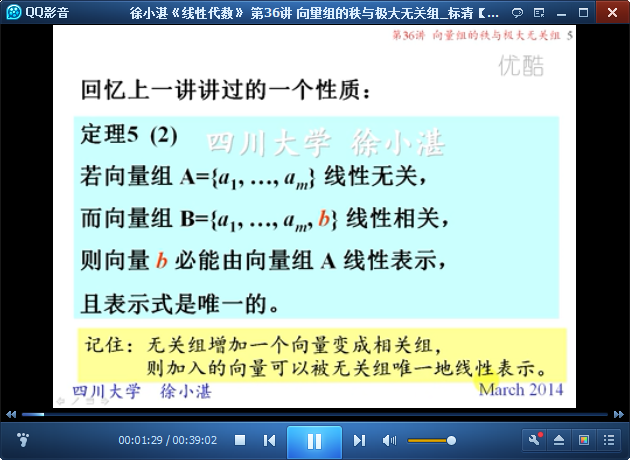

	极大线性无关组

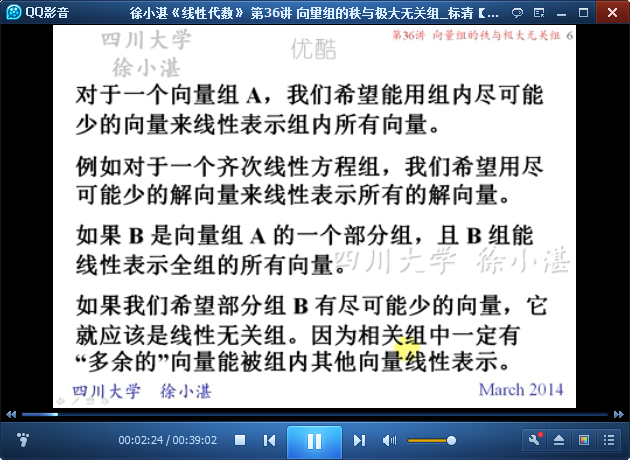

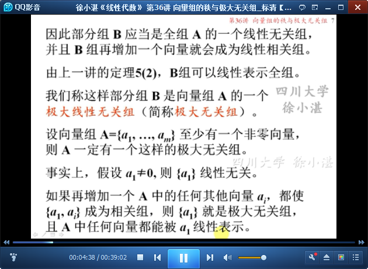

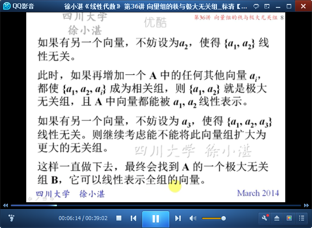

	极大无关组就是不能再扩大的线性无关组

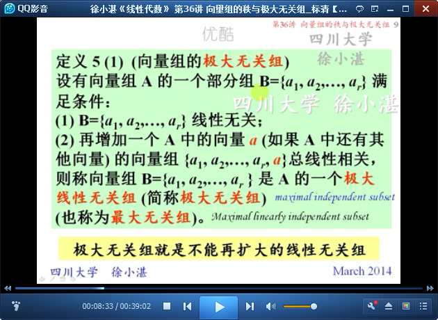

	命题：一个向量组A的极大无关组B与全组等价（即它们能互相线性表示）
	向量组“等价”的概念，就是“互相线性表示”

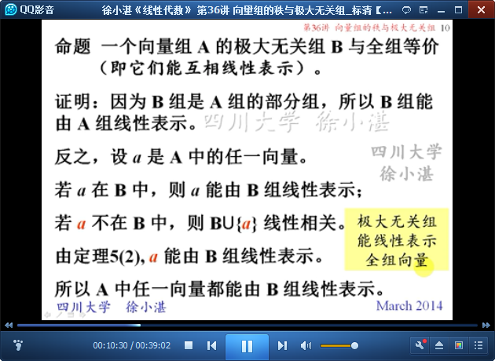

	推论：向量组的任意两个极大无关组等价

	能被更少的向量线性表示的向量组一定线性相关

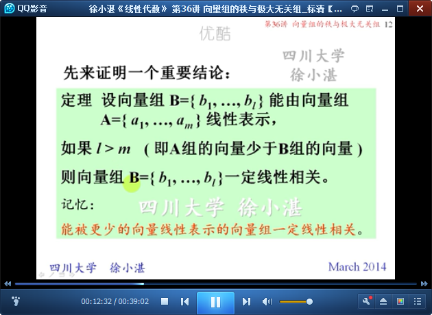

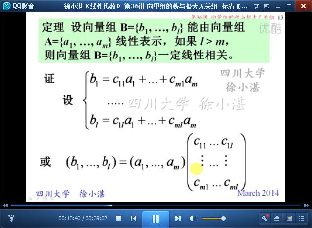

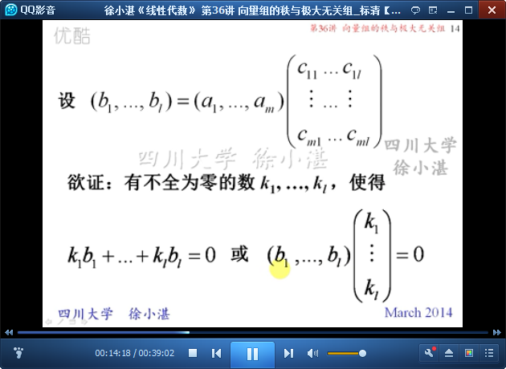

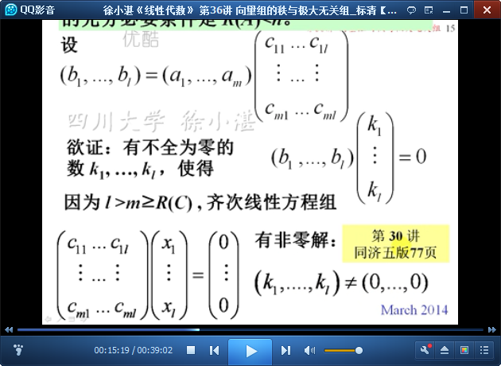

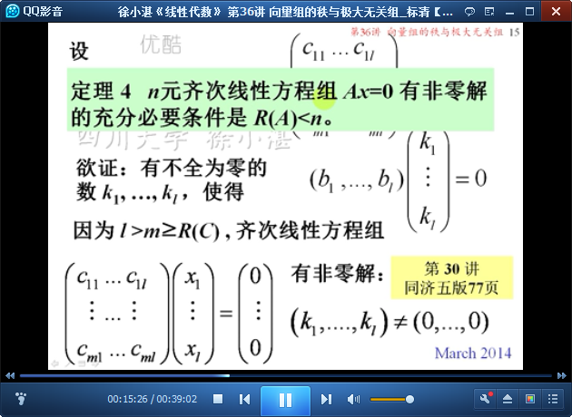

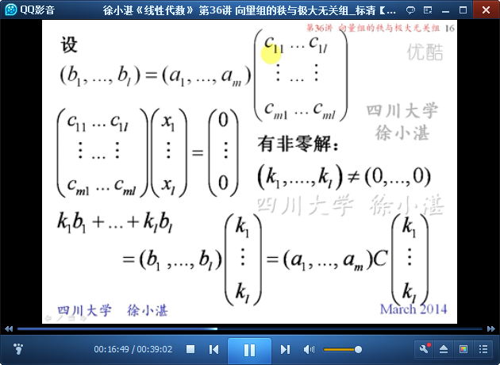

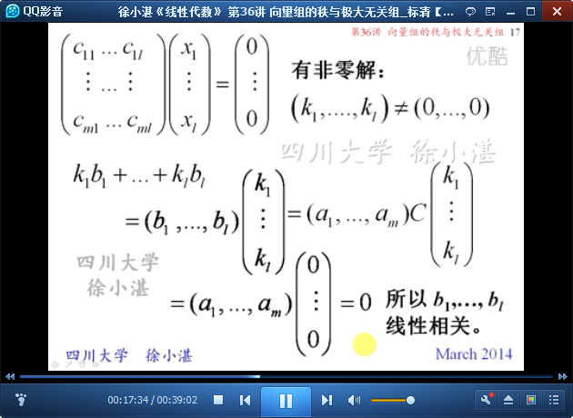

	推论：线性无关组不能由更少的向量线性表示

	两个等价的线性无关组所含的向量的个数一定相同。

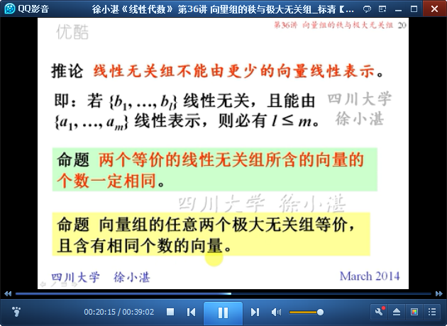

## 2、向量组的秩 ##

	向量组的秩-->极大无关组-->向量个数

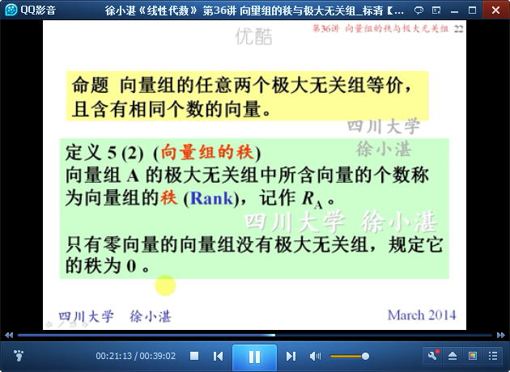

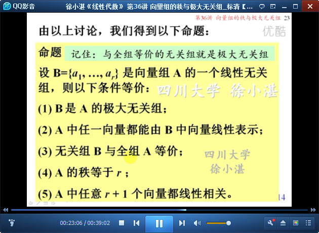

## 3、矩阵的秩与行（列）向量组的秩 ##

	下面讨论矩阵A的秩、A的行向量组的秩（行秩）与列向量组的秩（列秩）的关系

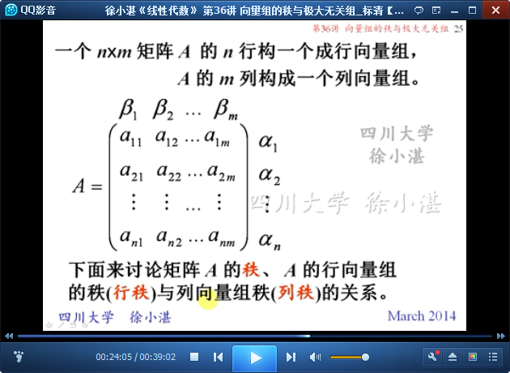

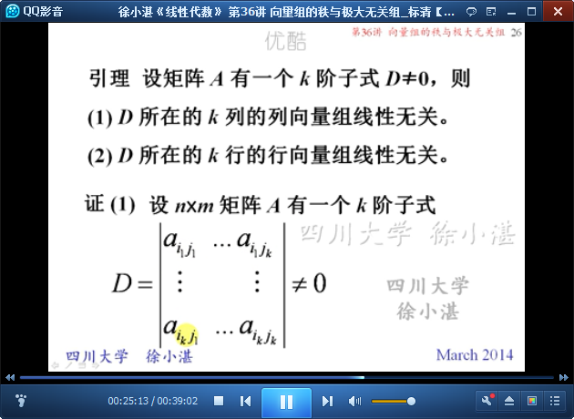

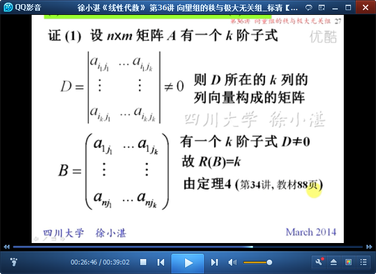

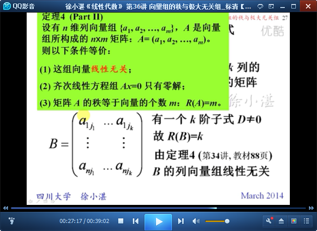

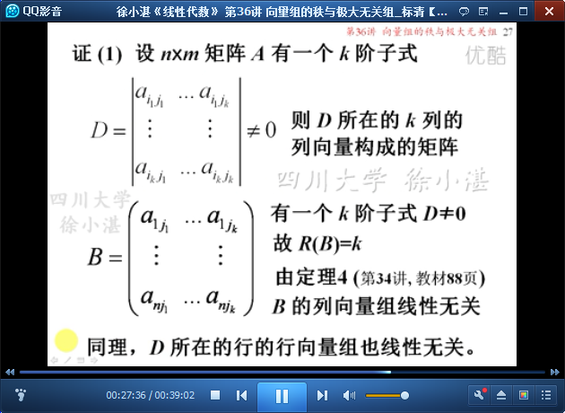

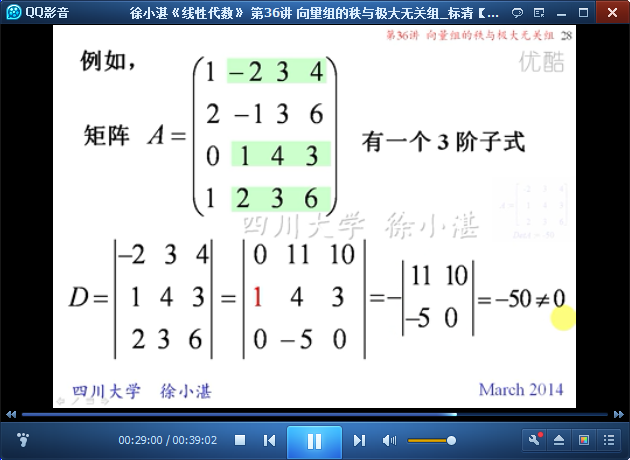

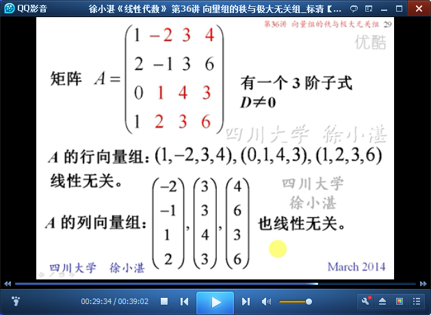

	定理6：三秩相等

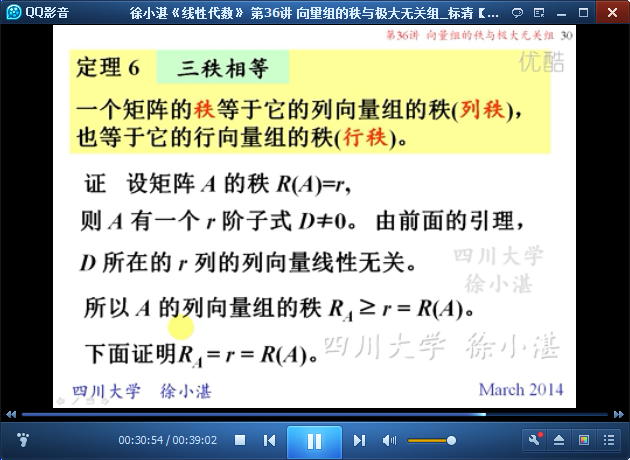

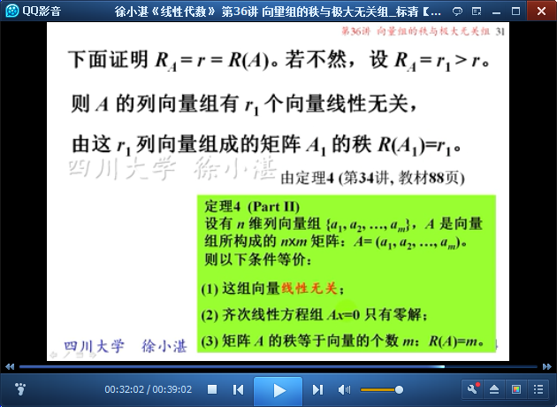

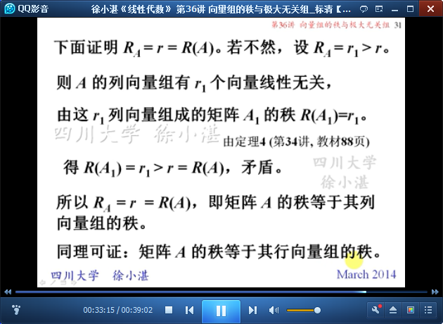

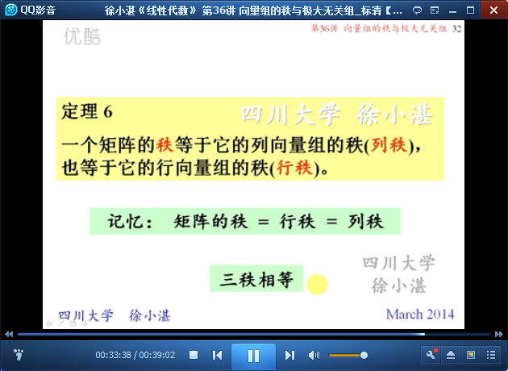

	矩阵的秩-->列向量组的秩

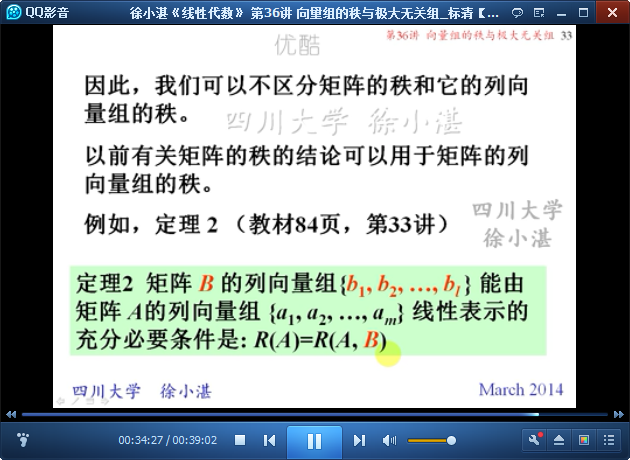

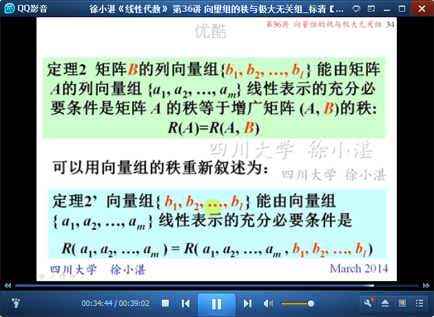

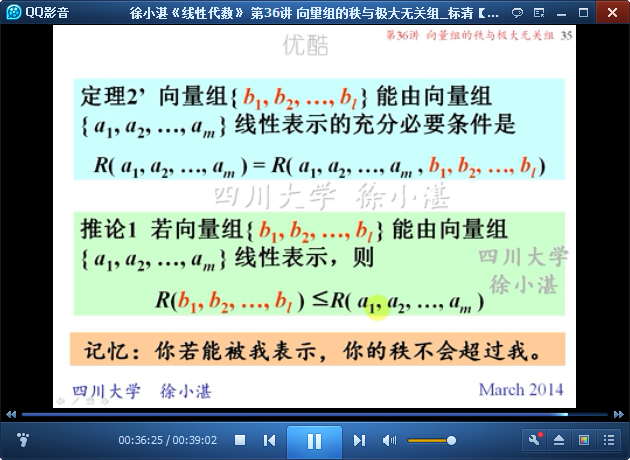

	等价向量必等秩，等秩向量组不一定等价。

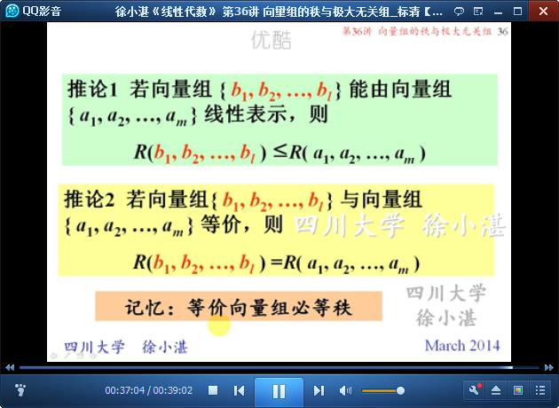

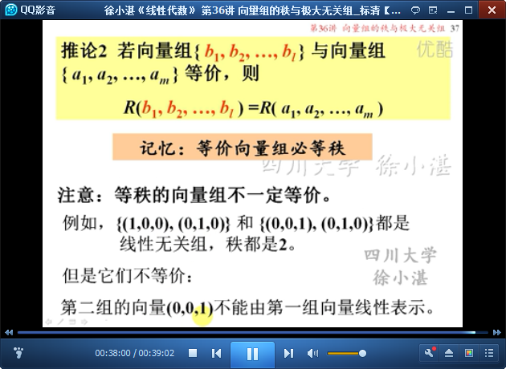

> 至此结束。 20年后，让你觉得更失望的不是你做过的事情，而是你没有做过的事情。