# 向量组的秩与极大无关组（例子） #

主要是讲例子

# 1、求向量组的秩和极大无关组的方法 #

	列向量组“线性无关”、“线性相关”的条件，与齐次线性方程组Ax=0的解的关系

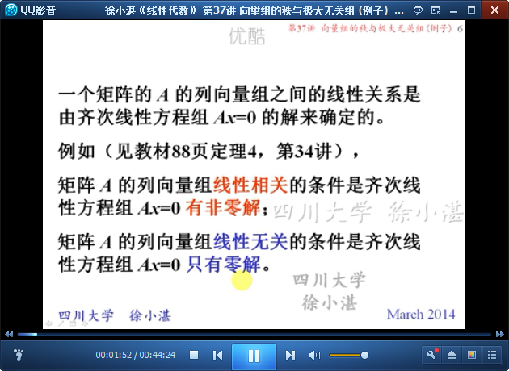

	对矩阵进行“行变换”，不会改变“列向量”的线性关系

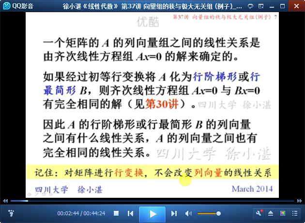

	例如：

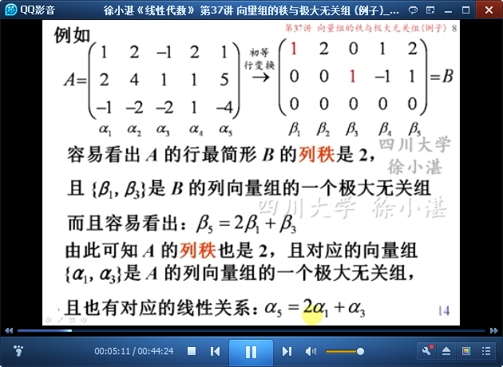

	求向量组的秩与极大无关组的方法 

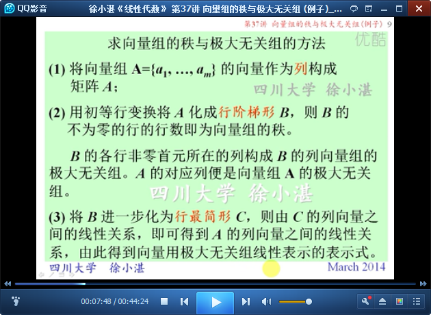

## 2、举例开始 ##

	例11：

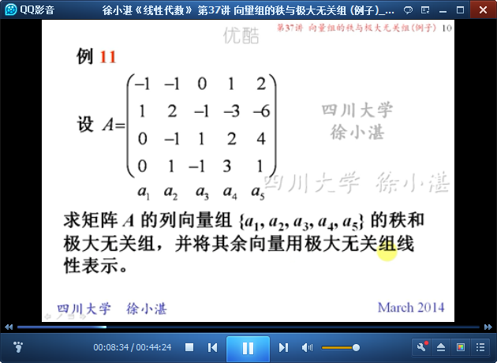

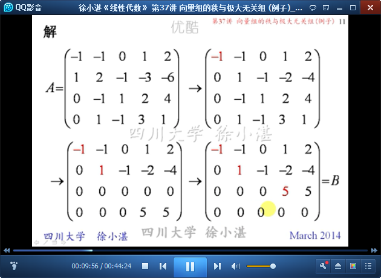

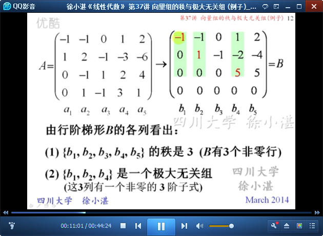

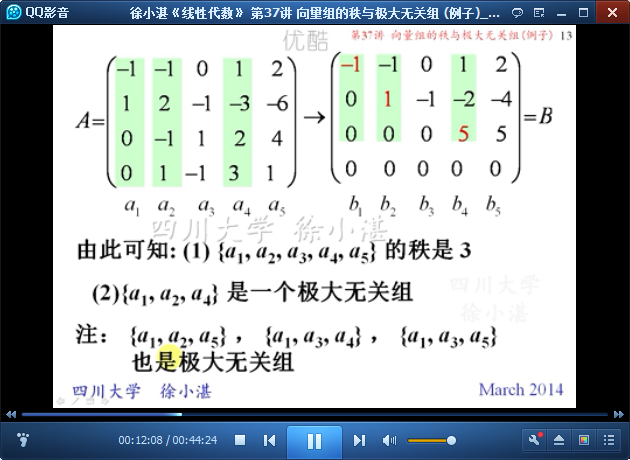

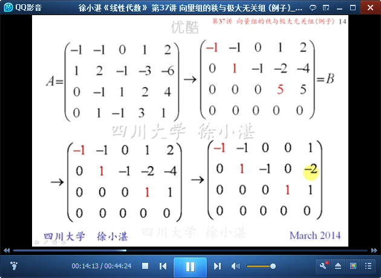

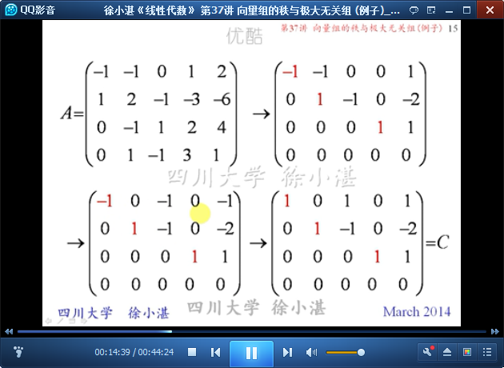

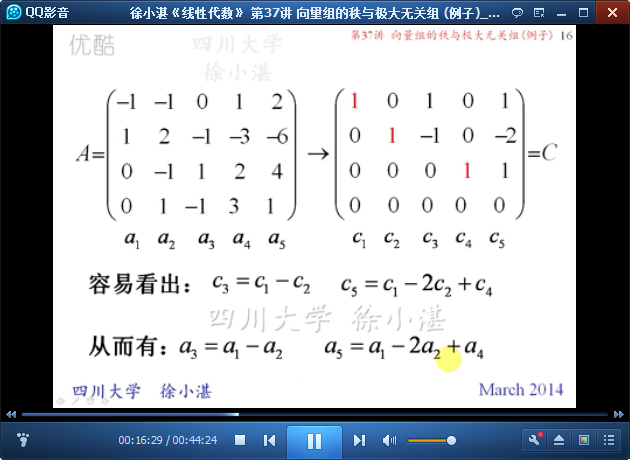

	例：

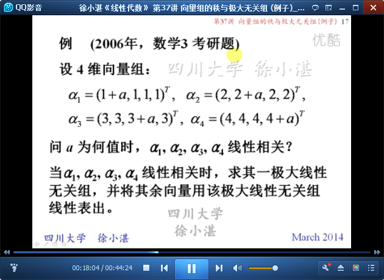

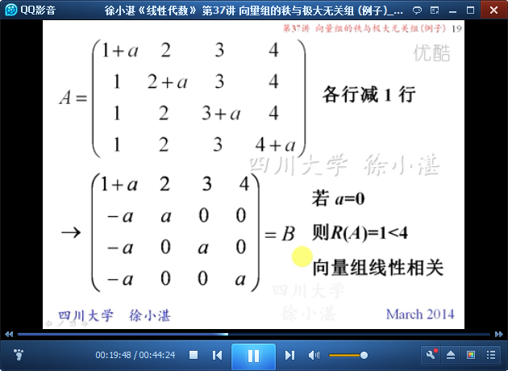

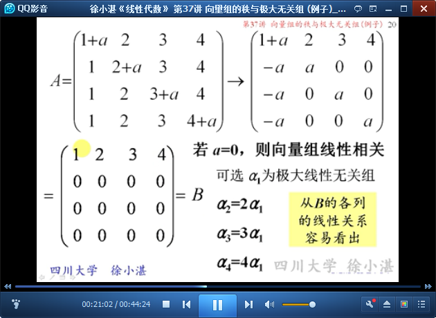

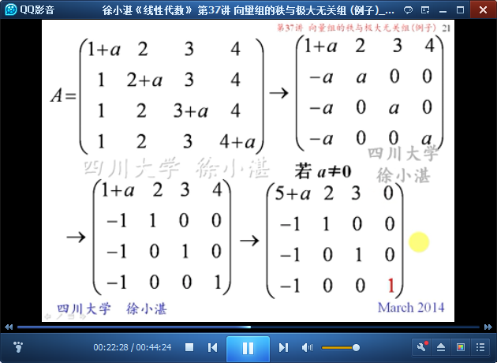

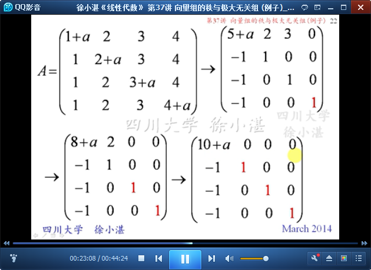

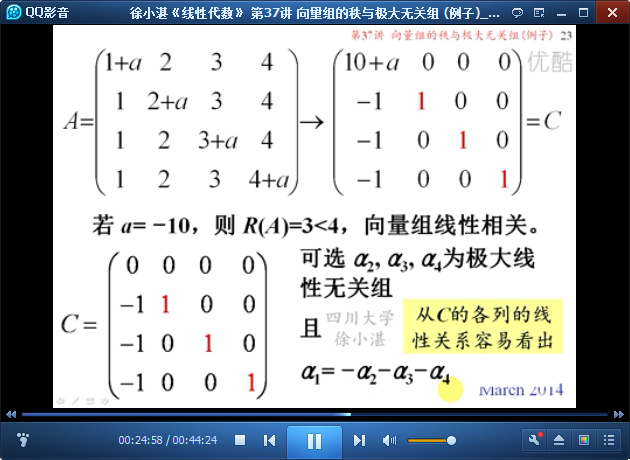

	例：

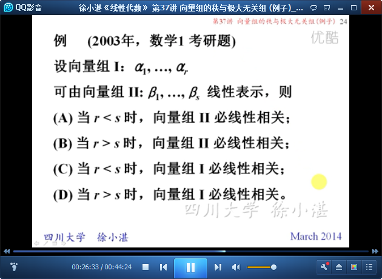

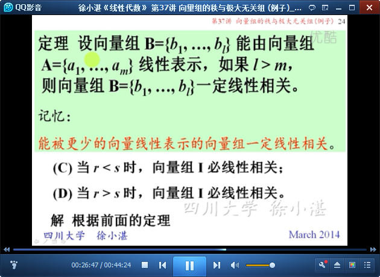

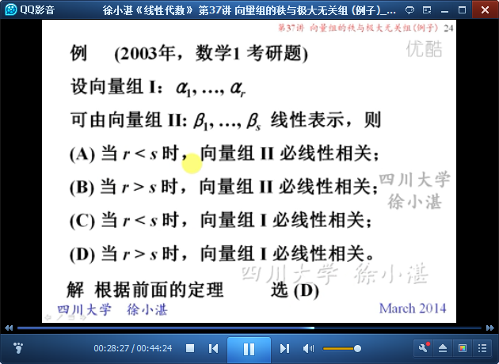

	例：

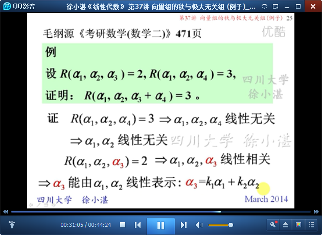

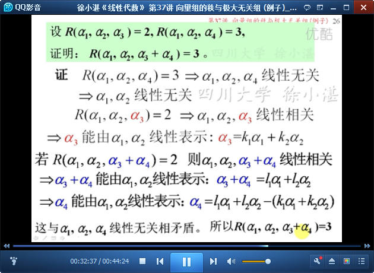

	例：

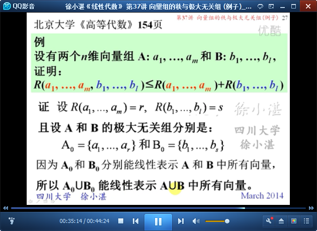

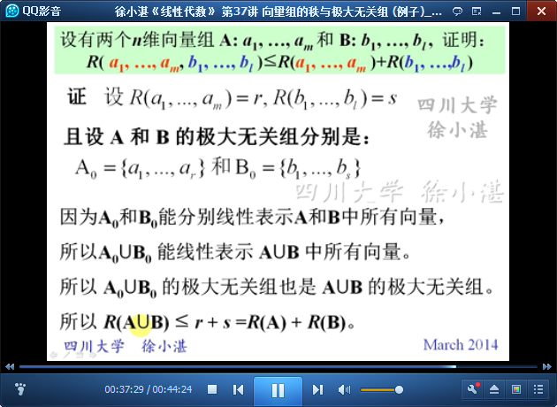

	例：

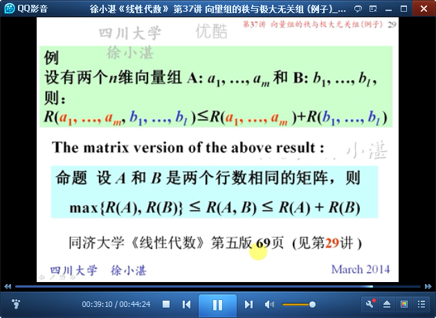

> 至此结束。 聪明在于勤奋，天才在于积累。——华罗庚