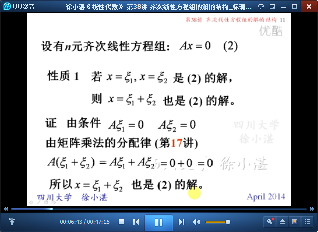

# 齐次线性方程组的解的结构 #

从两个方面讲本节内容：

- （1）复习30讲：线性方程组的解
- （2）齐次线性方程组的解的结构

# 1、复习线性方程组的解 #

	从n元齐次线性方程组 到 矩阵 表示

	齐次线性方程组：有非零解 和 只有零解 的条件

	解齐次线性方程组Ax=0的步骤

## 2、齐次线性方程组的解的结构 ##

	概念：解向量

	n元齐次线性方程组的性质：解的线性组合 仍是 方程组的解

	解集-->封装的

	无穷多解的解集的结构探究

	线性无关的解-->通解

	概念：解集的极大无关组-->基础解系

	定理：基础解系线性无关

	基础解系 和 解集（解的结构）

	基础解系不唯一，且其解向量个数为n-R(A)

	定理7：齐次线性方程组解集的秩

	例12：

	例：

> 至此结束。 阅读的最大理由是想摆脱平庸，早一天就多一份人生的精彩；迟一天就多一天平庸的困扰。——余秋雨