# 齐次线性方程组的解的结构 #

上一讲，我们讲了齐次线性方程组的解的结构；
这一讲，来讲齐次线性方程组的解的结构的一些应用。

## 1、复习上一讲的主要内容 ##

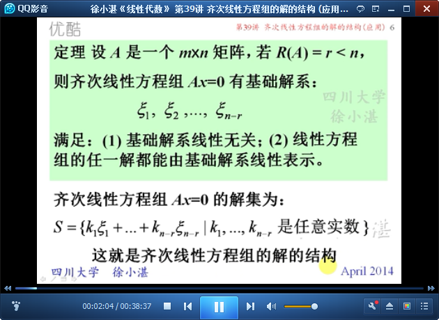

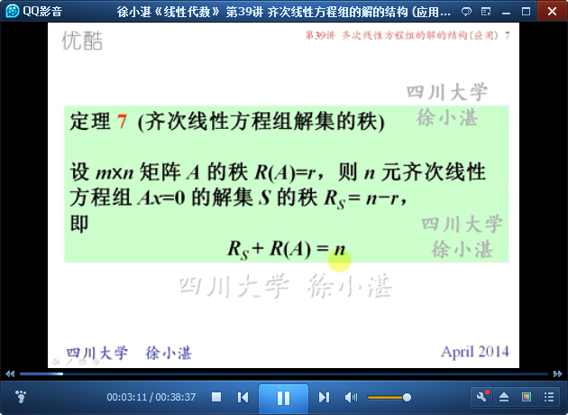

## 2、利用齐次线性方程组的解的结构讨论矩阵的秩 ##

	例13：

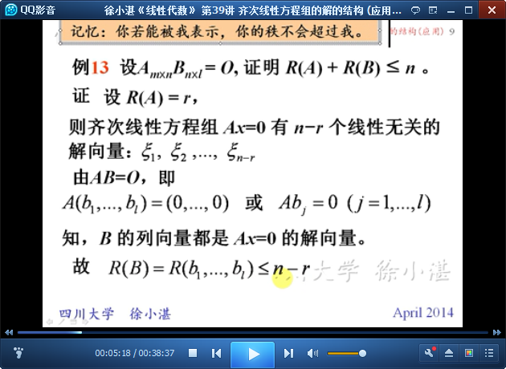

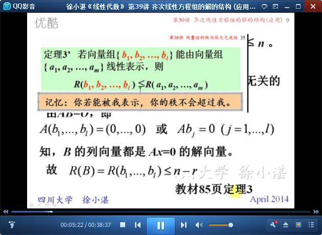

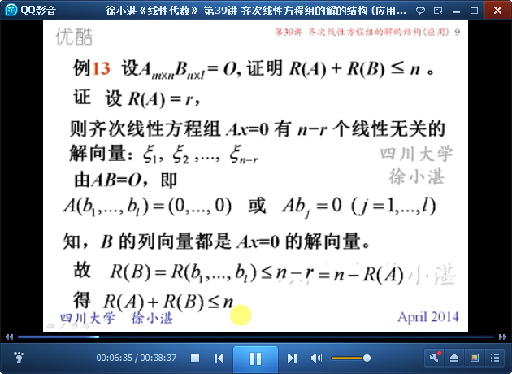

	例：

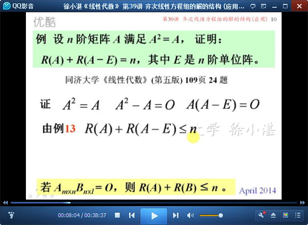

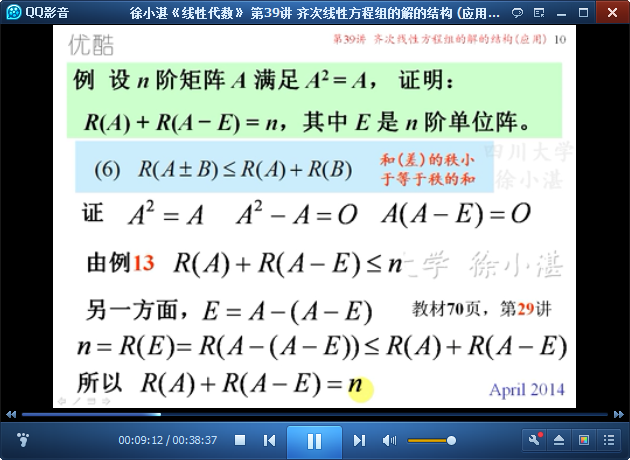

	例：

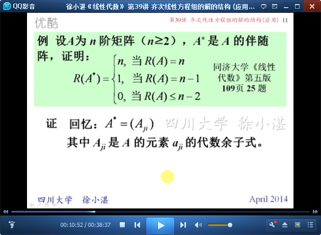

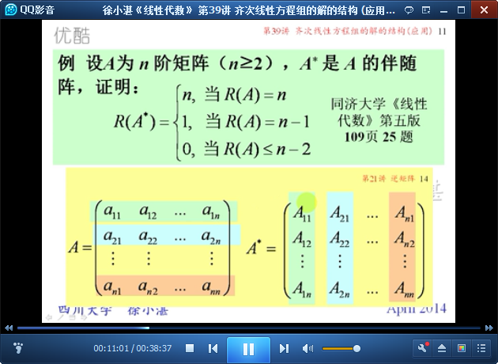

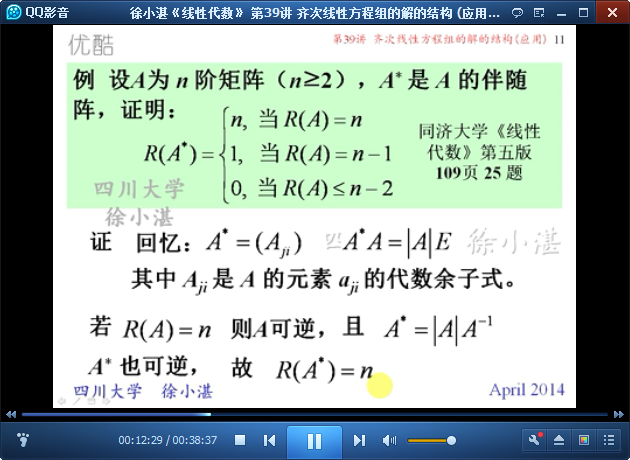

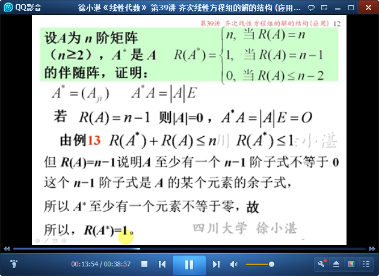

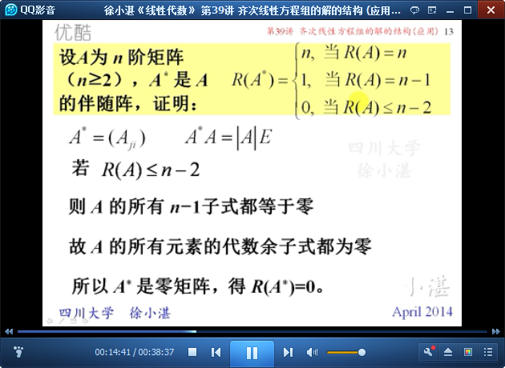

	例：

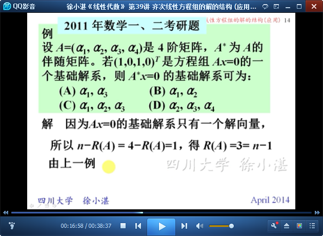

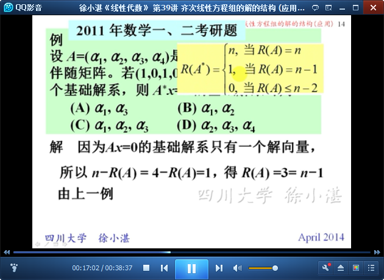

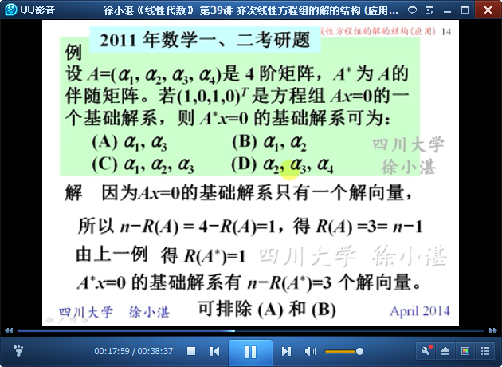

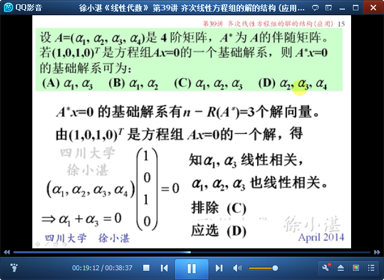

	例14：

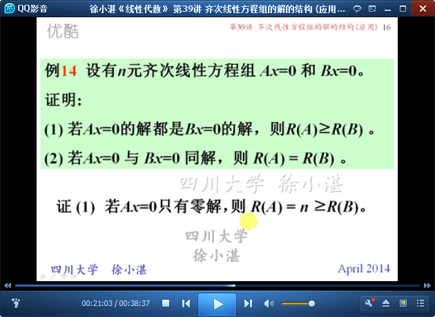

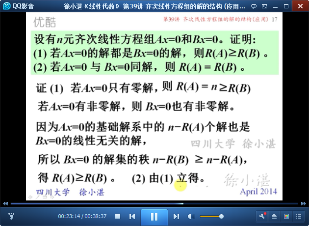

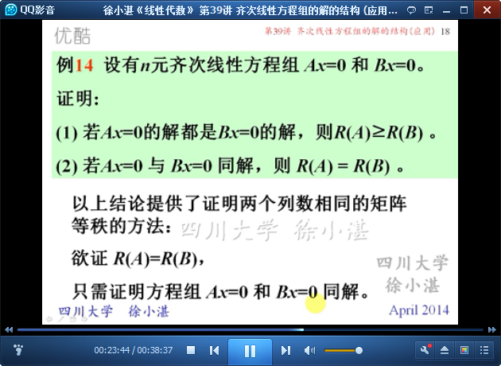

	例15：

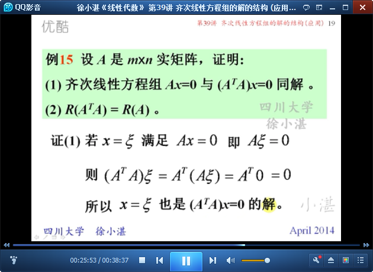

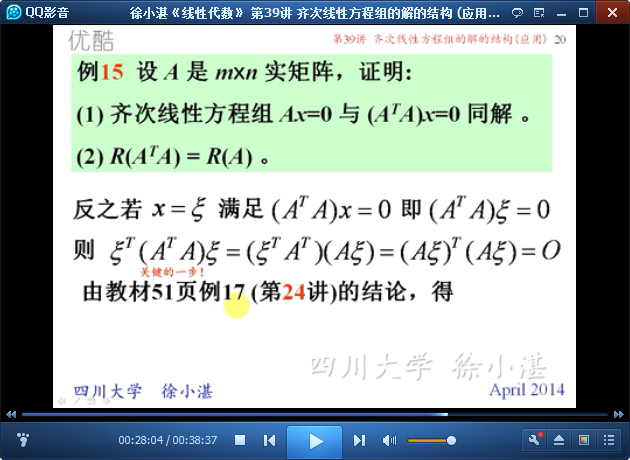

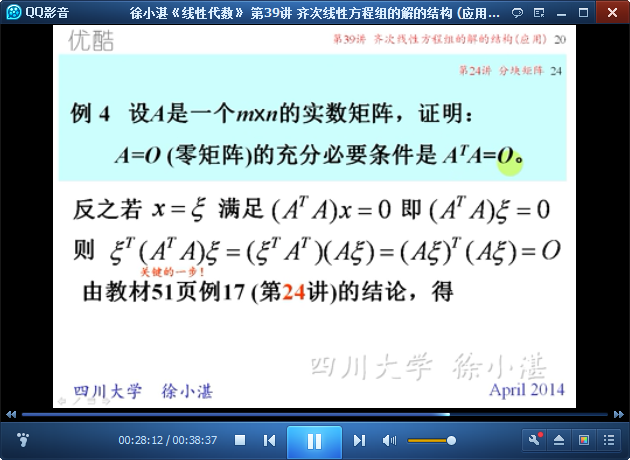

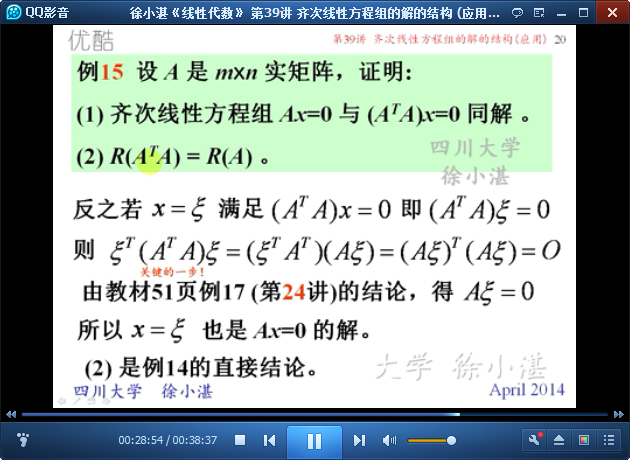

	例：

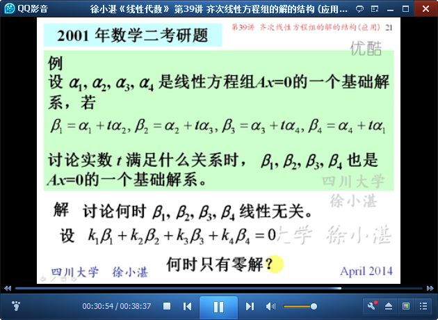

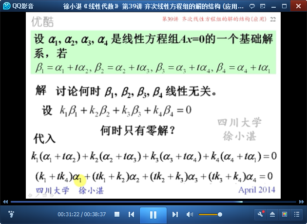

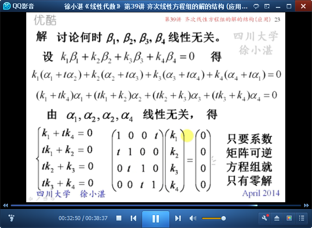

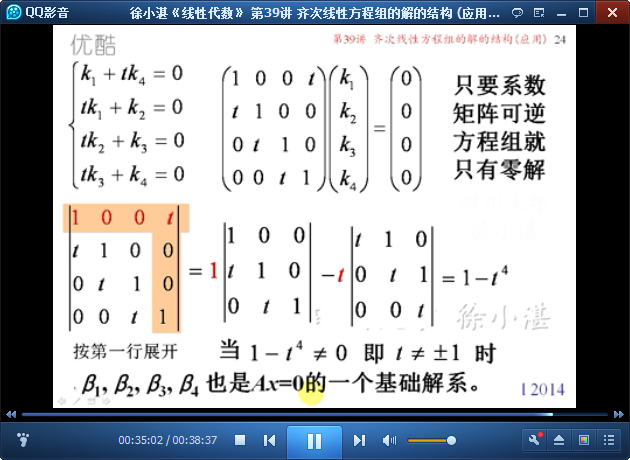

	一般的推论

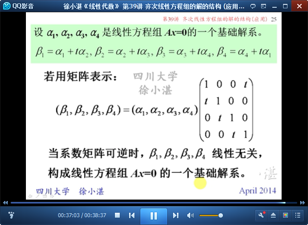

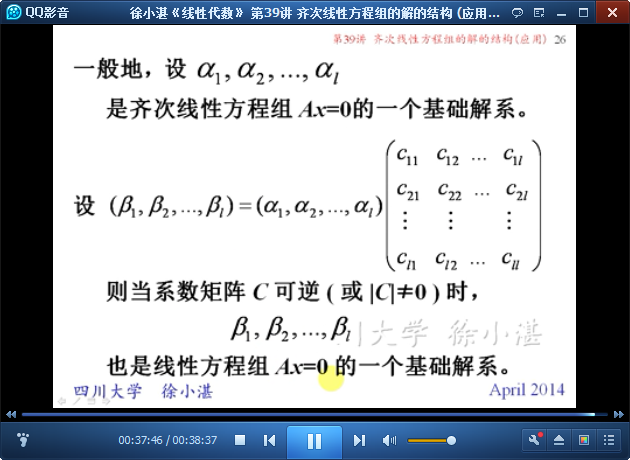

> 至此结束。 年岁愈来愈大，从青春中继承下来的东西只有一件，那就是对平庸生活的狂怒，一种不甘没落的决心。