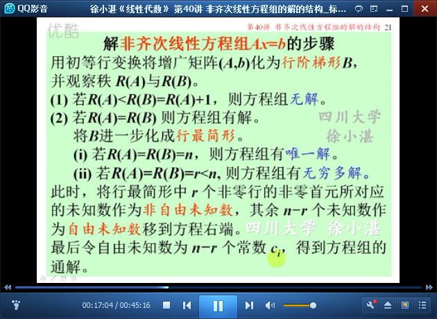
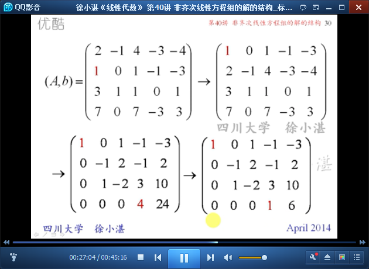

# 非齐次线性方程组的解的结构 #

在38讲，讲了齐次线性方程组的解的结构；
在本讲，讲非齐次线性方程组的解的结构。

## 1、复习30讲线性方程组的解 ##

	线性方程组-->系数矩阵-->增广矩阵-->秩与解的关系

## 2、复习38讲齐次线性方程组的解的结构 ##

	非齐次线性方程组的两个解的差是对应齐次方程组的解

	非齐次线性方程组的解与导出组的解之和是非齐次方程组的解

## 3、非齐次线性方程组的解的结构 ##

	非齐次线性方程组的通解

## 4、例题 ##

	解非齐次线性方程组Ax=b的步骤

	例1：

	例2：

	例3：

	例4：

> 至此结束。 总是在一种生活里向往另一种生活， 然后错过现在的生活，顺带也失去了向往的生活。