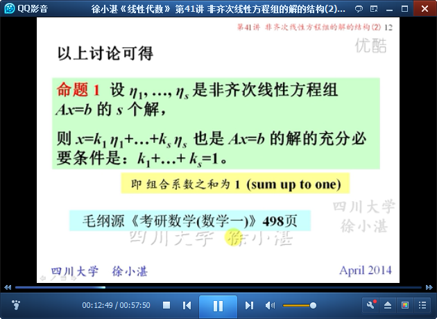
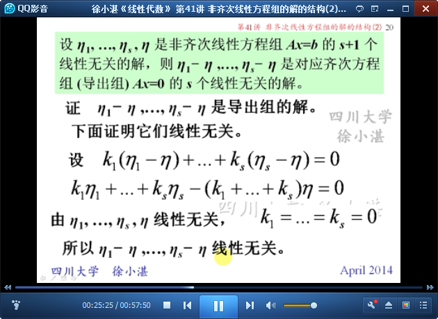
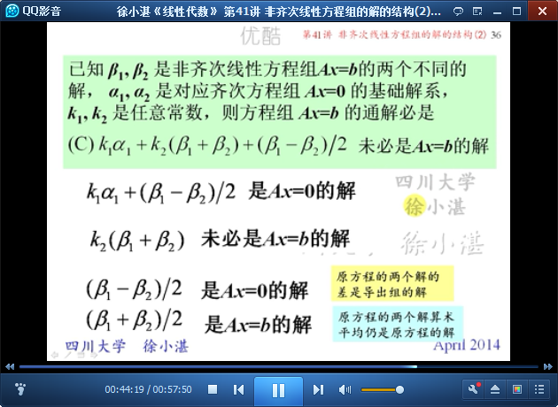
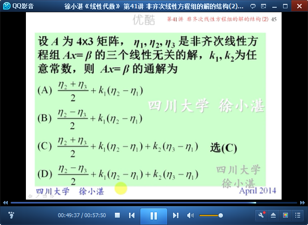
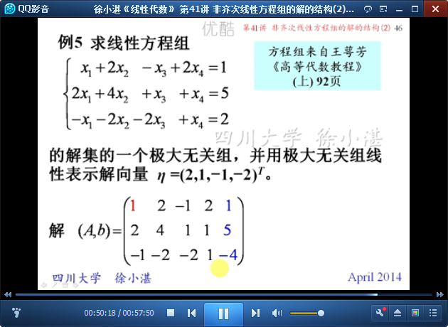
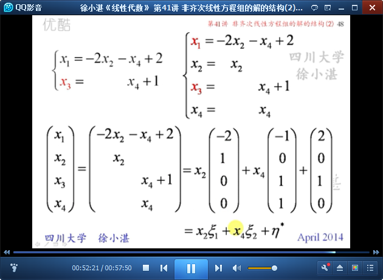
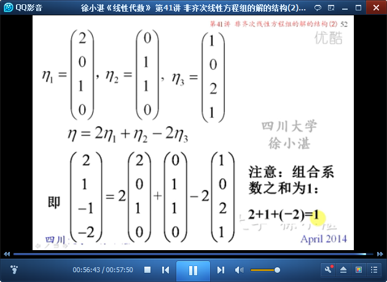

# 非齐次线性方程组的解的结构（2） #

在40讲，讲了非齐次线性方程组的解的结构；
在本讲，来讨论与非齐次线性方程组的解的结构相关的问题。

## 1、复习线性方程组的解的几个性质 ##

	n元齐次线性方程组和n元非齐次线性方程组的性质

## 2、非齐次线性方程组的解 ##

	非齐次线性方程组的解集关于线性运算不是封闭的

	命题1：

	命题2：

	例1：

	例2：

	命题3：

	命题4：

	命题5：

	推论：

	例3：

	例4：

	例5：

> 至此结束。 读书不要贪多，而是要多加思索，这样的读书使我获益不少。——卢梭