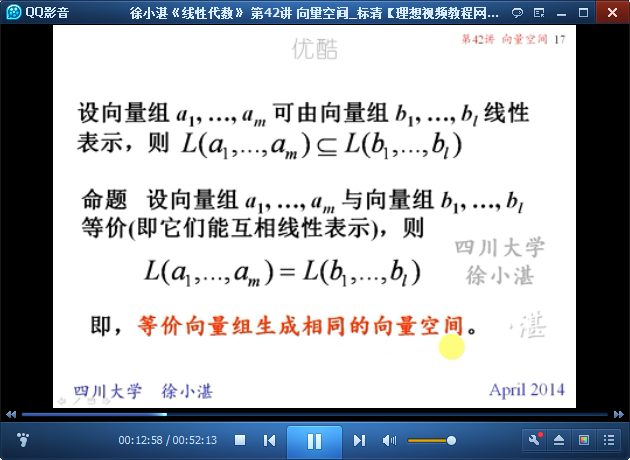

# 向量空间 #

## 1、向量空间 ##

	向量空间定义

	例1：判断是否为向量空间

	齐次线性方程组Ax=0的解空间

## 2、向量组生成的向量空间 ##

	向量组生成的向量空间

	向量空间的大小、等价

## 3、向量空间的基与维数 ##

	向量空间的基与维数的定义

	定义8：坐标

	例1：

	过渡矩阵

	过渡矩阵-->坐标变换

	例2：求过渡矩阵和坐标

	例3：求原来的基

> 至此结束。 坏书如同坏朋友，能使我们堕落。