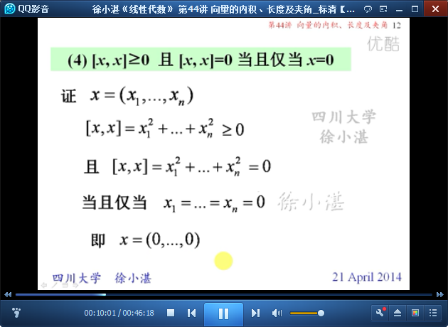
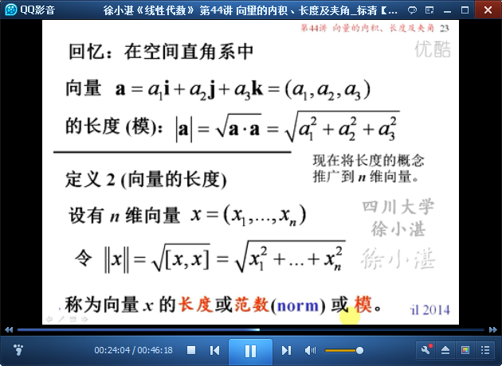

# 向量的内积、长度及夹角 #

本讲主要包括三部分内容：

- （1）向量的内积：数量积-->扩展-->内积
- （2）施瓦茨不等式：两个向量的“内积”与两个向量的“长度”的大小关系
- （3）向量的长度：长度/模-->夹角

> 夹角：（两个向量的）内积-->（两个向量各自的）长度-->（两个向量的）夹角
> 内积，是针对两个向量的
> 长度，是针对一个向量的
> 夹角，是针对两个向量的

## 1、向量的内积 ##

	数量积、夹角

	内积是数量积的推广

	内积的性质

## 2、施瓦茨不等式 ##

	施瓦茨（Schwarz）不等式

	施瓦茨（Schwarz）不等式的积分形式

## 3、向量的长度 ##

	向量长度的定义

	非零向量的单位化

	内积的绝对值不大于长度之积

	长度的性质

	夹角：内积和长度，引出夹角

	正交：正交 与 内积 的关系

	例1：

	例2：

> 至此结束。 读书和学习是在别人思想和知识的帮助下，建立起自己的思想和知识。——普希金
