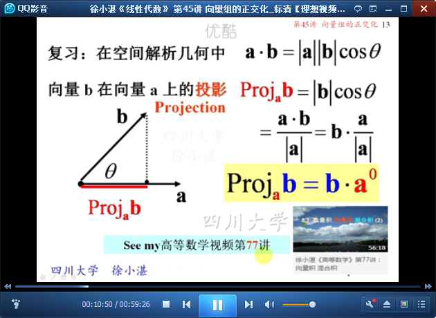

# 向量组的正交化 #

## 1、正交向量组的性质 ##

	非零正交组必是线性无关组，但无关组不一定是正交组

	例1：

## 2、规范正交基 ##

	投影

	规范正交基

## 3、施密特正交化过程 ##

	格兰姆-施密特正交化过程：无关组-->正交组

	三维空间的正交化过程

	下面给出施密特正交化过程

	例2：

	例3：

> 至此结束。 别怀念过去，幻想未来，虚度现在。