# 正交矩阵及正交变换 #

## 1、正交矩阵 ##

	命题1：此处是m*n阶矩阵

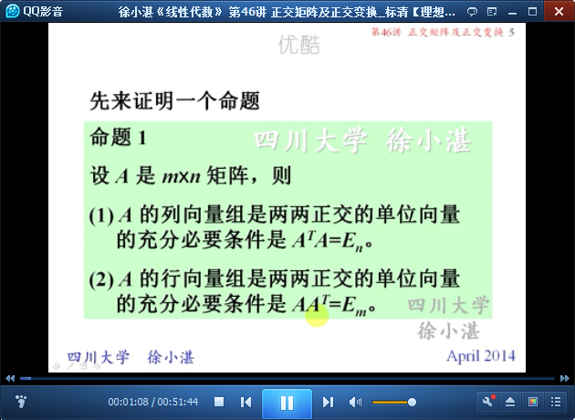

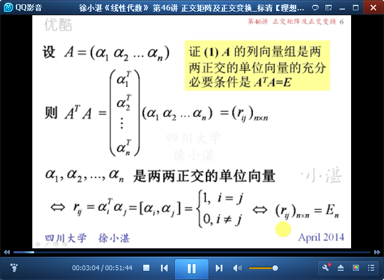

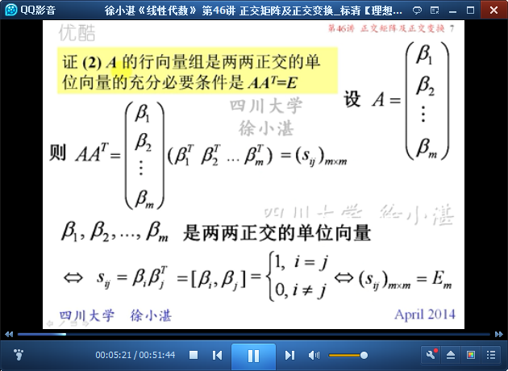

	推论：此处是n阶方阵

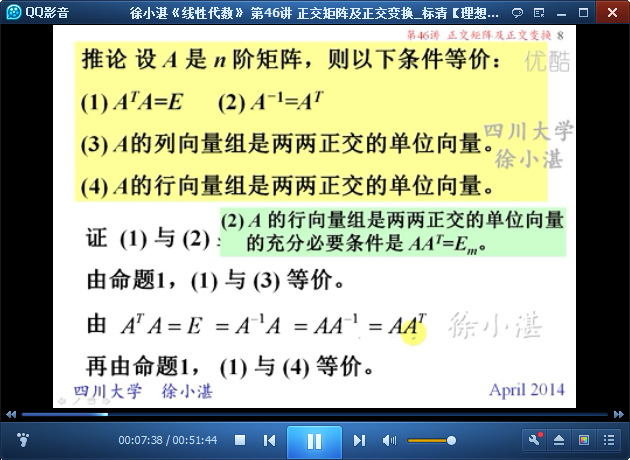

	定义：正交阵

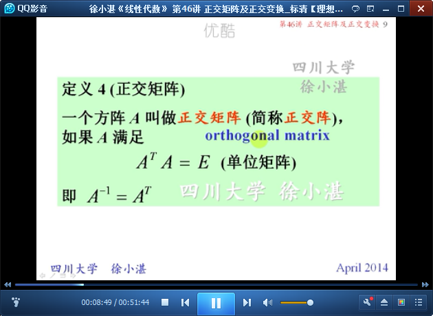

	命题2：由命题1得到

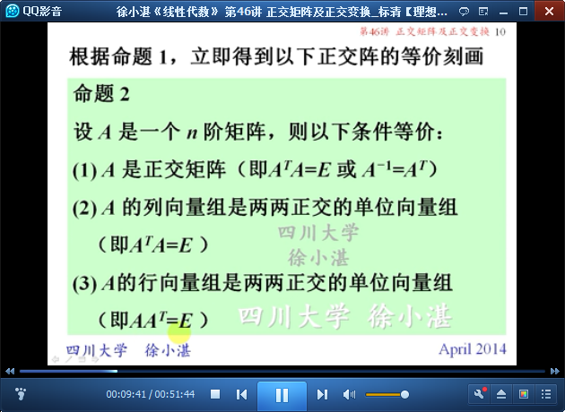

	例1：

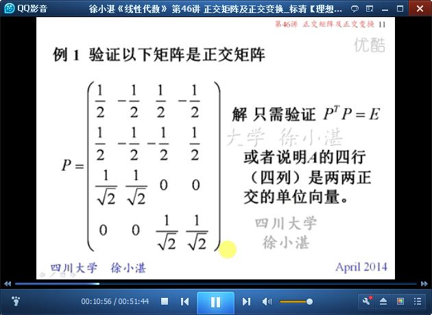

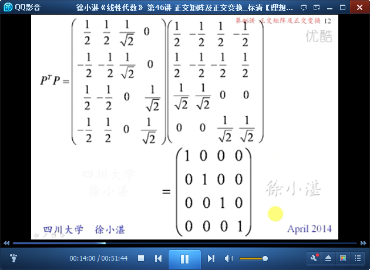

	正交矩阵的性质

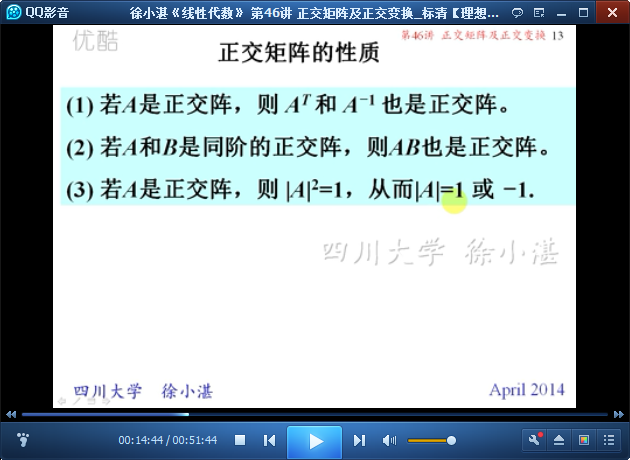

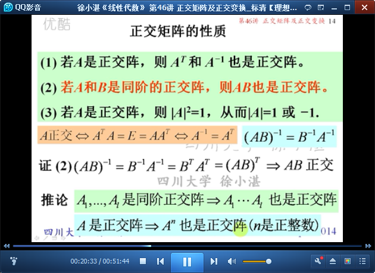

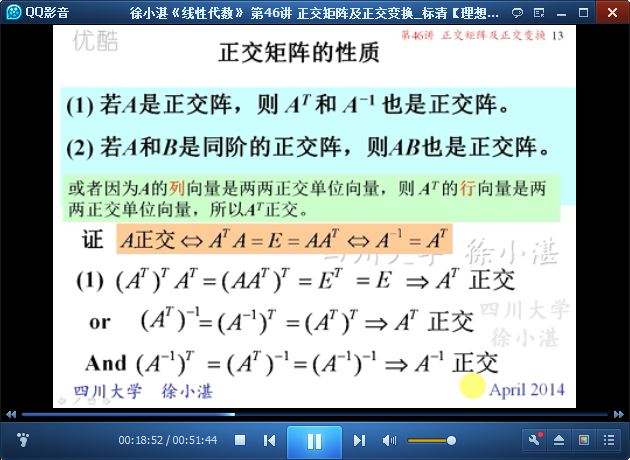

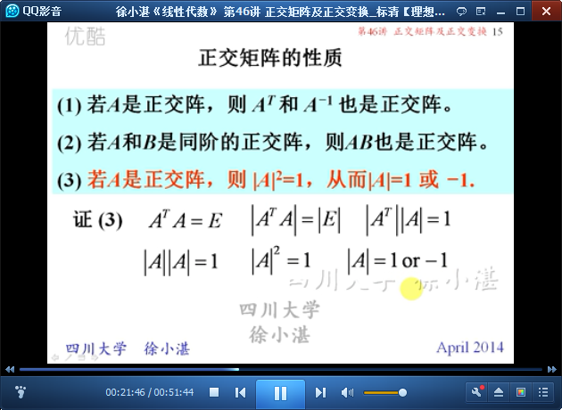

	思考和例2：

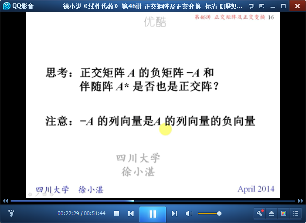

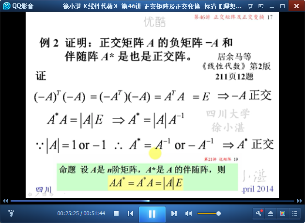

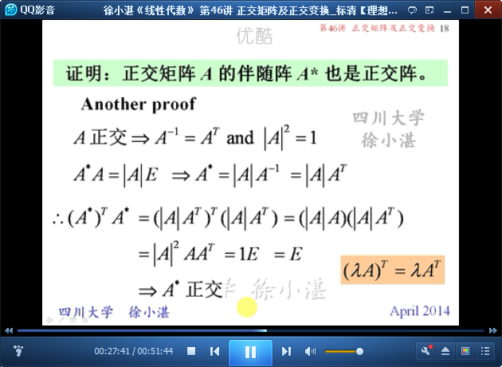

	例3：

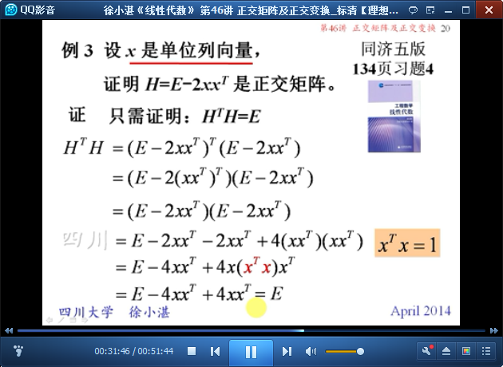

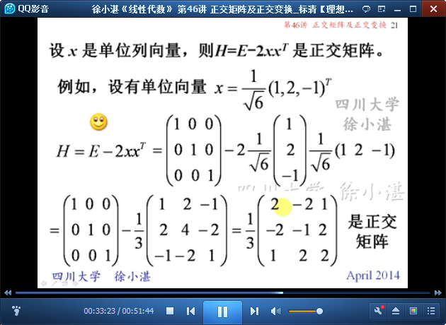

	例4：

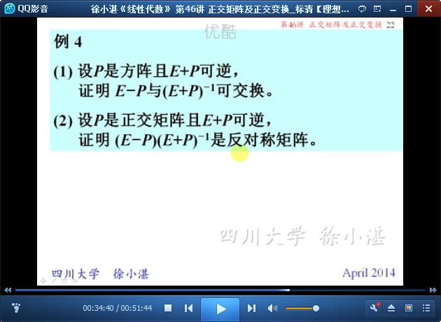

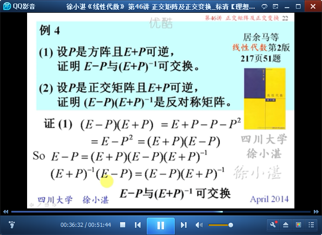

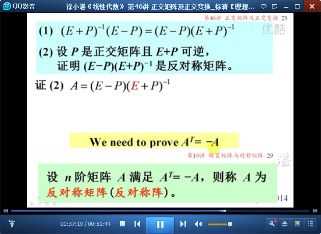

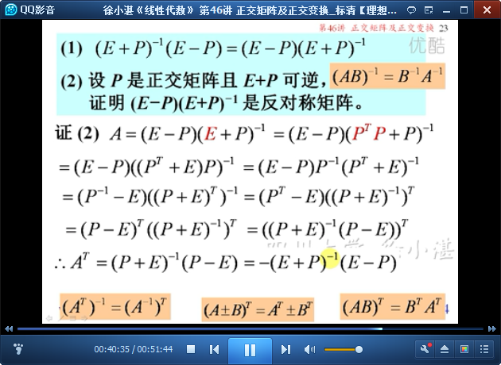

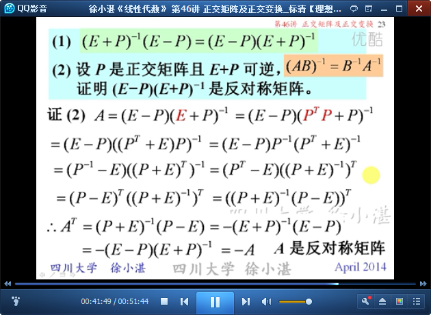

## 2、正交变换 ##

	定义：正交变换

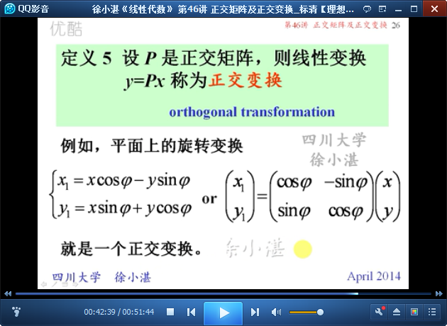

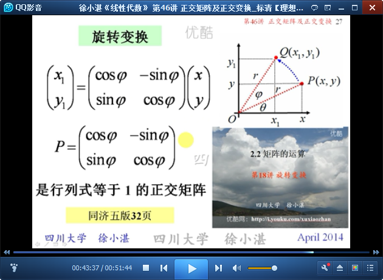

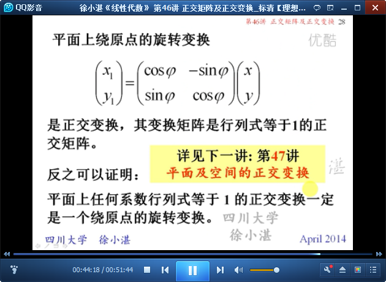

	正交变换的性质

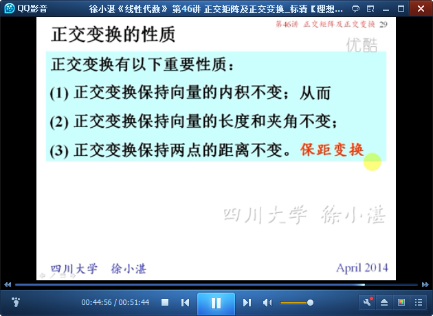

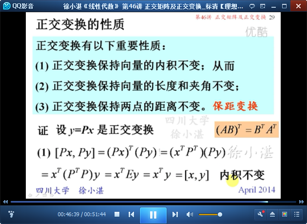

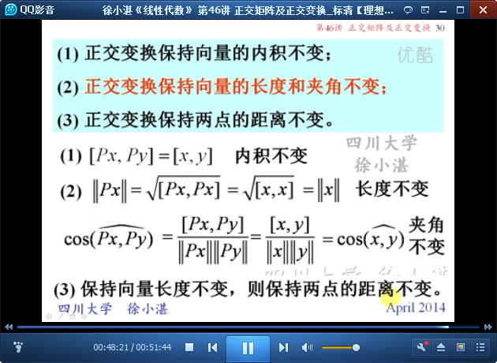

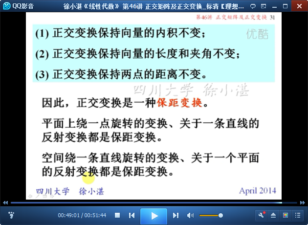

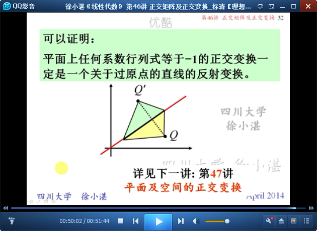

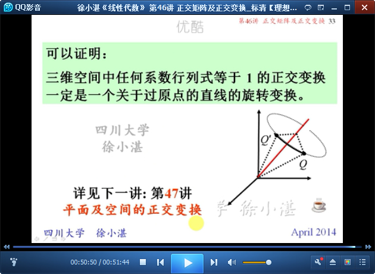

> 至此结束。 读书时要深思多问。只读而不想，就可能人云亦云，沦为书本的奴隶；或者走马看花，所获甚微。——王梓坤