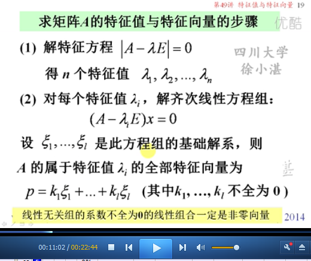
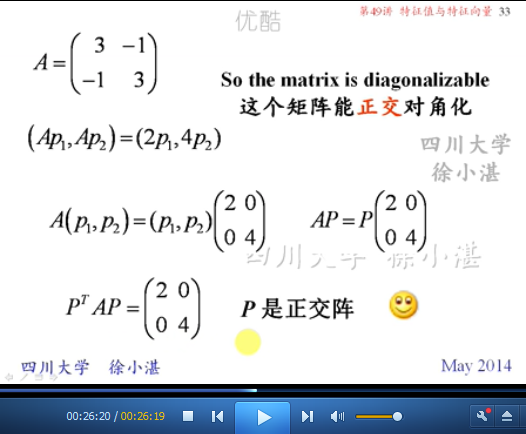
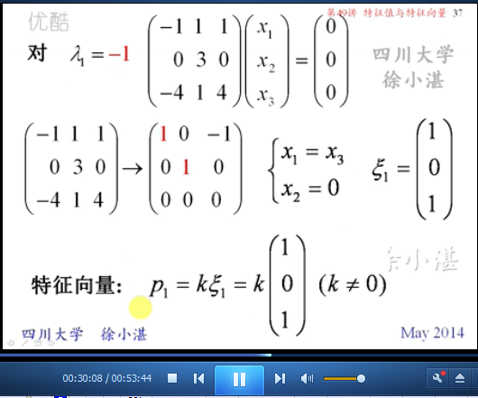

# 特征值与特征向量 #

这里主要讲三部分内容：

1. 特征值和特征向量的概念
2. 如何求解特征值和特征向量，主要是讲步骤
3. 举4个例子来演示如何求解，是实战的过程

## 1、特征值和特征向量的概念 ##

	讲述特征值(eigenvalue)与特征向量(eigenvector)的概念

	讲述eigen单词的来历

	矩阵A-->特征值-->特征向量-->齐次线性方程组的非零解
	方程组非零解的充分必要条件：行列式为0
	解空间-->特征空间(eigenspace)

	行列式-->特征方程
	n次方程-->n个根-->n个特征值

	等价命题

	特征向量的非零倍数也是特征向量

	从几何的角度，看待特征值与特征向量

## 2、求解特征值和特征向量的步骤 ##

	求矩阵A的特征值与特征向量的步骤

	矩阵A与特征值之间，是一对多的关系
	特征值与全部特征向量之间，也是一对多的关系
	几何重数 和 代数重数 两个概念

	单根 和 重根 概念的区分
	线性无关的特征向量 和 线性有关的特征向量
	s重特征根 与 s个线性无关的特征向量的关系：最多
	n阶矩阵 与 n个线性无关的特征向量 的关系

	s重特征根、s个线性无关的特征向量 与 矩阵对角化 的影响

## 3、举例子 ##

### 3.1、第一个例子 ###

	先求解特征值，再求解特征向量，最后看矩阵对角化。

	根据第1个特征值，求解特征向量

	根据第2个特征值，求解特征向量

	根据 特征值、特征向量 来判断 矩阵对角化

### 3.2、第二个例子 ###

	先求解特征值，再求解特征向量，最后看矩阵对角化。

	求解特征值

	根据第1个特征值，求解特征向量

	根据两个重根（特征值），求解出两个线性无关的特征向量

	根据特征值、特征向量，当前示例可以进行矩阵对角化

### 3.3、第三个例子 ###

	先求解特征值，再求解特征向量，最后看矩阵对角化。

	求解特征值

	根据第1个特征值求解特征向量

	根据两个重特征根，只求解到1个特征向量

	根据特征值和特征向量，无法进行矩阵对角化

### 3.4、第四个例子 ###

	在复数范围内，求解特征值与特征向量

	求解特征值

	根据第1个特征值，求解特征向量

	根据第2个特征值，求解特征向量

> 至此结束。 真理惟一可靠的标准就是永远自相符合。 —— 欧文

