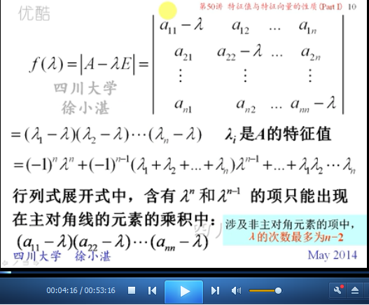

# 特征值与特征向量的性质（Part I） #

这里是从两个角度讲：

1. 特征多项式：从矩阵所有特征值的“乘积”、“加和”两个角度来看待“行列式”和“迹”
2. 特征值与特征向量的性质：其中主要讲了4个性质，对矩阵进行各种变换（k次方、逆矩阵、转置矩阵）的“特征值”和“特征向量”

## 1、特征多项式 ##

	由 矩阵A ==> A的特征多项式： 
	将特征值lambda作为变量，变成特征多项式（characteristic polynomial）

	第一点：矩阵的行列式 等于它的全体特征值之积

	第一点证明过程

	第二点：矩阵的迹 = 矩阵的全体特征值之和

	由第一点得到推论：方阵可逆-->行列式不为0-->它的所有特征值都不为零

	例1

	例2

## 2、特征值与特征向量的性质 ##

### 2.1、性质1 ###

	矩阵A，不变化的情况下，特征向量 和 非零线性组合
	属于同一特征值的若干个特征向量的非零线性组合 仍然是 属于该特征的特征向量。

### 2.2、性质2 ###

	矩阵A，进行平方变换成A^2，特征值和特征向量到底是什么

	从几何角度进行解释

	从2次方，向n次方进行推广而得到的“推论”

	例3

	由n次方 向 多项式 推广

### 2.3、性质3 ###

	矩阵A，进行求逆运算，再求特征值和特征向量是什么 

	从几何角度看

	矩阵A，得到伴随矩阵，再看特征值和特征向量是什么

### 2.4、性质4 ###

	矩阵A，进行转置，再求特征值和特征向量是什么？

### 2.5、小结 ###

	小总结

	举个例子

	例4

	例5

	例6

> 至此结束。 不管你经历多痛的事情，到最后都会渐渐遗忘。因为，没有什么能敌得过时光。
