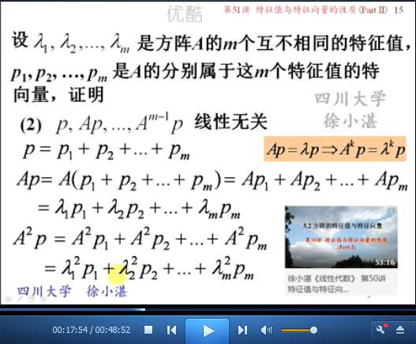

# 特征值与特征向量的性质（Part II） #

这里包含三部分内容：

1. 特征向量的线性无关：主要是围绕“特征向量”之间的“线性无关”来进行阐述
2. AB与BA的特征值：之前都是从一个矩阵的角度出发，而此是针对两个矩阵，来求解其特征值
3. 特征值的“代数重数”和“几何重数”：为后续矩阵对角化做准备

1、特征向量的线性无关，包含4部分，

- （1）矩阵A的“不同特征值对应的特征向量”是线性无关的。
- （2）由（1）得到更一般推论：一个特征值，可以对应多个线性无关特征向量；不同的特征值，对应的各自的多个线性无关特征向量，放到一起的时候，也是线性 无关的。
- （3）由（2）得到的推论：方阵A的一个特征向量，不能属于矩阵A的两个不同的特征值。
- （4）在一个特征值下的多个特征向量，进行线性组合后，还是特征向量；但是，不同特征值下的特征向量进行非零线性组合，就不再是矩阵的特征向量了。

2、AB与BA的特征值，主要是讲述两个矩阵的特征值（之前只是针对一个矩阵或对一个矩阵进行变换），其包括内容有3个部分：

- （1）当矩阵A、矩阵B为非同阶矩阵时，AB与BA有相同的“非零”特征值
- （2）当矩阵A、矩阵B为同阶矩阵时，AB与BA有相同的特征值
- （3）由（2）得出更一般的结论：特征多项式

3、特征值的“代数重数”和“几何重数”，包含3部分内容

- （1）讲述“代数重数”和“几何重数”的概念
- （2）“代数重数”与“几何重数”的关系是什么？大于等于
- （3）“代数重数”和“几何重数” 与 “矩阵对角化” 的关系

## 1、特征向量的线性无关 ##

	定理2：属于不同特征值的特征向量线性无关

	证明

	定理2+：不同特征的各自的线性无关特征向量，放到一起之后，所有的特征向量也是线性无关的

	推论：方阵A的一个特征向量不能属于A的两个不同的特征值。

	例1：

	由例1得出的结论：不同特征值下的特征向量，进行线性组合后，其结果不是原矩阵的特征向量

	例2：

## 2、AB与BA的特征值 ##

	例3：矩阵A、矩阵B为非同阶矩阵

	例3：矩阵A、矩阵B为同阶矩阵

	特征多项式

## 3、特征值“代数重数”和“几何重数”（选学） ##

### 3.1、代数重数和几何重数的概念 ###

### 3.2、代数重数与几何重数的关系：大于等于 ###

	证明

### 3.3、代数重数和几何重数 与 矩阵对角化 的关系 ###

> 至此结束。 如果你不出去走走，你就会以为这就是世界。
