# 几种特殊矩阵的特征值与特征向量 #

这里面包含的内容有如下几个部分：

1. 三角矩阵
2. 对角矩阵
3. 数量矩阵
4. 单位矩阵
5. 零矩阵
6. 幂零矩阵
7. 正交矩阵
8. 哈米尔顿-凯莱定理

## 1、三角矩阵 ##

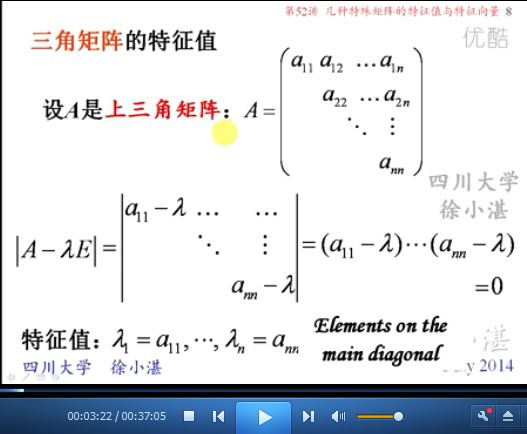

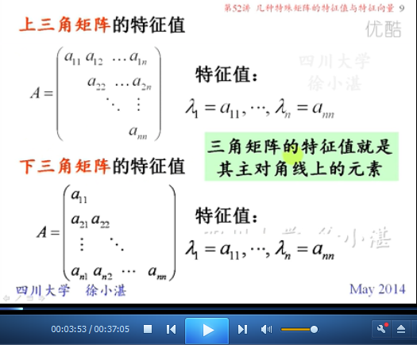

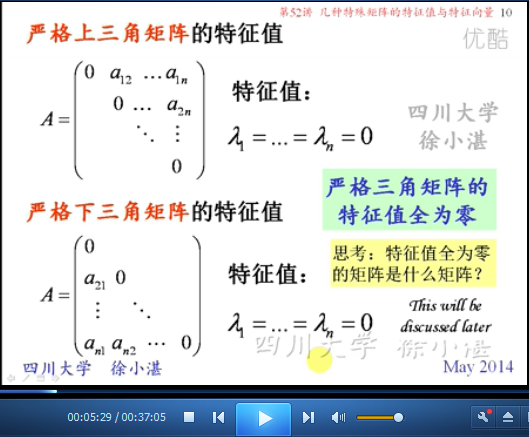

## 2、对角矩阵 ##

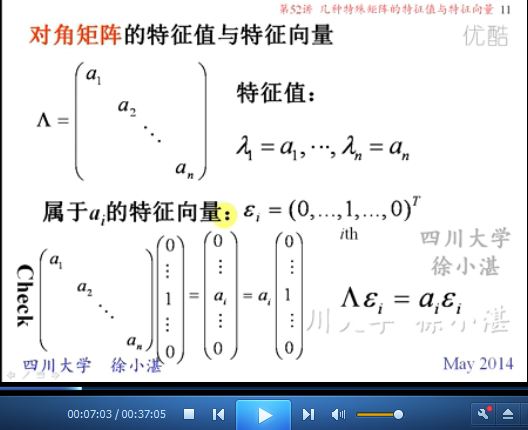

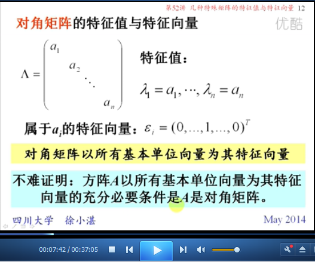

## 3、数量矩阵 ##

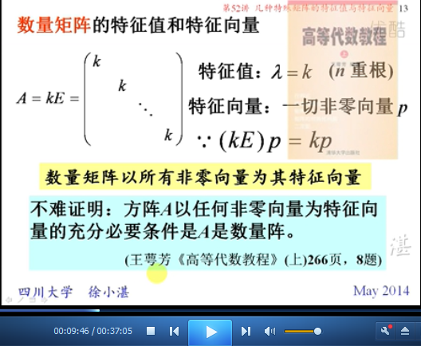

## 4、单位矩阵 ##

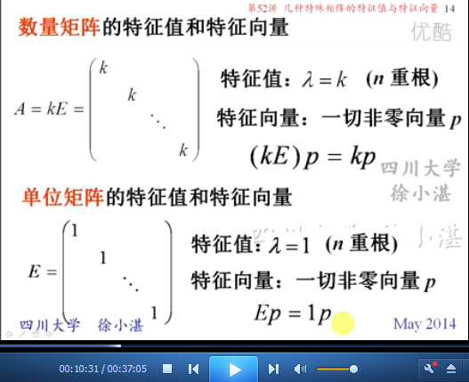

## 5、零矩阵 ##

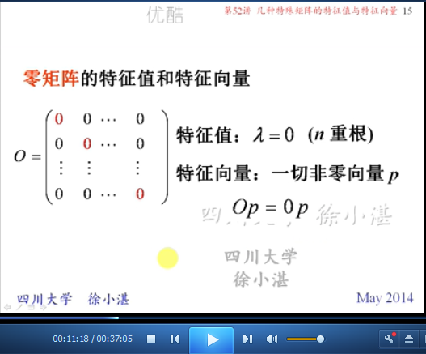

## 6、幂零矩阵 ##

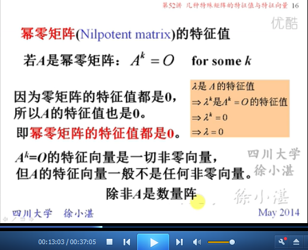

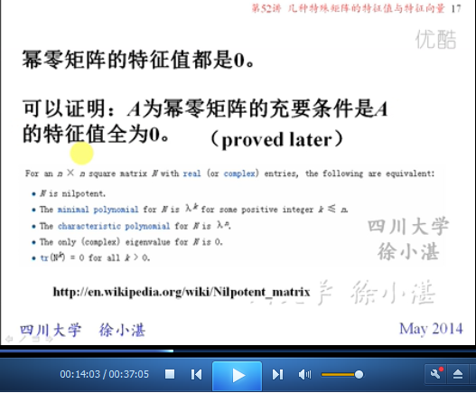

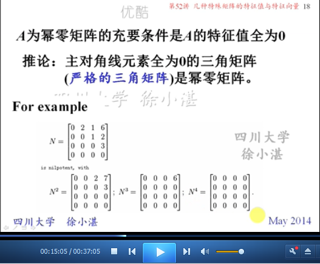

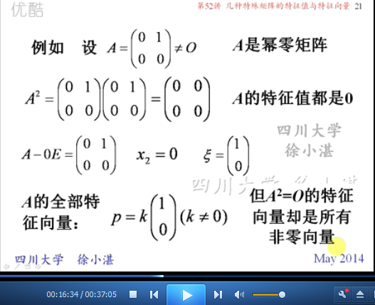

## 7、正交矩阵 ##

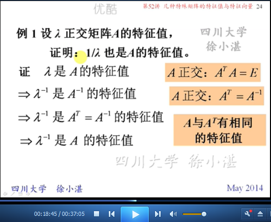

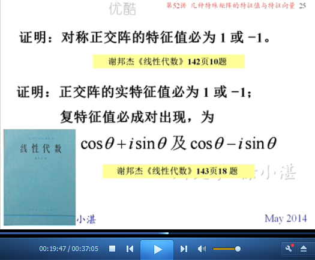

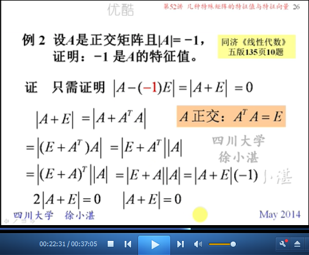

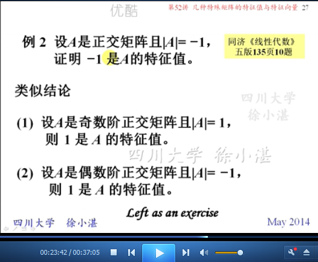

## 8、哈密尔顿-凯茉定理 ##

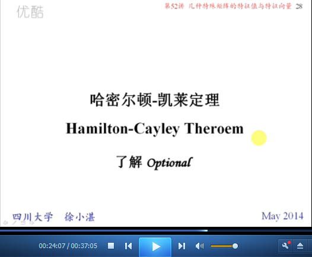

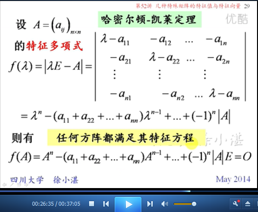

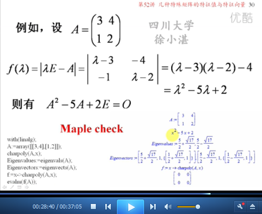

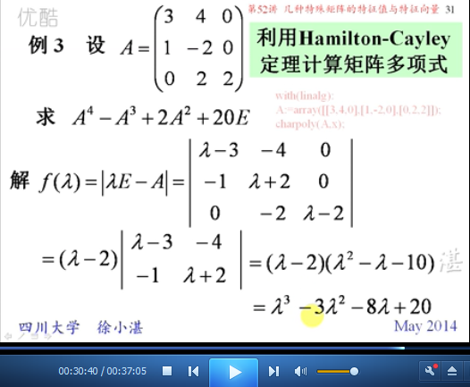

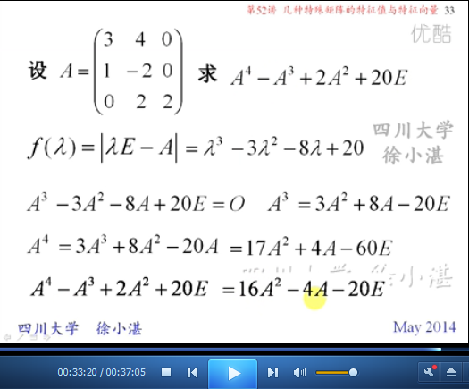

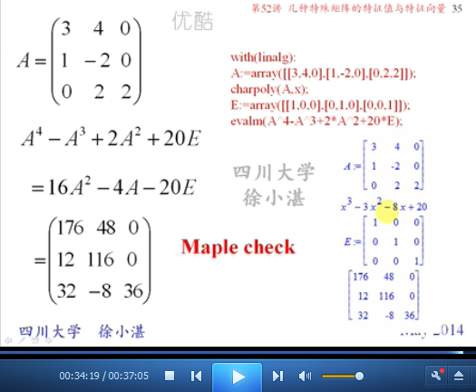

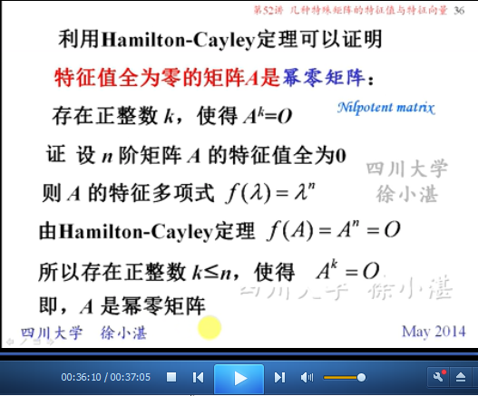

> 至此结束。 有些事一但错过了，就永远都来不及了，要做就得快。

