# 相似矩阵 #

## 1、相似矩阵的概念 ##

	通过“特征值”来构造“相似”矩阵

	定义：相似矩阵和相似变换

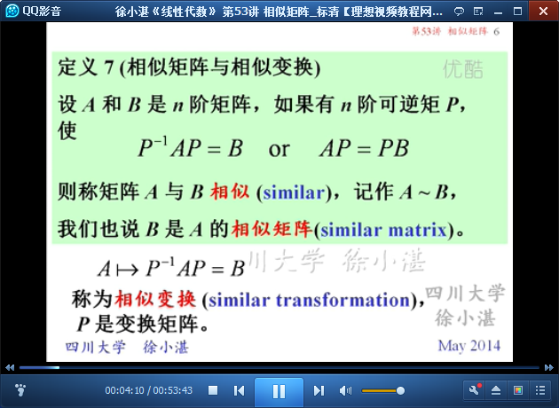

	矩阵的相似关系具有的性质：

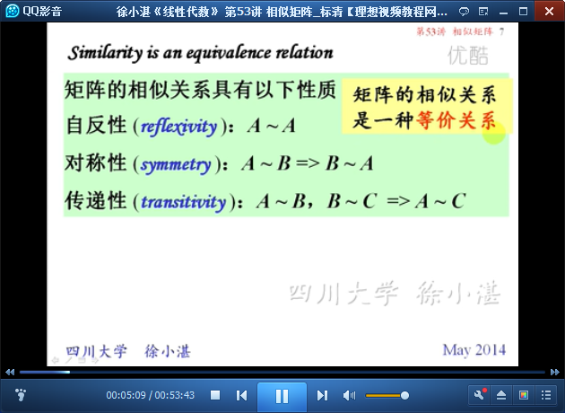

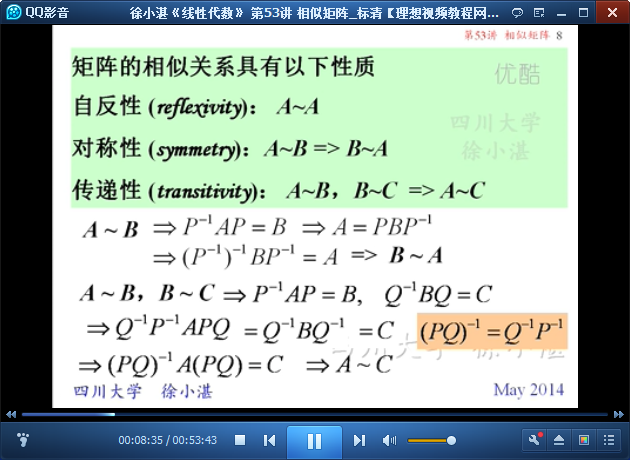

## 2、相似性的不变性质（Similarity Invariants） ##

	复习50讲 特征多项式

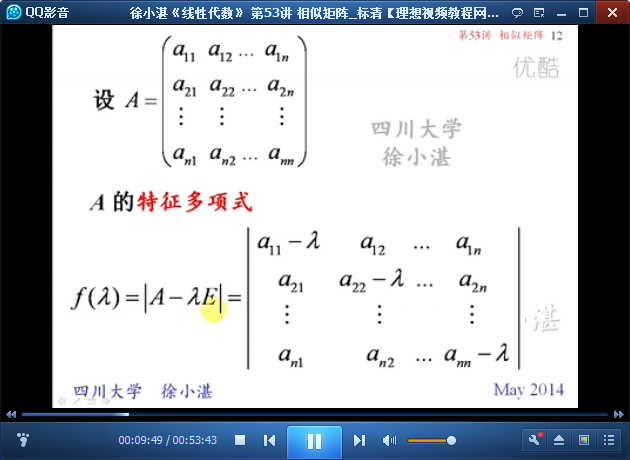

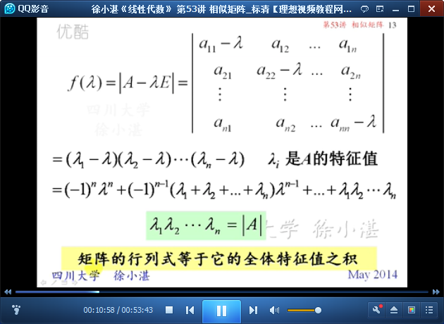

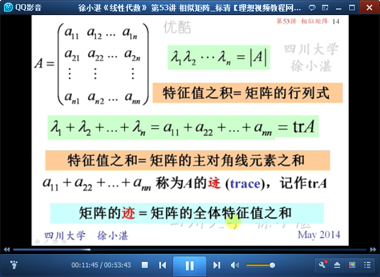

	定理3：相似矩阵有相同的特征多项式、特征值、行列式、迹、秩

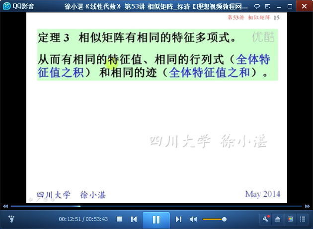

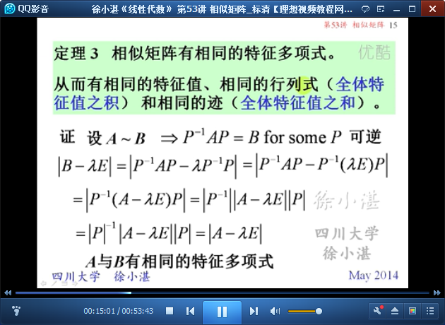

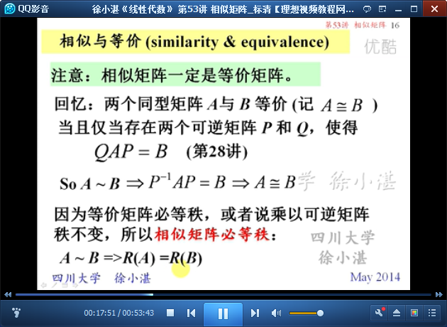

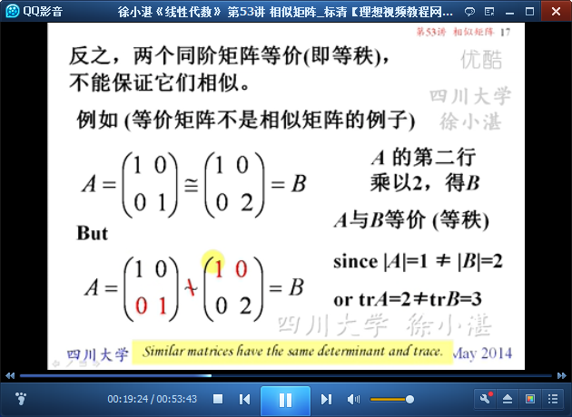

	小总结

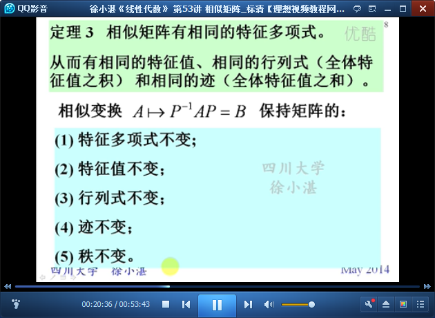

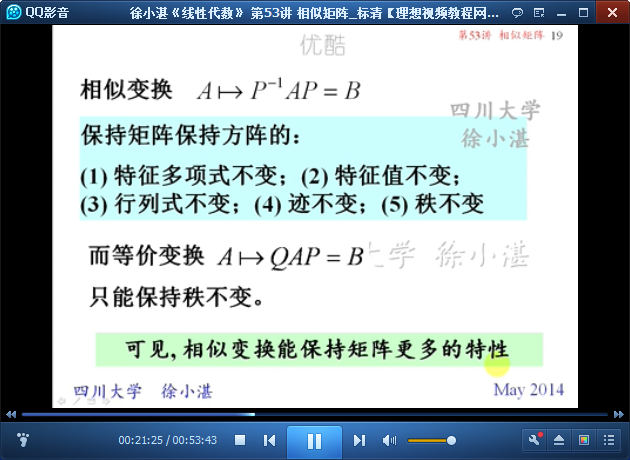

	相似变换不能保持矩阵的对称性

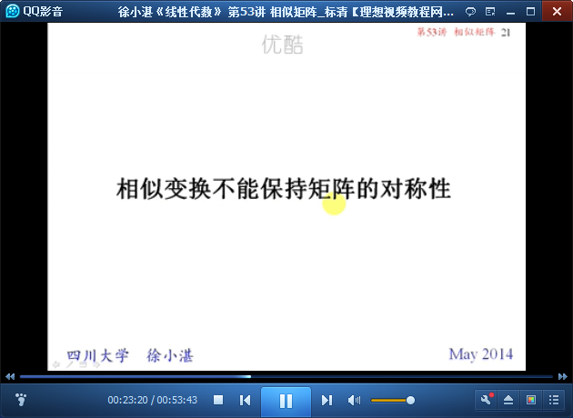

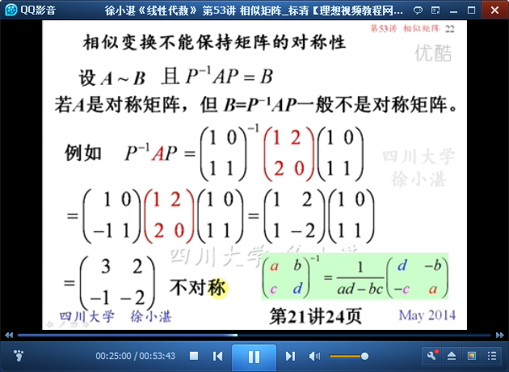

	相似矩阵具有相同的特征值，但不一定有相同的特征向量

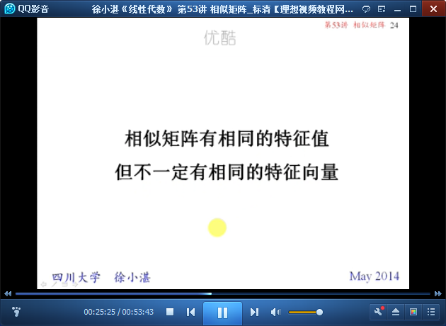

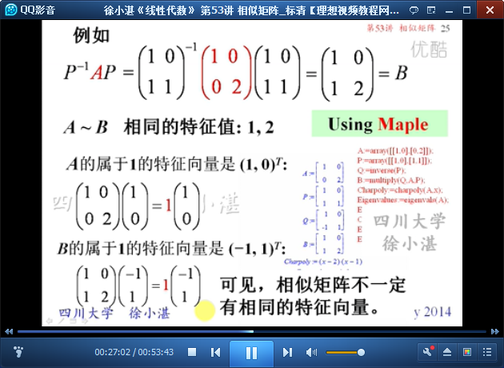

## 3、相似矩阵的运算性质 ##

	相似矩阵的幂也相似

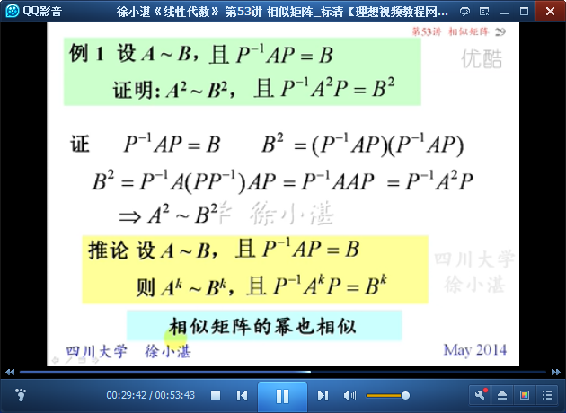

	相似矩阵的多项式也相似

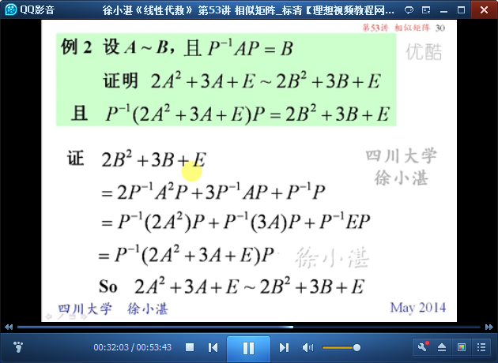

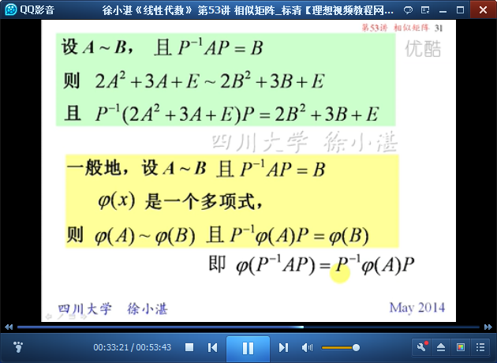

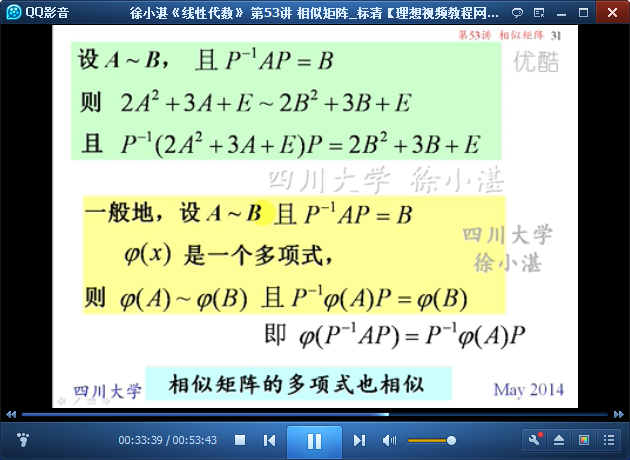

	相似矩阵的逆矩阵也相似

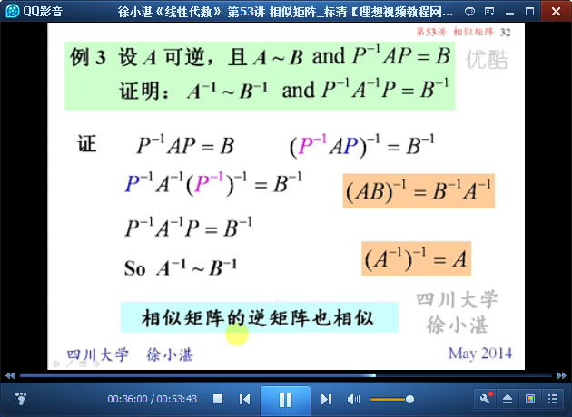

	相似矩阵的转置矩阵也相似

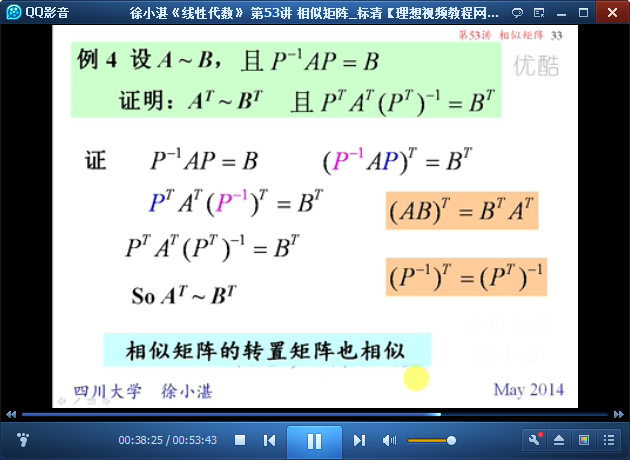

	相似矩阵的伴随矩阵也相似

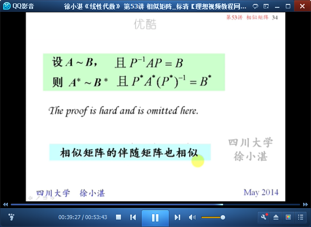

	小总结：相似矩阵的运算性质

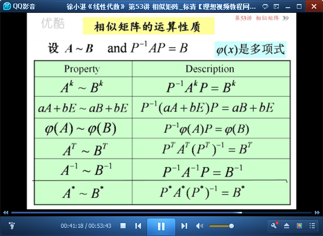

	例5：

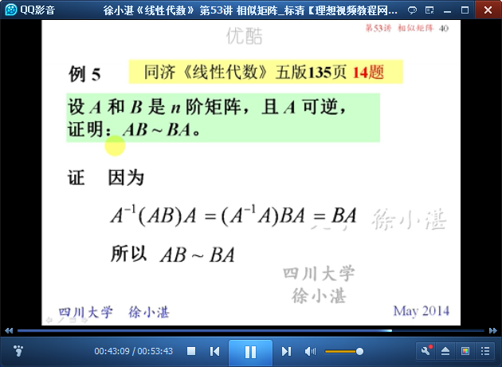

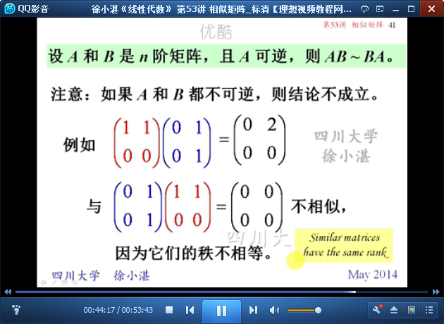

	例6：

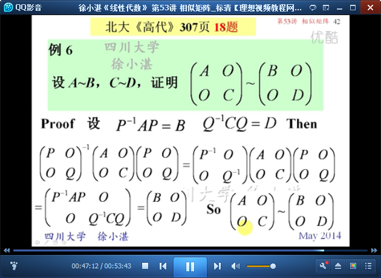

	考研题

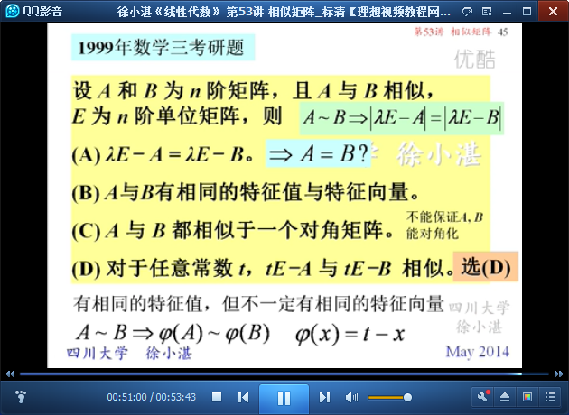

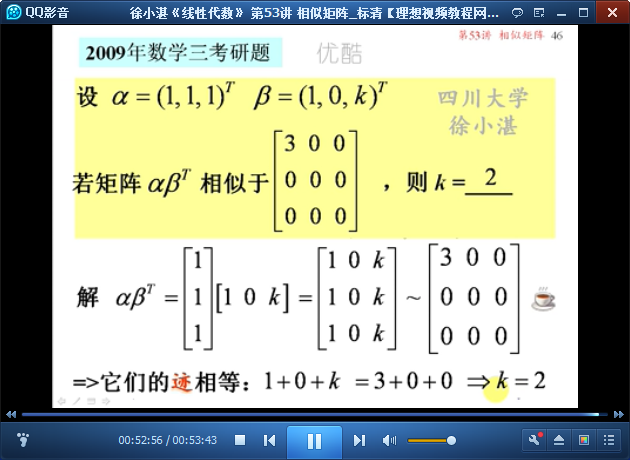

> 至此结束。 我后来才发现，成功，精力旺盛很重要，成功人士连续高强度工作十二小时都不觉得累，照样有激情，照样有创意，照样不着急对自己好，像一台旗舰手机，拥有超强的cpu和超大的运行内存。而普通人，每天的主题是，好累，好饿，好困，好无聊。