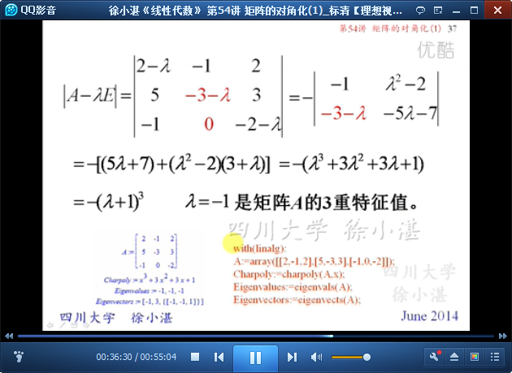

# 矩阵的对角化（1） #

## 1、矩阵的相似对角化 ##

	回忆“相似矩阵”和“相似变换”

	找一个与方阵A的简单的、相似的矩阵：零矩阵、单位阵、数量阵、对角阵

	命题

	定理4：n阶矩阵A与对角阵相似的 充分必要条件是 A有n个线性无关的特征向量，且对角矩阵的主对角线元素即为A的特征值。

	例如

	A是否能相似对角化：代数重数、几何重数

	例如

## 2、矩阵对角化的例子 ##

	例1:

	例2:

	例3:

	例4:矩阵对角化的应用

> 至此结束。 我们很少信任比我们好的人，宁肯避免与他们来往。相反，我们常对与我们相似、和我们有着共同弱点的人吐露心迹。我们并不希望改掉弱点，只希望收到怜悯与鼓励。