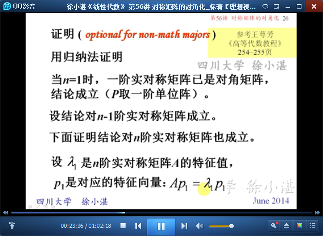
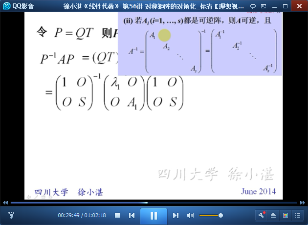
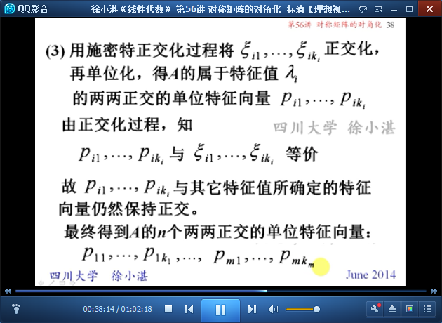
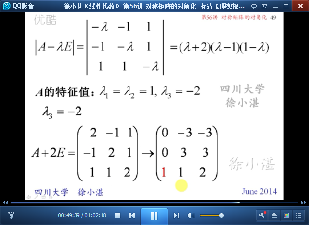
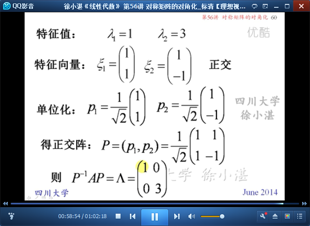

# 对称矩阵的对角化 #

## 1、对称矩阵的特征值和特征向量的性质 ##

	结论：任何实对称矩阵都能对角化，并且还能通过正交变换实现对角化

	这里要区分两个概念：实方阵 和 对称矩阵

	下面证明两个结论：（1）特征值是实数；（2）不同特征一值的特征向量是正交的。

	定理5：实对称矩阵的特征值必为实数。

	定理6：实对称矩阵的两个不同特征值所对应的特征向量是正交的。

	注意：非对称矩阵的不同特征值所对应的特征向量一定线性无关，但不一定正交。

## 2、对称矩阵的对角化定理 ##

	结论：任何实对称矩阵都能对角化，并且还能通过正交变换实现对角化。

	定理7：任何实对称矩阵都可以通过正交变换将其对角化。

	推论：n阶实对称矩阵A的每一个k重特征值恰好能确定k个线性无关的特征向量

## 3、对称矩阵对角化的步骤 ##

## 4、对称矩阵对角化的例子 ##

	例1：

## 5、对称矩阵对角化的应用 ##

	例2：

> 至此结束。 当你的才华还撑不起你的野心时，你就应该静下心学习