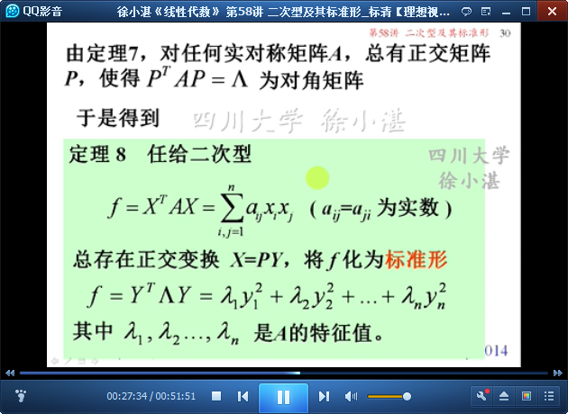
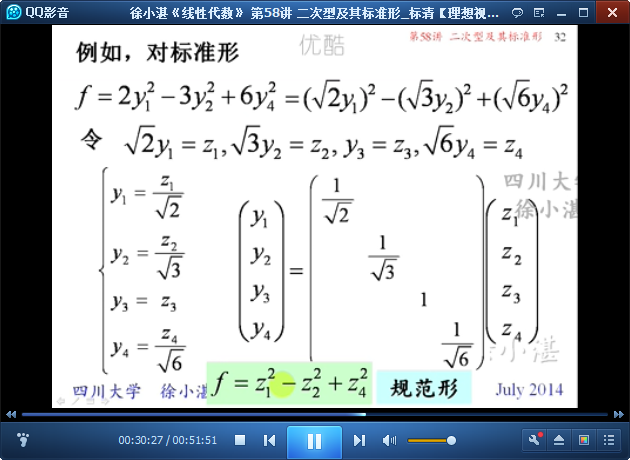
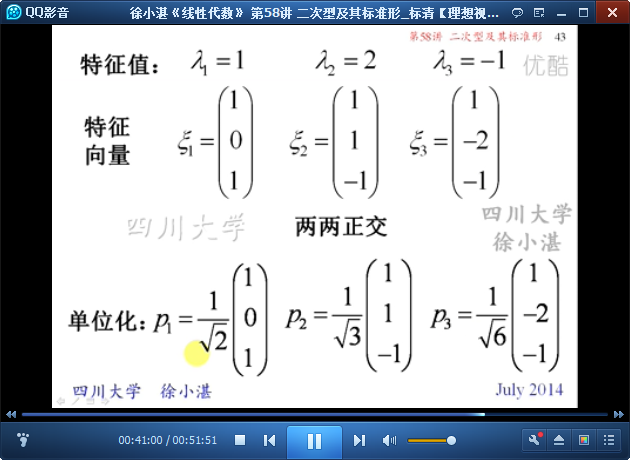

# 二次型及其标准形 #

## 1、二次型的概念 ##

	概念：二次曲线、二次曲面、交叉项、标准方程

	本讲内容：如何通过可逆的（或正交的）线性变换消去二次型中的交叉项

	定义：二次型

## 2、二次型的矩阵形式 ##

	概念：二次型f的矩阵

	二次型f与矩阵之间一一对应

	引出“标准形”

	提出问题：对称矩阵 是否可以变换为 对角矩阵

## 3、矩阵的合同关系 ##

	定义：矩阵的合同关系

	"合同"与"等价"的关系

	性质：合同变换 保持 对称性

	矩阵的合同关系具有的性质

	合同变换 与 相似变换 的区别：

	二次型的秩 与其矩阵的秩相同 
	二次型经过合同变换（PPT当中写错了），其秩不变

	对称矩阵A合同对角化

	定理8：二次型的标准形-->规范形

	推论：任何实对称矩阵都与对称矩阵LAMBDA“合同”并且“相似”

## 4、将二次型标准化的例子 ##

	例1：

	例2：

> 至此结束。 你以为的幸运，其实是别人努力了好久才发出来得光