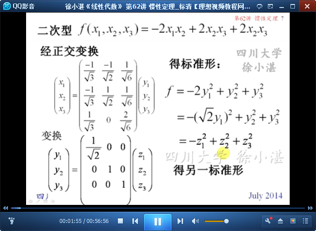

# 惯性定理 #

## 1、惯性定理 ##

	二次型的标准型不是唯一的。

	定理9（惯性定理）：二次型的标准形中正系数和负系数的项数也是唯一的。

	定义：正惯性指数、负惯性指数、符号差

	定义9*（惯性定理）：任意一个二次型可以经过可逆变换化成规范形，且规范形是唯一的。

	两个实对称矩阵合同的充分必要条件：正特征值、负特征值

	例1：

	例2：

	例3：

## 3、考研题评讲 ##

	例4：

	例5：

	例6：

> 至此结束。 趁年青应该多经历一些，不要给人生留下遗憾。