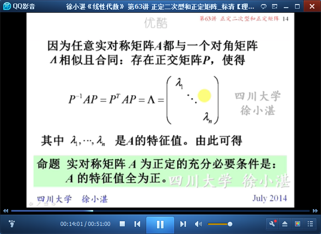
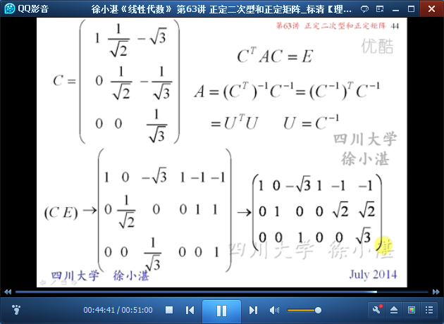

# 正定二次型和正定矩阵 #

## 1、正定二次型 ##

	定义10：正（负）二次型、正（负）矩阵

	如何判断一个二次型是正定的呢？

	定理10：

	推论：正定二次型的规范形是n阶单位矩阵

	命题：A与单位矩阵E合同

	推论：正定矩阵A的主对角元素大于零。

	命题：实对称矩阵A为正交的充分必要条件是：A的特征值全为正。

	定理11：A的各阶顺序主子式都为正

	德国数学家赫尔维茨

	小总结：正定的等价条件

## 2、例子 ##

	例1：

	例2：

	例3：

	例4：

	例5：

	例6：

	例7：

> 至此结束。 多说无益，三缄其口。初心莫负，爱憎不惊。