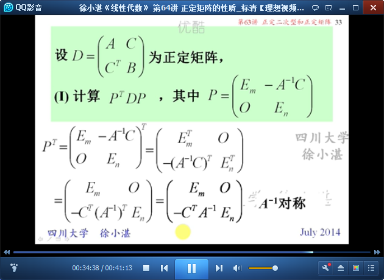

# 正定矩阵的性质 #

## 1、复习 ##

	复习：正定的等价条件

## 2、正定矩阵的性质 ##

	例1：设A是正定矩阵，则数乘矩阵、矩阵的幂、矩阵的逆、矩阵的伴随矩阵都是正定矩阵。

	例2：A、B是同阶正定矩阵，A+B也是正定矩阵。

	例3：A是n阶实对称矩阵，当实数t充分大后，tE+A是正定矩阵。

	例4：两个矩阵

	例5：两个矩阵

	例6：一个矩阵

## 3、考研题选讲 ##

	例7：

	例8：

	例9：

	例10：

> 至此结束。 衣服会褪色，墙壁会斑驳，一切都在改变，这就是生活！